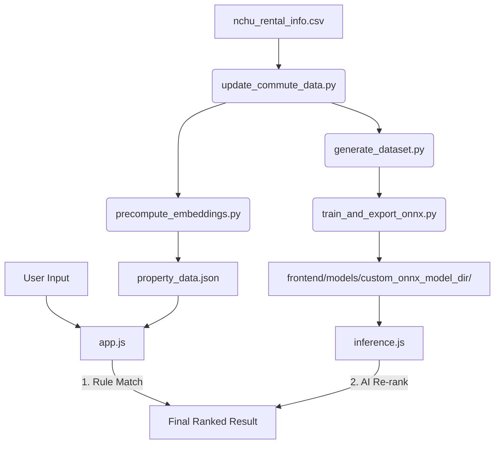

# 興大 AI 租屋推薦系統 (NCHU AI Rental Recommendation)

這是一個專為中興大學學生設計的 **Edge AI 租屋推薦系統**。使用者只需輸入自然語言需求（例如：「預算 6000 以內、走路 5 分鐘、要採光好有冷氣」），系統即可透過微調後的 **RoBERTa (rbt3)** 模型進行深度語意匹配，提供精準的房源建議。

## 專案亮點

- **深度語意理解 (RoBERTa)**: 從輕量級 ALBERT 升級至 **hfl/rbt3** (3 層 RoBERTa)，顯著提升對口語化需求（如：「不想追垃圾車」、「怕吵」）的理解能力。
- **真實路網導航 (OSRM)**: 捨棄直線距離估算，全面接入 **OSRM (Open Source Routing Machine)** 與 **ArcGIS Geocoding**。所有通勤時間皆為真實路網的步行/行車時間。
- **漸進式渲染 (Progressive Rendering)**: 採用「規則預覽 + AI 重排」雙階段渲染。使用者輸入後 **0.1 秒內** 顯示初步結果，AI 在背景運算完成後動態重排，消除等待延遲感。
- **邊緣端推論 (Edge AI)**: 使用 **ONNX Runtime Web (WASM)**，模型直接在瀏覽器運行，支援 **多執行緒 (Multi-threading)** 加速，反應迅速且隱私無虞。
- **極致視覺體驗**: 採用 Premium Dark Mode 設計，並實作了 **AI 運算遮罩 (Computing Overlay)**。在深度語意匹配期間提供流暢的視覺回饋，避免使用者產生系統卡頓的錯覺。

---

## 技術架構

- **前端介面 (Frontend)**: 原生 JavaScript (ES6+), HTML5, Vanilla CSS (Premium Dark Mode)
- **邊緣推論引擎 (Inference)**: [ONNX Runtime Web](https://onnxruntime.ai/) (啟用 WASM SIMD & Multi-threading)
- **語意模型 (Model)**: `hfl/rbt3` (Sentence-Pair Classification)，採單一匯出路徑至前端目錄，確保權重一致性。
- **路徑引擎 (Routing)**: OpenStreetMap (OSRM) + ArcGIS Geocoding API。

---

##  專案架構與資料流



---

## 核心模組說明

### 1. 數據與通勤修正 (`pipeline/data_prep/`)
* **`update_commute_data.py`**: 關鍵模組。使用 ArcGIS 將地址轉換為精確經緯度，再透過 OSRM 計算到興大正門的真實步行與機車路程。
* **`generate_dataset.py`**: 合成訓練樣本。加入「隱含意圖映射」（例如：提到垃圾車對應到具備子母車的房屋），並進行 **Hard Negative Mining** 提升模型分辨相似物件的能力。

### 2. 模型訓練與評估 (`pipeline/model_training/`)
* **`train_and_export_onnx.py`**: 使用 `rbt3` 進行微調。模型直接匯出至前端 `custom_onnx_model_dir`，取消冗餘的 `saved_models` 存儲。
* **`evaluate_model.py`**: 提供專業評估指標。除了傳統準確度，更導入了 **NDCG@5 (排序品質)** 與 **MRR (檢索效率)** 指標。

### 3. 前端推論引擎 (`frontend/js/`)
* **`inference.js`**: 核心邏輯。負責 Tokenization、ONNX 推理。實作了 **非同步 Yield 機制**，確保大型運算不阻塞 UI 渲染。
* **`app.js`**: 負責 UI 渲染。實作了 **Progressive Rendering** 與 **AI Loading Overlay**。

---

## 快速開始

### 1. 開啟推薦網頁
本專案為靜態網頁，只需本機伺服器即可執行：
```bash
python3 -m http.server 8080
```
造訪 `http://localhost:8080`。

### 2. 環境設定 (Python)
若要重新執行數據修正或模型訓練：
```bash
python3 -m venv .venv
source .venv/bin/activate
pip install torch transformers datasets numpy onnx onnxruntime requests
```

### 3. 數據刷新工作流
若修改了 `nchu_rental_info.csv`，請依序執行：
```bash
# 1. 更新真實路網距離與時間 (OSRM)
python pipeline/data_prep/update_commute_data.py

# 2. 生成前端所需的特徵資料與描述
python pipeline/data_prep/precompute_embeddings.py

# (可選) 若需重訓模型
python pipeline/data_prep/generate_dataset.py
python pipeline/model_training/train_and_export_onnx.py
```

---

## 效能指標 (Current Version - RBT3)

- **Accuracy**: ~90.5%
- **Mean NDCG @ 5**: 0.64 (高品質排序)
- **Mean Reciprocal Rank (MRR)**: 0.64 (平均在前兩名即可找到滿意房源)
- **感官延遲**: < 100ms (Progressive Rendering + UI Yielding 帶來的即時回饋感)

---

## 目錄導覽
- `frontend/`: 包含所有網頁資源與 ONNX 模型。
- `pipeline/`: 包含數據處理 (`data_prep`) 與模型訓練 (`model_training`) 的所有腳本。
- `data/`: 存放原始 CSV 與生成的訓練 JSON。
- `nchu_rental_info.csv`: 系統唯一資料來源。
