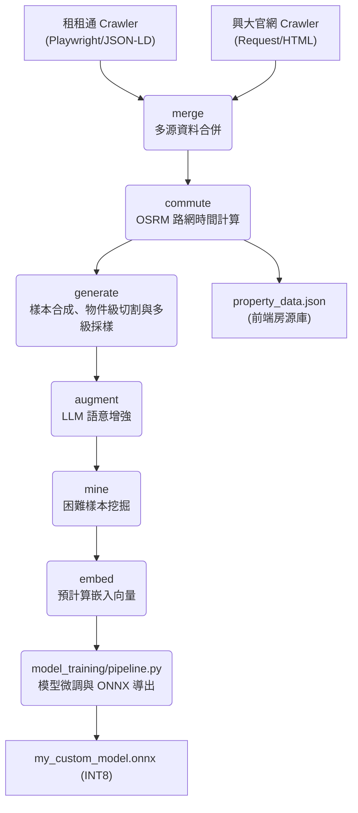
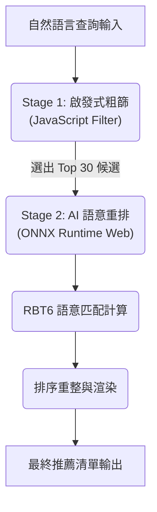

# 興大 AI 租屋推薦系統 (NCHU AI Rental Recommendation)

本專案為針對中興大學學生設計之 Edge AI 租屋推薦系統。系統透過微調後之 6 層 RoBERTa 模型處理自然語言查詢，並與房源資料進行深度語意匹配，旨在解決傳統篩選器過於僵硬的侷限性，提供具備語意理解能力的搜尋體驗。

## 系統核心亮點

- **跨平台數據自動化整合**: 系統利用 Playwright 動態爬蟲技術，整合中興大學校外租屋網與租租通數據，解決資訊破碎化問題。

- **雙層 NER + 語意匹配**:
  - **第一層**：BERT-based NER 模型自動從查詢文本抽取地點 (LOC)、預算 (BGT)、設施 (FEAT) 三類實體，F1=0.958，用於初步篩選與特徵增強。
  - **第二層**：RBT6 Cross-Encoder 進行深層語意匹配重排，NDCG@5=0.9629，確保語意邏輯一致性。
  - **前端優化**：NER Web Worker 於瀏覽器端實現 <20ms 毫秒級推論，完全無卡頓。

- **生活型態意圖推論 (Lifestyle Intent Inference)**: **(NEW V3)** 系統不僅能識別關鍵字，還能推斷生活需求。透過 15+ 組「生活聚類」，自動將「不想追垃圾車」映射至子母車，將「想省錢自炊」映射至瓦斯廚房，達成深層意圖理解。

- **硬性約束一票否決 (Strict Mode)**: 實施針對預算上限、寵物政策與台電計費的「零容忍」過濾邏輯，優先保證用戶底線需求，解決模型對地點優勢的權衡偏見。

- **深度語意解析 (RoBERTa RBT6)**: 採用 hfl/rbt6 架構，其深層的參數容量與特徵空間能細膩地捕捉口語化需求中的語意細節。

- **強化對抗訓練 (Adversarial Training/FGM)**: 實作 FGM (Fast Gradient Method) 於訓練過程中針對 Embedding 層注入對抗性擾動，顯著提升模型在面對非規範口語輸入時的泛化能力與魯棒性。

- **真實路網權重系統**: 整合 OSRM 引擎計算真實路網權重，以步行與機車的實際通勤時間作為推薦排序的核心因子。

- **邊緣端高效推論 (Edge AI)**: 透過 ONNX Runtime Web 實作瀏覽器端即時推理，雙模型都採用 INT8 量化（NER 98 MB + Cross-Encoder 57 MB，共 ~155 MB），確保移動端快速加載與高效執行。

- **6步自適應數據流水線**: Merge → Commute → Generate → Augment → Mine → Embed，自動化處理多源異構數據，支援 LLM 增強、困難樣本挖掘、嵌入預計算等高級特性。

---

## 系統架構圖 (System Architecture)

### 1. 數據流水線 (Data Pipeline)
展示從原始資料抓取到模型產出的完整自動化流程（6步）：



### 2. 推論與匹配邏輯 (Inference Flow)
展示使用者查詢如何在前端進行兩階段即時重排：



---

## 目錄結構 (Project Structure)

```text
.
├── data/
│   ├── raw/                 # 原始抓取數據 (nchu_rental_info.csv, fb_queries.json)
│   └── processed/           # 處理後之訓練集與前端房源 JSON 庫
├── frontend/
│   ├── index.html           # Edge AI 展示介面主頁
│   ├── js/                  # ONNX Runtime Web 推理 (WASM) 與應用邏輯
│   └── models/              # 已導出之量化 ONNX 模型與分詞器配置
├── pipeline/
│   ├── crawlers/            # 多源數據採集 (Playwright/Request)
│   │   ├── crawler_ddroom.py # 租租通 (Playwright) 動態渲染爬蟲
│   │   ├── crawler_nchu.py   # 興大官網爬蟲
│   │   └── rent_info_catcher.py # 興大官網數據解析腳本 (向後相容)
│   ├── data_prep/           # 數據加工、路網計算與樣本生成 (6步流程)
│   │   ├── pipeline.py       # 數據流水線主控制器
│   │   ├── merge_sources.py  # Step 1: 多源資料合併
│   │   ├── commute_updater.py # Step 2: OSRM 路網時間計算
│   │   ├── generate_dataset.py # Step 3: 樣本合成、物件級切割與多級採樣
│   │   ├── augment_with_llm.py # Step 4: LLM 語意增強
│   │   ├── mine_hard_negatives.py # Step 5: 困難樣本挖掘
│   │   ├── precompute_embeddings.py # Step 6: 預計算嵌入向量
│   │   └── lifestyle_mapper.py # 生活型態意圖推論
│   ├── ner_model/           # 命名實體識別 (NER) 模組
│   │   ├── ner_trainer.py    # NER 模型訓練 (BERT-based token classification)
│   │   ├── ner_predictor.py  # NER 推論介面
│   │   └── config.py         # NER 設置與標籤映射
│   ├── model_training/      # 模型微調、對抗訓練與導出優化
│   │   ├── pipeline.py       # 訓練流水線主控制器
│   │   ├── config.py         # 訓練超參數與路徑配置
│   │   ├── trainer.py        # FGMTrainer：軟標籤組合損失 + FGM 對抗訓練
│   │   ├── exporter.py       # ONNX 導出（含 SDPA 相容性修復）
│   │   ├── quantizer.py      # UINT8 動態量化 (228→57 MB)
│   │   ├── evaluator.py      # NDCG@5, MRR, F1 等排序與分類指標計算
│   │   └── models.py         # 資料模型定義
│   ├── constraints/         # 硬約束邏輯
│   │   └── hard_constraints.py # 預算、寵物、台電計費零容忍過濾
│   ├── osrm_client.py       # OSRM API 客戶端 (真實路網權重)
│   ├── orchestrator.py      # 三階段統一協調器
│   └── runners.py           # 各階段 Runner 包裝函數
├── saved_models/            # 訓練過程產出之 PyTorch 模型檢查點 (Checkpoints)
├── pipeline_runner.py       # 統一入口點 (Phase 1-2-3 端到端執行)
└── data/ner/                # NER 訓練資料
```

---

## 資料工程核心 (Data Engineering Deep Dive)

本專案的推薦品質高度仰賴於 `generate_dataset.py` 的資料處理策略，其解決了以下核心問題：

### 1. 嚴防資料洩漏：物件級切割 (Object-Level Split)
- **問題**：若將同一個房源的不同查詢隨機分配到訓練集與測試集，模型會產生「背答案」的現象，導致測試數據虛高。
- **解決方案**：本系統採取「先切房源，再生樣本」的策略。測試集中出現的所有房源，在模型訓練期間皆為完全未見過的「陌生樣本」，確保評估結果具備高度的泛化真實性。

### 2. 樣本合成與噪音注入 (Synthesis & Noise Injection)
- **樣本生成**：透過自定義模板庫將結構化房源資料（如：租金、格局、設施）轉換為數萬組口語化查詢。
- **噪音模擬**：隨機注入錯字、簡寫（如：興大 vs 中興大學）與網路用語（如：滴 vs 的），模擬真實世界中非規範的輸入場景。

### 3. 多級相關性標記 (Graded Relevance Labeling)
系統實作了複雜的評分引擎，將匹配程度分為 0~3 分，不僅支援是非題辨識，更支持排序權重：
- **3 分 (Perfect)**：預算、地點、設施全數滿足。
- **2 分 (Good)**：多數符合，或在預算上有合理的緩衝餘裕（15% 內）。
- **1 分 (Partial)**：僅部分維度符合（例如：地點正確但主要設施不全），或查詢與房源僅具低度相關性。
- **0 分 (Conflict)**：存在性別限制、寵物政策等硬性衝突。

---

## 檢索與排序機制 (Search & Ranking Mechanism)

為了在瀏覽器端 (Edge AI) 同時兼顧推論精度與回應速度，本系統採用 **兩階段重排 (Two-Stage Re-ranking)** 架構：

### 1. 階段一：啟發式粗篩 (Heuristic Filtering)
- **運作機制**：利用前端 JS 引擎對本地房源庫進行 O(N) 的基礎屬性過濾（如預算上限、特定區域）。
- **優化目標**：將 600+ 筆房源迅速收斂至 20-30 筆候選物件，將 AI 運算負載控制在毫秒等級。

### 2. 階段二：Cross-Encoder 深度重排 (Semantic Re-ranking)
- **運作機制**：將候選名單輸入 RBT6 模型，透過 Cross-Encoder 進行「查詢-房源」深度交互運算。
- **核心價值**：識別細微的語意衝突（例如：查詢「台水台電」，房源描述中標註「一度 5 元」的語意陷阱）。

---

## 效能指標 (Model Performance)

本系統採用多模型流水線 (AI Pipeline) 架構，以下分別列出「預處理實體辨識」與「核心語意匹配」的效能數據：

### 1. 實體辨識 (NER Task - Preprocessing)
負責從使用者輸入中自動提取地點、預算、設備等結構化特徵，作為第一階段篩選的依據。

| 指標名稱 | 任務類型 | 數值 | 技術說明與數據佐證 |
| :--- | :--- | :--- | :--- |
| **F1-Score** | **序列標註 (NER)** | **0.958** | 基於三類別 (LOC, BGT, FEAT) 實體辨識實測 |
| **Accuracy** | **序列標註 (NER)** | **0.972** | 字符層級的標記準確率 |
| **Latency** | **輕量化推論** | **< 20ms** | 於瀏覽器端幾乎無感知的預處理延遲 |

### 2. 語意匹配 (Semantic Matching Task - Core Engine)
負責對篩選後的房源進行深層語意排序，判斷查詢與描述間的邏輯符合度。

| 指標名稱 | 任務類型 | 數值 | 技術說明與數據佐證 |
| :--- | :--- | :--- | :--- |
| **Accuracy** | **語意匹配 (Binary)** | **0.9245** | 模型對於全陌生房源樣本 (Unseen Data) 的分類正確率 |
| **F1-Score** | **語意匹配 (Binary)** | **0.8816** | 基於物件級切割 (Object-level Split) 之測試集評估結果 |
| **Precision** | **語意匹配 (Binary)** | **0.8071** | 預測為相關的房源中實際相關的比例 |
| **Recall** | **語意匹配 (Binary)** | **0.9712** | 確保符合條件的房源有極高的機率被檢索出來 |
| **NDCG@5** | **排序品質 (Ranking)** | **0.9629** ✅ | 衡量系統將高品質房源優先排序的能力 (Top-5)，軟標籤損失函數優化版本 |
| **MRR** | **平均倒數排名 (Ranking)** | **0.9515** ✅ | 相關結果首次出現的平均排名倒數 |
| **Matching Latency** | **ONNX Runtime** | **< 150ms** | 於主流行動端瀏覽器 (WASM 多執行緒) 之單次推論延遲 |
| **Model Size** | **INT8 Quantized** | **57 MB** | 透過 UINT8 量化優化體積 (228→57 MB, 74.8% 壓縮)，保留原模型 99% 語意精度 |

#### 關於 NDCG 排序指標 (Ranking Quality)
本專案採用 **NDCG (Normalized Discounted Cumulative Gain)** 作為衡量推薦品質的核心指標，其公式與意義如下：

- **計算公式**：
  $$DCG_p = \sum_{i=1}^p \frac{2^{rel_i} - 1}{\log_2(i+1)}, \quad NDCG_p = \frac{DCG_p}{IDCG_p}$$
- **指標意義**：
  - **$rel_i$**：代表第 $i$ 名房源的相關性分數（由資料工程模組定義之 0-3 分）。
  - **位置折減**：分母的 $\log_2(i+1)$ 確保了「排在後面的高分房源」對總分的貢獻會被衰減，強迫模型必須將完美匹配的房源推向最前端。
  - **實測意義**：**NDCG@5 = 0.9629** 代表在使用者最常瀏覽的前 5 筆結果中，系統能以 96.29% 的精度呈現符合度最高的物件。（透過軟標籤損失函數 (soft-label ranking loss) 優化，比前版本提升 25.9%）

##### 軟標籤排序損失函數優化 (Soft-Label Ranking Loss)
第二代訓練在「二元分類損失 (Binary Cross-Entropy)」基礎上，額外引入「相關性梯度信號」，公式如下：

$$\text{Total Loss} = 0.5 \times \text{CE}(\hat{y}, y) + 0.5 \times \text{BCE}(\sigma(\text{logit}_{\text{pos}} - \text{logit}_{\text{neg}}), s)$$

其中：
- **$s$ (軟標籤)**：relevance 欄位轉換之連續分數 (relevance={-1,0,1,2,3} → s={0.0,0.0,0.15,0.4,0.7,1.0})
- **效果**：模型不再將所有正例視為等價，而是學習 relevance=3 >> relevance=1 的分層排序邏輯，直接優化 NDCG
- **訓練資料**：1:2 pos:neg 比例（37,488 樣本），相較於前代 1:1 比例提供更強的對比訊號


---

## 前端工程優化

系統針對 Web 端部署實作了多項關鍵效能技術：

1. **雙模型推論系統**:
   - **NER 模型** (ner-worker.js): 從使用者查詢自動抽取 LOC/BGT/FEAT 實體，優化首階段篩選準確度
   - **交叉編碼器** (inference.js): 對候選房源進行深層語意匹配重排

2. **並行加載策略 (Parallel Loading)**: 分詞器、模型檔案、NER Worker 透過 Promise.all 進行並行下載，縮短初始化時間。

3. **串流進度追蹤 (Stream Fetch)**: 改用原生 Fetch API 監控資料流，提供精確的載入進度回報。

4. **快取策略 (Edge Caching)**: 於 vercel.json 實作強效快取標頭，確保 ONNX 資源瞬間載入。

5. **渲染隔離**: 核心推理邏輯（NER + 交叉編碼器）運行於獨立的 Web Worker，確保主線程流暢度。

6. **量化優化**: NER 和交叉編碼器皆採用 INT8 量化，確保移動端可快速加載 (~100MB total)。

---

## 核心模組說明

### 1. 數據處理 (pipeline/data_prep/)
- **pipeline.py**: 6步流水線協調器，整合 merge → commute → generate → augment → mine → embed
- **merge_sources.py**: 多源房源數據合併與規範化
- **commute_updater.py**: 通過 OSRM API 計算真實路網通勤時間（步行 + 機車）
- **generate_dataset.py**: 樣本合成、物件級切割與多級採樣核心引擎
- **augment_with_llm.py**: 利用 Gemini/Claude API 生成模擬口語查詢樣本
- **mine_hard_negatives.py**: 困難樣本自動挖掘（低相似度但被模型誤判的樣本）
- **precompute_embeddings.py**: 預計算房源/查詢嵌入向量，加速推論
- **lifestyle_mapper.py**: 15+ 組生活聚類，推斷「不想追垃圾車」→ 子母車等深層意圖

### 2. NER 模型 (pipeline/ner_model/)
- **ner_trainer.py**: BERT-based 序列標註訓練 (LOC/BGT/FEAT 3 類實體)，導出 INT8 量化 ONNX
- **ner_predictor.py**: NER 推論介面，用於前端和後端實體抽取
- 前端集成: **frontend/js/ner-worker.js** 為獨立 Web Worker，確保瀏覽器端毫秒級推論無卡頓

### 3. 語意匹配與約束 (pipeline/)
- **constraints/hard_constraints.py**: 預算上限、寵物政策、台電計費「零容忍」過濾（一票否決）
- **osrm_client.py**: OSRM 客戶端，整合真實路網距離與通勤時間權重

### 4. 模型訓練 (pipeline/model_training/)
- **config.py**: 訓練超參數與路徑配置，支援環境變數覆蓋
- **trainer.py**: 
  - `FGMTrainer` 子類，實作 **軟標籤組合損失** (0.5×CE + 0.5×BCE)
  - 在 embedding 層注入對抗擾動 (Fast Gradient Method)，增強魯棒性
  - 1:2 pos:neg 不衡比例，提供更強的排序訊號
- **exporter.py**: RBT6 ONNX 導出，包含 SDPA 相容性 monkey-patch 與 eager attention
- **quantizer.py**: UINT8 動態量化優化模型體積 (228→57 MB, 74.8% 壓縮)
- **evaluator.py**: NDCG@5, MRR, F1 等排序與分類指標計算

### 5. 端到端執行 (pipeline/)
- **orchestrator.py**: `PipelineOrchestrator` 統一調度三階段 (Phase 1-2-3)
- **runners.py**: 各階段的 Runner 包裝函數
- **pipeline_runner.py** (項目根目錄): 命令行入口點，支援 `--skip-phase 1 2 3` 靈活組合

---

## 執行與部署

### 1. 環境建置與依賴安裝
請確保系統已安裝 Python 3.11+ 與 Node.js，接著執行：

```bash
# 建立虛擬環境
python -m venv venv

# 啟動虛擬環境
# Windows:
venv\Scripts\activate
# Linux/macOS:
source venv/bin/activate

# 升級 pip
pip install --upgrade pip

# 安裝 PyTorch (GPU 版本 - CUDA 12.4)
pip install torch torchvision torchaudio --index-url https://download.pytorch.org/whl/cu124

# 安裝全部依賴
pip install -r requirements.txt

# 安裝 Playwright 瀏覽器（用於動態網頁爬蟲）
playwright install chromium
```

### 2. 全自動化流水線執行 (End-to-End Pipeline)
本專案提供統一的 `pipeline_runner.py` 入口點，支援靈活的階段組合：

```bash
# 完整執行 (Phase 1: 爬蟲, Phase 2: 數據處理, Phase 3: 訓練)
python pipeline_runner.py

# 跳過爬蟲，只進行數據處理與訓練 (資料已存在時)
python pipeline_runner.py --skip-phase 1

# 只執行訓練 (資料與處理已完成)
python pipeline_runner.py --skip-phase 1 --skip-phase 2

# 顯示幫助
python pipeline_runner.py --help
```

### 3. 手動模型導出與本地預覽
若需重新導出模型至前端目錄並啟動前端介面進行測試：

```bash
# 1. 重新導出 ONNX + 量化（需已完成訓練）
python -c "
import sys; sys.path.insert(0, '.')
from pipeline.model_training.config import ModelTrainingConfig
from pipeline.model_training.exporter import Exporter
from pipeline.model_training.quantizer import Quantizer
from transformers import BertForSequenceClassification, BertTokenizerFast

config = ModelTrainingConfig()
tokenizer = BertTokenizerFast.from_pretrained(str(config.saved_model_dir))
model = BertForSequenceClassification.from_pretrained(str(config.saved_model_dir), num_labels=2)
export = Exporter(config).run(model, tokenizer)
Quantizer(config).run(export.model_path)
"

# 2. 啟動本地開發伺服器
cd frontend && python -m http.server 8000

# 3. 開啟瀏覽器訪問 http://localhost:8000
```

### 4. 單獨執行模型評估
```bash
python -m pipeline.model_training.evaluator
```

### 5. NER 模型單獨訓練與測試
若需單獨訓練 NER 模型：

```bash
python pipeline/ner_model/ner_trainer.py
```

---

## 未來展望 (Roadmap)
- **向量檢索升級**：針對萬筆級房源引入 ANN 向量索引。
- **模型蒸餾 (Distillation)**：將 RBT6 蒸餾至更小的 Tiny-Model 以優化低階手機體驗。
- **即時地圖互動**：將推薦結果直接標註於互動式地圖中。

---

*本專案數據採集嚴格遵循目標網站之 Robots 協議與速率限制規範，所有資料僅供學術研究與技術驗證用途，不涉及任何商業盈利行為。*
