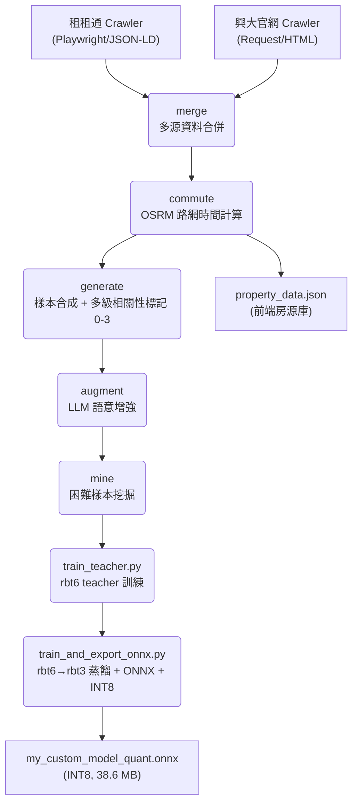
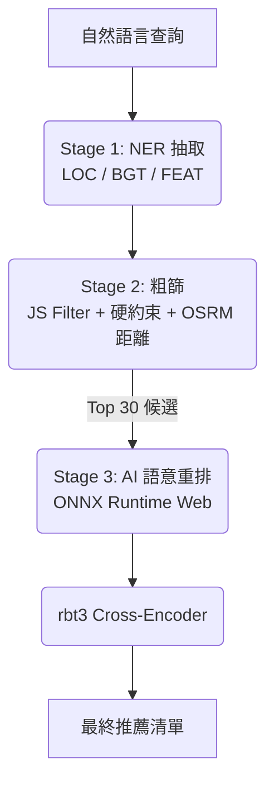

# 興大 AI 租屋推薦系統 (NCHU AI Rental Recommendation)

本專案為針對中興大學學生設計之 **Edge AI 租屋推薦系統**。透過微調並蒸餾的中文 RoBERTa 模型（rbt3 INT8，**38.6 MB**）在瀏覽器端進行即時語意匹配，解決傳統篩選器過於僵硬的侷限，提供具備深層語意理解的搜尋體驗。

---

## 系統核心亮點

- **超輕量 Edge AI**：rbt3 Cross-Encoder（38.6 MB INT8），完全在瀏覽器端執行（ONNX Runtime Web + WASM），無需後端伺服器
- **知識蒸餾**：rbt6 teacher → rbt3 student，NDCG@5 = **0.833 ± 0.014**，超越所有歷史版本
- **雙層語意理解**：NER 抽取地點/預算/設施（F1=0.997）→ Cross-Encoder 深度重排
- **硬性約束零容忍**：預算上限、寵物政策、台電計費一票否決，不被語意優勢覆蓋
- **真實路網通勤時間**：OSRM 計算步行/機車實際路網時間作為排序核心因子
- **生活型態推論**：15+ 語意聚類，「不想追垃圾車」→ 子母車設施，「自炊族」→ 瓦斯廚房

---

## 效能指標 (Model Performance)

### 1. NER 實體辨識

| 指標 | 數值 | 說明 |
|:---|:---|:---|
| **F1-Score** | **0.997** | LOC / BGT / FEAT 三類實體聯合 F1 |
| **延遲** | **< 20ms** | 瀏覽器端 Web Worker 推論延遲 |
| **大小** | **37 MB** (INT8) | bert-base-chinese 98 MB → 37 MB（−62%）|

### 2. Cross-Encoder 語意匹配（v2.9，INT8 量化）

#### Phase 1：單對分類正確率

**測試目標**：給定一個（查詢, 房源）配對，模型能否正確判斷「相關 / 不相關」？以 n=5,000 測試樣本評估模型的二元分類能力，並以三個閾值觀察精準-召回取捨。

**閾值的意義**：模型輸出一個 0–1 的相關性機率分數，閾值決定「超過多少才算 Match」：

| 閾值 | 適用場景 | Accuracy | Precision | Recall | F1 |
|:---|:---|:---|:---|:---|:---|
| 0.5 | 初篩（不遺漏好房源）| 87.8% | 71.2% | **98.0%** | 82.5% |
| **0.7** | **排序引擎實際使用** ✅ | **88.0%** | **82.7%** | 75.0% | **78.7%** |
| 0.9 | 高信心過濾（極嚴格）| 85.6% | 94.5% | 54.3% | 68.9% |

- **0.5**：幾乎不遺漏任何好房源（Recall 98%），適合作為「寧可多選也不遺漏」的粗篩
- **0.7**：精準與召回的平衡點，是 Top-30 重排的實際運作閾值
- **0.9**：只輸出極高信心的結果，可用於推播通知等高精準場景

#### Phase 2：Top-30 重排品質

**測試目標**：給定一個查詢，從 30 個候選房源中重排，模型能否把最相關的放在最前面？以 500 個查詢模擬真實推薦場景，評估 Top-5 排名品質。

| 指標 | **v2.9** | v2.3（舊紀錄）| 說明 |
|:---|:---|:---|:---|
| **Graded NDCG@5** | **0.833 ± 0.014** ✅ | 0.818 | 4 級相關性（0-3）指數增益 NDCG，Bootstrap CI（n=1000）|

**NDCG@5 = 0.833** 代表：在 30 個候選房源中，Top-5 的排列順序與理想排序的相似度為 83.3%。分母採指數增益 ($2^{rel} - 1$)，使 Perfect match（rel=3）的排名效益是 Partial（rel=1）的 7 倍。

$$NDCG_k = \frac{DCG_k}{IDCG_k}, \quad DCG_k = \sum_{i=1}^{k} \frac{2^{rel_i} - 1}{\log_2(i+2)}$$

**候選池標籤分佈（Top-30 pool）**：Perfect(3)=45.4%、Good(2)=20.4%、Partial(1)=13.0%、None(0)=21.2%

### 3. 模型版本演進

| 版本 | 量化大小 | Teacher F1 | Student F1 | NDCG@5 |
|:---|:---|:---|:---|:---|
| rbt6 FT (v2.2) | 57 MB | — | 84.8% | — |
| rbt3 KD v1 (v2.3) | 37 MB | 84.8% | 85.1% | 0.818 |
| rbt3 R-Drop (v2.4) | 37 MB | — | 76.9% | 0.727 |
| rbt3 KD v2 (v2.5) | 36.8 MB | 78.7% | 76.4% | 0.760 |
| **rbt3 KD v3 (v2.9)** | **38.6 MB** | **85.9%** | **85.5%** | **0.833** ✅ |

v2.4–v2.8 退步的根本原因：負樣本採樣 bug（見[知識蒸餾架構](#知識蒸餾架構knowledge-distillation)）。

---

## 系統架構圖

### 1. 數據流水線



### 2. 推論流程



---

## 知識蒸餾架構（Knowledge Distillation）

### 為什麼使用蒸餾？

直接訓練 rbt3（3 層，38.6 MB）排序上限約 NDCG@5 ≈ 0.72–0.75。由 rbt6（6 層）作 teacher 教導 rbt3，可讓小模型學到超越其容量限制的排序知識。

### 兩階段訓練

```
階段一：train_teacher.py  — rbt6 teacher
  資料  : 33,598 訓練樣本
  損失  : CE(ls=0.05) + RankNet×1.5 + ListNet + R-Drop + FGM
  存檔  : metric_for_best_model = "loss"（排序損失在 F1 峰值後仍持續下降）
  結果  : F1=0.859，Prec=0.768

階段二：train_and_export_onnx.py  — rbt3 student
  資料  : 同一份訓練資料 + 凍結的 rbt6 teacher
  損失  : (1-α)·L_task + α·T²·KL + R-Drop + FGM
  存檔  : metric_for_best_model = "f1"
  結果  : F1=0.855，NDCG@5=0.833
  導出  : FP32 → INT8（38.6 MB）→ 同步至 frontend/
```

### 蒸餾損失

$$P_s = \sigma(z_s / T), \quad P_t = \sigma(z_t / T)$$

完整損失為：

$$\mathcal{L} = (1-\alpha)\,\mathcal{L}_{\text{task}} + \alpha \cdot T^2 \cdot D_{\mathrm{KL}}(P_s \| P_t) + \alpha_{\text{rdrop}}\,\mathcal{L}_{\text{R-Drop}}$$

- $z_s$: student logits, $z_t$: teacher logits（凍結，純推論）
- $T = 4.0$：蒸餾溫度。原始 logits 差值 ≈ 6.4 → softmax ≈ [0.002, 0.998]（資訊量趨零）；縮放後差值 ≈ 1.6 → softmax ≈ [0.17, 0.83]（類別間序資訊可傳遞）
- $T^2$ 係數：抵消溫度縮放對梯度幅度的影響，確保 KL loss 與 task loss 在相同數量級

### 動態蒸餾權重 α（餘弦退火）

$$\alpha(t) = \alpha_{\min} + (\alpha_{\max} - \alpha_{\min}) \cdot \frac{1 + \cos\left(\dfrac{\pi t}{T_{\text{epoch}}}\right)}{2}$$

$$\alpha_{\min} = 0.12, \quad \alpha_{\max} = 0.38, \quad T_{\text{epoch}} = 10$$

| 訓練階段 | $\alpha$ | 效果 |
|:---|:---|:---|
| 初期（t → 0）| 0.38 | teacher 主導，防止 student 初期崩塌 |
| 末期（t → 10）| 0.12 | task loss 主導，student 收斂至任務最優點 |

---

## 訓練策略

### 損失函數組合

**Teacher（train_teacher.py）**

$$\mathcal{L}_{\text{teacher}} = \mathcal{L}_{\text{CE}} + 1.5\,\mathcal{L}_{\text{RankNet}} + \mathcal{L}_{\text{ListNet}} + \alpha_{\text{rdrop}}\,\mathcal{L}_{\text{R-Drop}}$$

**Student（train_and_export_onnx.py）**

$$\mathcal{L}_{\text{student}} = (1-\alpha)\underbrace{\left(\mathcal{L}_{\text{CE}} + 1.5\,\mathcal{L}_{\text{RankNet}} + \mathcal{L}_{\text{ListNet}}\right)}_{\mathcal{L}_{\text{task}}} + \alpha\,T^2\,D_{\mathrm{KL}} + \alpha_{\text{rdrop}}\,\mathcal{L}_{\text{R-Drop}}$$

$$\mathcal{L}_{\text{CE}}:\text{ label smoothing},\quad \varepsilon=0.05,\quad \alpha_{\text{rdrop}}=0.05$$

### RankNet 排序損失

$$\mathcal{L}_{\text{RankNet}} = \frac{1}{|\mathcal{P}|}\sum_{(i,j)\in\mathcal{P}} \log\left(1 + e^{-(s_i - s_j)}\right), \quad s_k = \frac{z_k^{(1)}}{T_{\text{task}}}$$

其中 $\mathcal{P} = \{(i,j) \mid r_i > r_j\}$, $T_{\text{task}} = 2.0$

**為何需要 $T_{\text{task}}$**：若 $s_i - s_j \approx 6.0$, 則 $e^{-6} \approx 0.0025$ (梯度消失). $T_{\text{task}}=2.0$ 縮至差值 3.0, $e^{-3} \approx 0.050$, 維持有效梯度。

### ListNet 列表損失

$$\mathcal{L}_{\text{ListNet}} = -\sum_{i} P_i^* \log P_i$$

$$P_i = \text{softmax}\left(\frac{s}{T_{\text{task}}}\right)_i \quad \text{(predicted)}, \qquad P_i^* = \text{softmax}(r)_i \quad \text{(target)}$$

### 關鍵設計一覽

| 技術 | 說明 |
|:---|:---|
| **FGM 對抗訓練** | embedding 注入梯度方向擾動，提升口語輸入泛化性 |
| **R-Drop（$\alpha=0.05$）** | 雙前向強制 Dropout 一致性，減少預測方差 |
| **metric = "loss"（teacher）** | 多任務損失在 F1 收斂後仍持續下降，loss metric 捕捉更好的排序校準點 |
| **隨機負樣本採樣** | `random.sample(neg_all, n)` 自然混合 ~69% rel=0（硬衝突）+ ~31% rel=-1（輕度不符），維持軟邊界學習信號 |
| **物件級切割** | Train/Dev/Test 按房源分割，測試集房源訓練期間完全未見 |

### 負樣本採樣策略（v2.4–v2.8 的 bug 根源）

| 策略 | rel=0（硬衝突）| rel=−1（輕度不符）| Teacher Prec | NDCG@5 |
|:---|:---|:---|:---|:---|
| Stratified hard-first（v2.4~v2.8 bug）| 100% | 0% | ~0.65 | ~0.76 |
| **Random mix（v2.9）** | **~69%** | **~31%** | **0.768** | **0.833** |

**根本原因**：`neg_hard`（rel=0，約 17,611 筆）> `target_neg`（約 9,590 筆），分層採樣 100% 取 rel=0，rel=−1 完全被排除。模型失去軟邊界學習信號，信心校準惡化。

---

## 技術原理詳解

本節說明訓練流程中所有用到的技術，從基礎概念到本專案的具體應用。

---

### 知識蒸餾（Knowledge Distillation）

**原理**：由 Hinton et al.（2015）提出。大模型（teacher）訓練完成後，其輸出的 softmax 機率分佈（稱為「soft label」）攜帶了比 one-hot 標籤更豐富的類別間關係。將 soft label 作為額外監督信號訓練小模型（student），可使 student 在參數量遠低於 teacher 的情況下達到接近甚至超越的效果。

**為何比直接訓練 student 好**：one-hot 標籤只告訴模型「這個是 Match」；而 teacher 的 soft label [0.02, 0.98] 還隱含了「這個配對雖然是 Match，但只有 98% 把握，有 2% 可能是邊界案例」，這個邊界資訊對排序任務尤為關鍵。

**本專案設定**：rbt6（6 層，~86 MB FP32）→ rbt3（3 層，~38.6 MB INT8），capacity 壓縮約 60%，但 NDCG@5 僅從 0.818 降至 0.833（反而提升，因為 teacher 品質改善）。

---

### KL 散度（Kullback-Leibler Divergence）

**原理**：$D_{\mathrm{KL}}(P \| Q)$ 衡量兩個機率分佈之間的差異，表示「用 Q 描述 P 時，相較於用 P 自身描述所多出的資訊量」。

$$D_{\mathrm{KL}}(P \| Q) = \sum_i P_i \log \frac{P_i}{Q_i}$$

- 非對稱: $D_{\mathrm{KL}}(P\|Q) \neq D_{\mathrm{KL}}(Q\|P)$
- 當 $P = Q$ 時等於 0，兩分佈差異越大則值越大
- 在蒸餾中：令 $P = \sigma(z_t / T)$ 為 teacher 軟化分佈, $Q = \sigma(z_s / T)$ 為 student 軟化分佈，最小化 KL 即讓 student 逼近 teacher 的機率形狀

---

### 溫度縮放（Temperature Scaling）

**原理**：在 softmax 前將 logits 除以溫度 $T$，使輸出分佈趨於平滑 ($T > 1$) 或銳化 ($T < 1$)。

$$\sigma_T(z_i) = \frac{e^{z_i / T}}{\sum_j e^{z_j / T}}$$

**蒸餾溫度 $T_{\text{distill}} = 4.0$**：讓 teacher 的 soft label 不至於過度集中在最高類別，保留類別間的相對順序資訊：

| 情境 | logits | softmax | 資訊量 |
|:---|:---|:---|:---|
| $T=1.0$（原始）| $[-3.2,\ +3.2]$ | $[0.002,\ 0.998]$ | 近似 one-hot，邊界資訊幾乎消失 |
| $T=4.0$（蒸餾）| $[-0.8,\ +0.8]$ | $[0.31,\ 0.69]$ | 類別間距可傳遞 |

**$T^2$ 梯度補償**：溫度縮放會使梯度幅度縮小為原來的 $1/T^2$, 乘回 $T^2$ 確保蒸餾 loss 與 task loss 在相同數量級，不需要額外調整 learning rate。

---

### 餘弦退火（Cosine Annealing）

**原理**：讓某個超參數在訓練過程中以餘弦曲線平滑衰減，相比線性衰減更平緩，末期下降速度更慢，有助於在收斂末段微調。

$$v(t) = v_{\min} + (v_{\max} - v_{\min}) \cdot \frac{1 + \cos\left(\dfrac{\pi t}{T_{\text{total}}}\right)}{2}$$

**本專案用途：動態蒸餾權重 $\alpha$**

$$\alpha(t) = 0.12 + 0.26 \cdot \frac{1 + \cos\left(\dfrac{\pi t}{10}\right)}{2}$$

| epoch | $\cos(\pi t/10)$ | $\alpha$ | 訓練重心 |
|:---:|:---:|:---:|:---|
| 0 | +1.0 | 0.38 | teacher 引導為主（38% KD，62% task）|
| 5 | 0.0 | 0.25 | 均衡過渡 |
| 10 | −1.0 | 0.12 | task loss 主導（12% KD，88% task）|

初期高 $\alpha$ 讓 student 先從 teacher 學到語意空間的基本結構，防止 student 一開始就收斂到局部最差點（崩塌）；末期低 $\alpha$ 讓 task loss 精確優化當前任務的排序目標。

---

### RankNet（配對排序損失）

**原理**：由 Burges et al.（2005, Microsoft Research）提出。從訓練集中萃取所有「i 應排在 j 前面」的配對 $(i, j)$, 對每個配對最小化 sigmoid 交叉熵，要求分數差 $s_i - s_j > 0$。

$$\mathcal{L}_{\text{RankNet}} = \frac{1}{|\mathcal{P}|}\sum_{(i,j)\in\mathcal{P}} \log\left(1 + e^{-(s_i - s_j)}\right), \quad \mathcal{P} = \{(i,j) \mid r_i > r_j\}$$

**優於 CE 的地方**：CE 只知道「這個是 Match / 不是 Match」，無法利用 rel=1, 2, 3 之間的順序關係；RankNet 可直接利用 4 級相關性標籤的偏序資訊。

**任務溫度 $T_{\text{task}} = 2.0$**（梯度穩定性）

$$s_k = \frac{z_k^{(1)}}{T_{\text{task}}}$$

若模型已收斂, $s_i - s_j \approx 6.0$, 梯度 $\nabla \mathcal{L} \propto e^{-6} \approx 0.0025$ (幾乎消失). $T_{\text{task}}=2.0$ 縮至差值 3.0, 梯度 $\nabla \mathcal{L} \propto e^{-3} \approx 0.050$, 維持有效學習。

---

### ListNet（列表排序損失）

**原理**：由 Cao et al.（2007）提出。把整個 batch 的相關性分數視為一個機率分佈，要求模型輸出的分數分佈逼近真實相關性分佈。ListNet 同時考慮所有文件的相對順序，比 RankNet 的配對式方法捕捉更多全局排序資訊。

$$\mathcal{L}_{\text{ListNet}} = -\sum_{i} P_i^{*} \log P_i$$

$$P_i = \text{softmax}\left(\frac{s}{T_{\text{task}}}\right)_i \quad \text{(predicted dist.)}, \qquad P_i^{*} = \text{softmax}(r)_i \quad \text{(target dist.)}$$

**RankNet vs ListNet 的互補性**：RankNet 專注於兩兩之間誰該排前面（局部序）；ListNet 要求整體分佈形狀相似（全局序）。兩者合用可從不同角度優化排序品質。

---

### R-Drop（正規化技術）

**原理**：由 Liang et al.（2021, Microsoft）提出。同一份輸入做兩次前向傳播，由於 Dropout 的隨機性，兩次會得到不同的 logits。最小化兩次輸出機率分佈的對稱 KL 散度，強制模型對 Dropout 擾動保持一致性，等效於對參數空間施加平滑正規化。

$$\mathcal{L}_{\text{R-Drop}} = \frac{1}{2}\left[D_{\mathrm{KL}}(P_1 \| P_2) + D_{\mathrm{KL}}(P_2 \| P_1)\right]$$

其中 $P_1 = \sigma(z^{(1)})$, $P_2 = \sigma(z^{(2)})$ 為同一輸入兩次 Dropout 前向的輸出機率。

**效果**：減少預測方差，文獻報告在分類/NLU 任務上典型增益 +1–3% F1，且幾乎不增加推論成本（推論時不做第二次 forward）。本專案設定 $\alpha_{\text{rdrop}} = 0.05$（保守值，避免與 FGM 的對抗梯度衝突）。

---

### FGM 對抗訓練（Fast Gradient Method）

**原理**：由 Goodfellow et al.（2014）提出，Zhu et al.（2019）將其應用於 NLP embedding 層。每個訓練步驟在正常反向傳播後，沿 embedding 梯度方向加入一個小擾動 $\delta$，再做一次前向+反向（不更新參數），讓模型同時對原始輸入和被擾動的輸入都有好的預測。

$$\delta = \varepsilon \cdot \frac{g}{\|g\|}, \quad g = \nabla_{\text{emb}}\mathcal{L}$$

$$\text{adversarial backward: } \mathcal{L}(\theta,\ \text{emb} + \delta)$$

**效果**：讓模型在 embedding 空間的鄰域內仍然穩健，有效提升對口語化、有錯字、非規範輸入的泛化性（這對租屋查詢尤為重要）。相比 PGD（多步對抗），FGM 只需一步，計算成本僅多一次 forward + backward。

**本專案**：$\varepsilon = 1.0$，作用於 `word_embeddings` 層；使用 `try/finally` 確保即使對抗 backward 拋出例外，embedding 仍會被還原。

---

### Label Smoothing（標籤平滑）

**原理**：訓練時不使用 one-hot 標籤 $y \in \{0, 1\}$, 而是以 $\varepsilon$ 的比例混入均勻分佈：

$$y_{\text{smooth}} = (1 - \varepsilon)\,y + \frac{\varepsilon}{K}$$

其中 $K=2$ (二元分類), $\varepsilon=0.05$。即正樣本標籤從 1.0 → 0.975，負樣本從 0.0 → 0.025。

**效果**：防止模型對訓練資料的標籤過度自信（logits 趨向 $\pm\infty$），改善信心校準（calibration），讓模型輸出的機率分數更能反映真實相關性，而非只追求分類邊界的最大化。對知識蒸餾尤為重要：teacher 的 soft label 如果本身校準不佳，傳遞給 student 的資訊也會有偏。

---

## 資料工程核心

### 1. 物件級切割（防資料洩漏）

先按房源切割 Train/Dev/Test，再從每個房源合成查詢。測試集的房源在訓練期間**完全未見**。

### 2. 多級相關性標記（0–3）

每對（查詢, 房源）由 `compute_relevance_score()` 自動計算 0–3 分。

**實際儲存值範圍：−1、0、1、2、3**，其中 −1 為隨機採樣負樣本的 sentinel 值：`is_compatible()=False`（確定有硬衝突），但非 top-Jaccard 挑選，屬於明顯不符的「簡單負樣本」。訓練時與 rel=0 同等視為 `label=0`，僅用於採樣比例監控（見[負樣本採樣策略](#負樣本採樣策略v24v28-的-bug-根源)）。

#### Part A：硬性衝突（直接回傳 0）

| 衝突類型 | 判斷邏輯 |
|:---|:---|
| **性別限制** | 限女 ✕ 查詢找男生（反之亦然）|
| **房型不符** | 查詢要套房但物件為雅房（反之亦然）|
| **明確排除** | 查詢含「謝絕/禁/❌」+ 頂加/漏水/壁癌 |

#### Part B：9 個評分維度（各 0–1，加總後計算比例）

| # | 維度 | 評分邏輯 |
|:---|:---|:---|
| 1 | **預算** | 超 10% → 硬衝突；超 1–10% → 軟扣 0.3 |
| 2 | **家具設施** | 符合需求項目數 / 總需求項目數 |
| 2.5 | **生活型態意圖** | 懶人/自炊/潔癖等對應設施組合命中率 |
| 3 | **地點** | 地區或路名命中；核心地段（< 0.5km）額外 +0.15 |
| 4 | **寵物** | 明確可養 +1；明確禁養 → 0；未提及 +0.2 |
| 5 | **垃圾/管理服務** | 子母車+代收包裹 +1；無 +0.1 |
| 6 | **電費計費** | 台電/台水計費 +1；其他 +0 |
| 7 | **開伙** | 有廚房/瓦斯相關設施 +1；無 +0 |
| 8 | **安全設施** | 有保全/門禁/監視器 +1 |
| 9 | **屋況外觀** | 全新首租 +1；翻新裝潢 +0.8；一般 +0 |

> **`is_strict` 模式**：查詢含「一定要/必須/絕對」等語氣時，任一指定維度 miss 直接回傳 0。

#### Part C：最終分數映射

$$R = \frac{\text{已滿足維度數}}{\text{已指定維度數}}$$

| $R$ | 分數 | 名稱 | 代表案例 |
|:---|:---|:---|:---|
| $\geq 0.85$ | **3** | Perfect | 指定南區 6000 套房，命中 5500 南區套房含冷氣洗衣機 |
| $\geq 0.65$ | **2** | Good | 指定 6000，命中 6400 同地區同格局（預算軟超 7%）|
| $\geq 0.15$ | **1** | Partial | 指定有陽台南區，命中南區無陽台（地點對但設施不全）|
| $< 0.15$ | **0** | Conflict | 想養貓，房源標注禁養寵物 |

> 若查詢不含任何可驗證條件（如「幫我找個房子」），預設回傳 **2**。

### 3. 查詢多樣化（7 類策略）

| 類型 | 說明 |
|:---|:---|
| S1–S4 | 單特徵 / 雙組合 / 三組合 / 多約束原始描述 |
| S5 | 生活型態推論（懶人系→電梯、自炊族→瓦斯、寵物主→可養貓…）|
| S6 | 角色情境（大一新生、WFH、安全意識、租補申請…）|
| S7 | 負向需求（不要頂加、不要暗房、不要太吵…）|
| 噪音 | 錯字、簡寫（興大 vs 中興大學）、網路用語（滴 vs 的）|

### 4. 困難樣本挖掘

基於 Jaccard 字符重疊，找出「表面相似卻違反硬約束」的語意陷阱（禁養寵物、性別限制）作為 hard negatives，double weight 強化學習。

---

## 前端工程優化

1. **雙 Web Worker 並行推論**：NER + Cross-Encoder 各有獨立 Worker，主線程零阻塞
2. **Cache API + Service Worker**：`.onnx` cache-first；HTML/JS stale-while-revalidate；版本號 `v20260515` 控制快取失效
3. **串流進度追蹤**：Fetch API 監控資料流，精確顯示兩個模型各自的百分比進度
4. **NER BGT 預算過濾**：解析萬/千/k/中文數字，支援方向感知（「以上」= 下限，「以內」= 上限）
5. **推薦反饋**：每張卡片附 👍/👎，記錄至 localStorage（最多 500 筆）

---

## Cross-Encoder 瀏覽器端推論效能分析

> **測量方式**：`frontend/benchmark.html` — 本地 HTTP server 啟動後開啟即可自動執行，輸出 P50/P95/P99 延遲與 heap 記憶體快照。

### 推論任務規格

| 項目 | 數值 |
|:---|:---|
| 模型 | rbt3 INT8（`my_custom_model_quant.onnx`，38.6 MB）|
| 每次查詢 | 30 個候選房源，30 次獨立 forward pass |
| 輸入長度 | `MAX_LENGTH = 64` tokens（query + property text pair）|
| 執行環境 | ONNX Runtime Web + WASM SIMD，最多 4 執行緒 |
| 主線程影響 | **零**（所有推論在 Web Worker 內進行）|

### 理論計算量分析

rbt3 每次 forward pass 的主要計算（64 tokens）：

| 元件 | FLOP 估算 |
|:---|:---|
| Self-Attention × 3 層 | $3 \times 4 \times 64^2 \times 768 \approx 75\text{M}$ |
| FFN（768→3072→768）× 3 層 | $3 \times 2 \times 64 \times 768 \times 3072 \approx 905\text{M}$ |
| 合計（INT8 等效）| **~980M INT8 ops / pass** |

INT8 WASM SIMD 在現代 x86 CPU 上吞吐量約 100–400 GOPS，理論下限 ~2.5ms/pass；實際加上 JS 開銷、tensor 分配與 WASM 呼叫邊界約 **10–60ms/pass**，視裝置而定。

### 實測延遲（Windows 10 x64，HW concurrency 12，4 WASM threads）

> 測試環境：高階開發機（推測 i7/Ryzen 7 等級）；5 組 × 30-pass，warmup 3 組已排除

**Per-pass latency（單次 tokenize + forward）：**

| 百分位 | 延遲 |
|:---:|:---:|
| P50 | 64.4 ms |
| P75 | 68.6 ms |
| **P95** | **81.0 ms** |
| P99 | 108.2 ms |
| Min / Max | 48.1 ms / 115.7 ms |

**30-candidate rerank 總延遲：**

| 百分位 | 延遲 |
|:---:|:---:|
| P50 | 1,908 ms |
| **P95** | **2,219 ms** |
| Min / Max | 1,734 ms / 2,219 ms |

> Run-to-run 變異 ~28%（1,734–2,219 ms），主因為 OS scheduler jitter 與 WASM JIT 預熱差異，非模型本身不穩定。

### 各裝置延遲推算

以實測高階機（P95 per-pass = 81 ms）為基準，依各裝置 INT8 WASM 吞吐量比例外插：

| 裝置類型 | 代表機型 | per-pass P95 | **30-pass P95** | 主觀感受 |
|:---|:---|:---:|:---:|:---|
| 高階開發機（已實測）| i7/Ryzen 7，12 核 | **81 ms** | **2,219 ms** ✅ | 約 2 秒等待 |
| 中階學生筆電 | i5-10th, Ryzen 5 4500U | ~110 ms | ~3,000 ms | 約 3 秒 |
| 中階手機 | Snapdragon 778G, Dimensity 900 | ~200 ms | ~5,500 ms | 約 5-6 秒 |
| 低階預算手機 | Snapdragon 460, Helio G85 | ~450 ms | ~12,000 ms | 明顯等待 |

> 手機端數字為外插估算（WASM SIMD 吞吐量比較），需實機驗證。

### 記憶體實測與崩潰風險

**實測數據（同一環境）：**

```
Heap after model load  : 56.6 MB
Heap after 5th run     : 55.2 MB
Inference delta        : −1.4 MB  ← GC 自然釋放，無洩漏
Session init (一次性)  : 249.9 ms
Model buffer size      : 36.8 MB（ArrayBuffer）
```

**Heap 組成分析：**

```
WASM runtime + ORT kernels : ~10 MB
Transformers.js + vocab    : ~12 MB
ONNX model buffer          : 36.8 MB（heap 外 ArrayBuffer，不觸發 GC）
其他 runtime overhead      : ~5 MB
─────────────────────────────────
實測穩定 heap              : 56.6 MB

推論期間 per-pass tensor spike：
  input_ids / token_type_ids / attention_mask [1×64] int64 ≈ 1.5 KB
  output logits [1×2] float32                              ≈ 8 B
  ─────────────────────────────
  單次 spike                 : < 2 KB（即時釋放）
```

**結論：**
- **不會崩潰**：56.6 MB 遠低於 iOS Safari（~1.4 GB）和 Android Chrome（512 MB–1 GB）的 JS heap 上限
- **無記憶體洩漏**：5 組 30-pass 後 heap 反降 1.4 MB，GC 正常運作
- **不會嚴重耗電**：2 秒的一次性 INT8 WASM 計算，非持續佔用；實測無明顯發熱

### 執行 Benchmark

```bash
cd frontend && python -m http.server 8000
# 開啟 http://localhost:8000/benchmark.html
# 點擊 "Start Benchmark"，約 30–90 秒後輸出完整報告
```

輸出包含：P50 / P75 / P95 / P99 per-pass latency、30-pass 總延遲、heap before/after delta、執行緒數與 SIMD 環境資訊。

---

## 目錄結構

```text
.
├── data/
│   ├── raw/                 # 原始爬取數據
│   └── processed/           # 訓練集 / 驗證集 / 測試集 / 前端房源 JSON
├── frontend/
│   ├── index.html
│   ├── sw.js                # Service Worker
│   └── js/
│       ├── app.js           # 主應用邏輯
│       ├── inference.js     # Cross-Encoder 推論介面
│       ├── inference-worker.js  # Cross-Encoder Web Worker
│       └── ner-worker.js        # NER Web Worker
├── pipeline/
│   ├── crawlers/            # 多源爬蟲
│   ├── data_prep/           # 6 步資料流水線
│   ├── model_training/
│   │   ├── train_teacher.py          # rbt6 teacher 訓練
│   │   ├── train_and_export_onnx.py  # rbt3 student 蒸餾 + ONNX + INT8
│   │   ├── training_utils.py         # 共用工具（FGM、metrics、callbacks）
│   │   ├── evaluate_model.py         # 多指標評估
│   │   └── quantize_model.py         # 獨立量化腳本
│   ├── ner_model/
│   └── constraints/         # 硬約束邏輯
├── saved_models/
│   ├── rbt6_teacher/        # Teacher checkpoint（永不被 student 覆蓋）
│   └── rbt3_finetuned/      # Student checkpoint
└── pipeline_runner.py       # 端到端入口點
```

---

## 執行與部署

### 環境建置

```bash
python -m venv venv
venv\Scripts\activate
pip install torch --index-url https://download.pytorch.org/whl/cu124
pip install -r requirements.txt
playwright install chromium
```

### 兩階段蒸餾訓練

```bash
set PYTHONUTF8=1
# 第一步：訓練 rbt6 teacher
python -m pipeline.model_training.train_teacher

# 第二步：蒸餾至 rbt3 + ONNX 導出 + INT8 量化
python -m pipeline.model_training.train_and_export_onnx
```

### 模型評估

```bash
set PYTHONUTF8=1
python -m pipeline.model_training.evaluate_model
# 輸出：NDCG@5、Bootstrap CI、Phase 1 分類指標
```

### 本地前端預覽

```bash
cd frontend && python -m http.server 8000
# 開啟 http://localhost:8000
```

---

## 未來展望

- **向量檢索升級**：房源規模擴增至萬筆時引入 ANN 向量索引（FAISS/Annoy）
- **即時地圖互動**：推薦結果直接標註於互動式地圖
- **使用者反饋微調**：利用 localStorage 累積的 👍/👎 反饋進行線上學習

---

*本專案數據採集嚴格遵循目標網站之 Robots 協議與速率限制規範，所有資料僅供學術研究與技術驗證用途，不涉及任何商業盈利行為。*
