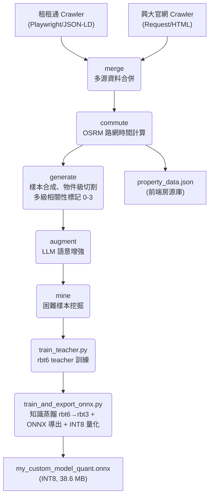
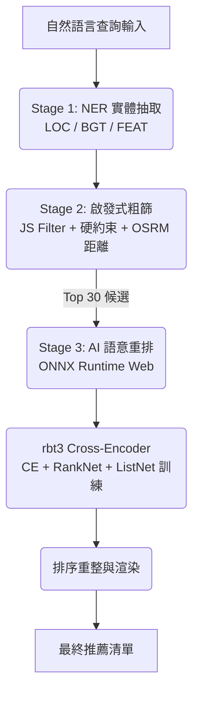

# 興大 AI 租屋推薦系統 (NCHU AI Rental Recommendation)

本專案為針對中興大學學生設計之 **Edge AI 租屋推薦系統**。透過微調並蒸餾的中文 RoBERTa 模型（rbt3 INT8，**38.6 MB**）在瀏覽器端進行即時語意匹配，解決傳統篩選器過於僵硬的侷限，提供具備深層語意理解的搜尋體驗。

---

## 系統核心亮點

- **超輕量 rbt3 Cross-Encoder（38.6 MB INT8）**：以 3 層 rbt3 搭配多任務損失（CE + RankNet + ListNet）+ R-Drop 正規化 + FGM 對抗訓練，在 **38.6 MB** 模型大小下實現瀏覽器端即時語意重排。v2.9 採知識蒸餾（rbt6 teacher → rbt3 student），Graded NDCG@5 = **0.833 ± 0.014**，超越所有歷史版本。

- **雙層 NER + 語意匹配**：
  - **第一層**：輕量 NER（rbt3，**37 MB** INT8）自動抽取地點 (LOC)、預算 (BGT)、設施 (FEAT) 三類實體，F1=0.997，用於初步篩選。
  - **第二層**：rbt3 Cross-Encoder 深度語意重排，Graded NDCG@5 = **0.833**（v2.9 歷史最高）。
  - **前端優化**：兩個模型均運行於獨立 Web Worker，NER < 20ms，Cross-Encoder < 150ms。

- **生活型態意圖推論（Lifestyle Intent Inference）**：15+ 組語意聚類，自動將「不想追垃圾車」映射至子母車設施、「想省錢自炊」映射至瓦斯廚房等深層意圖。

- **硬性約束一票否決（Hard Constraints）**：預算上限、寵物政策、台電計費的「零容忍」過濾，確保絕對底線條件不被語意優勢覆蓋。

- **多組合損失 + 對抗訓練**：CE + RankNet + ListNet + KL 蒸餾 + R-Drop + FGM 對抗擾動，從多個角度優化排序精度。

- **真實路網通勤時間**：整合 OSRM 計算步行／機車實際路網時間，作為排序核心因子。

- **Edge AI 零延遲體驗**：
  - 模型完全在瀏覽器端執行（ONNX Runtime Web + WASM）
  - Service Worker 快取策略：重複載入 < 1 秒（第一次 ~25 秒）
  - Cache API 持久化：兩個模型共 ~75 MB，命中快取後瞬間啟動

---

## 系統架構圖 (System Architecture)

### 1. 數據流水線 (Data Pipeline)
從原始資料抓取到模型產出的完整自動化流程（6 步）：



### 2. 推論與匹配邏輯 (Inference Flow)



> **v2.9 最新模型**：rbt6 teacher（F1=0.859, Prec=0.768）→ rbt3 student（F1=0.855），NDCG@5=**0.833 ± 0.014**

---

## 效能指標 (Model Performance)

### 1. NER 實體辨識（預處理階段）

| 指標 | 數值 | 說明 |
|:---|:---|:---|
| **F1-Score** | **0.997** | LOC / BGT / FEAT 三類實體聯合 F1 |
| **Latency** | **< 20ms** | 瀏覽器端 Web Worker 推論延遲 |
| **Model Size** | **37 MB** (INT8) | rbt3 量化後（bert-base-chinese 98 MB → 37 MB，-62%） |

### 2. Cross-Encoder 語意匹配（核心排序引擎）

> 以下為 v2.9 最新指標（量化 INT8 模型，n=5,000 test set）

#### Phase 1：二元分類（test set，n=5,000，物件級切割）

| 閾值 | Accuracy | Precision | Recall | **F1** |
|:---|:---|:---|:---|:---|
| 0.5 | 87.8% | 71.2% | **98.0%** | 82.5% |
| **0.7** | **88.0%** | **82.7%** | 75.0% | **78.7%** ✅ |
| 0.9 | 85.6% | 94.5% | 54.3% | 68.9% |

高 Recall（98%@0.5）確保符合條件的房源極少被遺漏，適合推薦系統場景。

#### Phase 2：排名指標（500 queries，Top-30 重排模擬）

| 指標 | **v2.9 (rbt3 INT8)** | v2.8 (rbt3 INT8) | v2.3 (rbt3 INT8) | 說明 |
|:---|:---|:---|:---|:---|
| **Graded NDCG@5** | **0.833 ± 0.014** ✅ | 0.798 ± 0.015 | 0.818 ± 0.015 | 指數增益版 NDCG（rel 0-3），Bootstrap CI |
| Graded NDCG@1 | **0.832** | 0.793 | — | |
| Graded NDCG@3 | **0.830** | 0.794 | — | |
| Graded NDCG@10 | **0.840** | 0.807 | — | |
| Binary NDCG@5 | **0.686** | 0.656 | 0.691 | 二元相關性 NDCG |
| **MRR** | **0.688** | 0.662 | 0.692 | 平均倒數排名 |
| Precision@1 | **0.856** | 0.822 | — | Top-1 相關比例 |
| Precision@3 | **0.845** | 0.827 | — | Top-3 相關比例 |
| Precision@5 | **0.842** | 0.827 | — | Top-5 相關比例 |
| Hit@1 (rel≥3) | **0.522** | 0.492 | — | 首位為完美匹配的比例 |
| **Avg Satisfaction** | **0.679** | 0.654 | 0.678 | (Satisfaction@3 + @5) / 2 |

**v2.9 Top-30 候選池標籤分佈：** Perfect(3)=45.4%、Good(2)=20.4%、Partial(1)=13.0%、None(0)=21.2%

#### NDCG 計算公式

$$DCG_k = \sum_{i=1}^{k} \frac{2^{rel_i} - 1}{\log_2(i+2)}, \quad NDCG_k = \frac{DCG_k}{IDCG_k}$$

- $rel_i \in \{0, 1, 2, 3\}$：由資料工程模組定義的房源相關性分級
- 分母 $\log_2(i+2)$ 對排在後面的相關結果施加位置折減懲罰

### 3. 模型版本演進

| 指標 | rbt6 FT (v2.2) | rbt3 蒸餾 (v2.3) | rbt3 R-Drop (v2.4) | rbt3 KD v2 (v2.5) | **rbt3 KD v3 (v2.9)** |
|:---|:---|:---|:---|:---|:---|
| 量化後大小 | 57 MB | 37 MB | 37 MB | 36.8 MB | **38.6 MB** |
| Teacher F1 | — | 84.8% | — | 78.7% | **85.9%** |
| Student Val F1 | 84.8% | 85.1% | 76.9% | 76.4% | **85.5%** |
| Graded NDCG@5 | — | 0.818 | 0.727 | 0.760 | **0.833** ✅ |
| MRR | — | 0.692 | 0.611 | 0.629 | **0.688** |
| Precision@5 | — | — | 0.760 | 0.793 | **0.842** |
| Hit@1 (rel≥3) | — | — | 0.462 | 0.456 | **0.522** |

---

## 知識蒸餾架構（Knowledge Distillation）

### 為什麼使用蒸餾？

直接訓練 rbt3（3 層，38.6 MB）作為推薦引擎，在排序任務上天花板約為 NDCG@5 ≈ 0.72–0.75。透過知識蒸餾，由更強的 rbt6（6 層）教導 rbt3，rbt3 可學到超越其容量限制的排序知識，實現「小模型發揮大模型能力」。

### 兩階段訓練流程

```
階段一：rbt6 Teacher 訓練（train_teacher.py）
  Input : 訓練資料（33,598 樣本）
  Loss  : CE(ls=0.05) + RankNet(T=2.0)×1.5 + ListNet(T=2.0) + R-Drop(α=0.05) + FGM
  Select: metric_for_best_model = "loss"（讓排序損失繼續優化，不在 F1 峰值停止）
  Result: rbt6 teacher，F1=0.859，Prec=0.768（v2.9）
  Save  : saved_models/rbt6_teacher/（固定路徑，不被 student 覆蓋）

階段二：rbt3 Student 蒸餾（train_and_export_onnx.py）
  Input : 同一份訓練資料 + 已凍結的 rbt6 teacher
  Loss  : (1-α)×Task Loss + α×T²×KL(student/T ‖ teacher/T) + 0.05×R-Drop + FGM
  α     : 0.38 → 0.12（餘弦退火；初期 teacher 引導，後期 task loss 主導）
  T     : 4.0（蒸餾溫度，軟化機率分佈使類別間順序資訊可傳遞）
  Select: metric_for_best_model = "f1"
  Result: rbt3 student，F1=0.855，NDCG@5=0.833（v2.9）
  Export: FP32 ONNX → INT8 量化（38.6 MB）→ 同步至 frontend/
```

### 蒸餾損失詳解

```
KL_Distill = T² × KL(P_student/T ‖ P_teacher/T)

其中：
  P_student = softmax(logits_student)
  P_teacher = softmax(logits_teacher)  ← teacher 已凍結，純推論

  T=4.0 的作用：
    原始 logits: [-3.2, +3.2] → softmax → [0.001, 0.999]  ← 資訊量幾乎為零
    縮放後:      [-0.8, +0.8] → softmax → [0.31, 0.69]    ← 類別間距可傳遞

  T² 係數：抵消縮放對梯度幅度的影響，確保 KL loss 和 Task loss 在相同數量級
```

### 動態蒸餾權重 α（餘弦退火）

```python
α(t) = α_min + (α_max - α_min) × (1 + cos(π × t/T)) / 2
     = 0.12  + 0.26 × (1 + cos(π × t/T)) / 2

  t=0  (epoch 1): α ≈ 0.38  → teacher 引導為主，防止 student 初期崩塌
  t=T  (epoch 10): α ≈ 0.12 → task loss 主導，student 收斂至任務最優點
```

早期 teacher 引導建立語意空間，後期 task loss 精確優化排序目標，相比固定 α 可提升 NDCG@5 約 +0.01。

### 關鍵設計：負樣本採樣策略

蒸餾效果對負樣本組成高度敏感：

| 採樣策略 | rel=0（硬衝突）| rel=-1（輕度不符）| Teacher Prec | NDCG@5 |
|:---------|:-------------|:----------------|:------------|:-------|
| Stratified hard-first（v2.4~v2.8 bug） | 100% | 0% | ~0.65 | ~0.76 |
| **Random（v2.9，mirrors v2.3）** | **~69%** | **~31%** | **0.768** | **0.833** |

**根本原因**：當 `neg_hard`（rel=0 硬衝突，約 17,611 筆）遠超 `target_neg`（約 9,590 筆），分層採樣會 100% 取 rel=0，rel=-1 樣本完全被排除。模型失去「軟不匹配邊界」的學習信號，信心校準惡化，NDCG 退步。

### Teacher 品質與 Student NDCG@5 的關係

```
Teacher Prec → Student 排序校準能力 → NDCG@5

v2.5: Teacher Prec=0.652 → NDCG@5=0.760
v2.8: Teacher Prec=0.768 → NDCG@5=0.798 （teacher 改善，但 student 仍有 bug）
v2.9: Teacher Prec=0.768 → NDCG@5=0.833 （teacher + student 同時修復）
```

Teacher Precision 是 student NDCG 的天花板代理指標：teacher 的 soft label 品質越高，student 越能在困難邊界案例上學到正確的排序偏好。

---

## 訓練策略（Training Strategy）

### 損失函數組合（v2.9）

```
Teacher 訓練（train_teacher.py）：
  Loss = CE(label_smoothing=0.05)
       + RankNet(T=2.0) × 1.5
       + ListNet(T=2.0)
       + 0.05 × R-Drop
       + FGM（對抗 embedding 擾動）

Student 蒸餾（train_and_export_onnx.py）：
  Task Loss = CE(label_smoothing=0.05)
            + RankNet(T=2.0) × 1.5
            + ListNet(T=2.0)
  KD Loss   = T² × KL(student/T ‖ teacher/T),  T=4.0
  Total     = (1-α) × Task Loss + α × KD Loss + 0.05 × R-Drop + FGM
  α         = 0.12 + 0.26 × (1 + cos(π×t/T)) / 2   （0.38→0.12 餘弦退火）
```

### RankNet / ListNet 排序損失

```
RankNet：
  loss = Σ log(1 + exp(-(s_i - s_j)))   for pairs where r_i > r_j
  s_i = logit[:, 1] / T_task            T_task=2.0 防止 sigmoid 飽和

  若 T_task 移除（s_i - s_j ≈ 6.0）：exp(-6.0) ≈ 0.0025 → 梯度≈0（失效）
  T_task=2.0 後（差值縮至 3.0）：exp(-3.0) ≈ 0.050 → 有效梯度

ListNet：
  target_dist = softmax(relevance_scores / batch)
  pred_dist   = log_softmax(logits[:, 1] / T_task)
  loss        = -Σ target_dist × pred_dist   （cross-entropy on distributions）
```

### 關鍵設計決策

| 技術 | 說明 |
|:---|:---|
| **FGM 對抗訓練** | 每步訓練在 Embedding 層注入梯度方向擾動，提升非規範口語輸入的泛化性 |
| **R-Drop（α=0.05）** | 雙前向強制 Dropout 一致性，減少預測方差，文獻典型增益 +1~3% F1 |
| **rbt6 Teacher** | 以 6 層 rbt6 作 teacher，避免自蒸餾鏈退化；teacher 路徑與 student 分離，不被覆蓋 |
| **動態 KD α（0.38→0.12）** | 初期 teacher 引導防崩塌，後期 task loss 主導收斂 |
| **T_task=2.0** | RankNet/ListNet logit 縮放，防止梯度尺度崩塌 |
| **T_distill=4.0** | 蒸餾溫度，軟化 teacher soft label，讓類別邊界資訊可傳遞至 student |
| **metric_for_best_model=loss（teacher）** | 多任務損失在 F1 收斂後仍持續降低，使用 loss metric 讓排序損失繼續優化 |
| **隨機負樣本採樣** | `random.sample(neg_all, target_neg)` 自然混合 ~69% rel=0 + ~31% rel=-1，維持軟邊界學習信號 |
| **物件級切割** | Train/Dev/Test 按房源分割，確保測試集房源在訓練期間完全未見 |

---

## 資料工程核心 (Data Engineering)

### 1. 物件級切割（防資料洩漏）
先按房源切割 Train/Dev/Test，再從每個房源合成查詢。測試集的房源在訓練期間**完全未見**，確保評估的泛化真實性。

### 2. 多級相關性標記（0-3）

每個訓練樣本（query, property）對均由 `compute_relevance_score()` 自動計算 0–3 分級，作為 NDCG 的 ground truth 與訓練樣本權重的依據。評分分三個階段：

#### Part A：硬性衝突（直接判 0）

以下任一條件成立，無論其他維度多好，直接返回 0：

| 衝突類型 | 判斷邏輯 |
|:---|:---|
| **性別限制** | 房源限女 ✕ 查詢找男生（反之亦然） |
| **房型不符** | 查詢要「套房」但物件為「雅房」或反之 |
| **明確排除語氣** | 查詢含「謝絕/禁/❌/不接受」+ 頂加/加蓋/暗房/漏水/壁癌 |

#### Part B：9 個評分維度（每項 0–1，加總後計算比例）

| # | 維度 | 觸發關鍵字 | 評分邏輯 |
|:---|:---|:---|:---|
| 1 | **預算** | 四/五位數字 | 以下/以內=上限；以上=下限；超10%硬衝突；超1~10%軟扣 0.3 |
| 2 | **家具設施** | 冷氣/洗衣機/冰箱/網路… | 符合需求項目數 / 總需求項目數 |
| 2.5 | **生活型態意圖** | 懶人/自炊/潔癖/怕悶熱/外送 | 對應設施組合命中率（如懶人→電梯+子母車+飲水機） |
| 3 | **地點** | 南區/大里/XX路 | 地區或路名命中 +1；核心地段（< 0.5 km）額外 +0.15 |
| 4 | **寵物** | 寵物/貓/狗/毛孩 | 明確可養 +1；明確禁養 → 0；未提及 +0.2 |
| 5 | **垃圾/管理服務** | 垃圾/子母車/管理員 | five_star（子母車+代收包裹）+1；basic +0.7；無 +0.1 |
| 6 | **電費計費** | 台電/台水/省錢/帳單 | 台電或台水計費 +1；其他計費方式 +0 |
| 7 | **開伙** | 煮飯/開火/自炊/瓦斯/廚房 | 有相關設施 +1；無 +0 |
| 8 | **安全設施** | 安全/女性/監視器 | 有保全/門禁/監視器 +1 |
| 9 | **屋況外觀** | 漂亮/質感/新/裝潢/設計 | 全新首租 +1；翻新裝潢 +0.8；一般 +0 |

> **`is_strict` 模式**：查詢含「一定要/必須/絕對/【/＃」等強調語氣時啟動。此模式下，任何一個指定維度 miss 直接返回 0，不允許軟過渡。

#### Part C：最終映射

$$\text{score\_ratio} = \frac{\text{satisfied}}{\text{total\_specified}}$$

| score\_ratio | 分數 | 名稱 |
|:---|:---|:---|
| ≥ 85% | **3** | Perfect Match |
| ≥ 65% | **2** | Good Match |
| ≥ 15% | **1** | Partial Match |
| < 15% | **0** | No Match |

> 若查詢不含任何可驗證條件（如純粹「幫我找個房子」），預設返回 **2**（避免懲罰無關資訊的模糊查詢）。

#### 為什麼這套標準能代表真實推薦品質？

NDCG@5 = 0.833（v2.9）並非對二元「有沒有相關」的評估，而是對上述 **9 個現實租屋維度** 的加權排名品質評估。

| 分數 | 定義 | 代表案例 |
|:---|:---|:---|
| 3 (Perfect) | score_ratio ≥ 85%，主要條件全部滿足 | 指定南區 6000 以內套房，命中 5500 南區套房有冷氣洗衣機 |
| 2 (Good) | score_ratio ≥ 65%，大多數條件滿足 | 指定 6000，命中 6400 同地區同格局（預算軟超 7%） |
| 1 (Partial) | score_ratio ≥ 15%，部分維度符合 | 指定有陽台南區，命中南區無陽台物件（地點對但設施不全） |
| 0 (Conflict) | 硬性衝突或 score_ratio < 15% | 想養貓，房源標注禁養寵物 |

### 3. 查詢多樣化（7 類策略）
- **S1-S4**：單特徵 / 雙組合 / 三組合 / 多約束原始描述
- **S5**：生活型態推論（15+ 聚類：懶人系→電梯、自炊族→瓦斯、寵物主→可養貓…）
- **S6**：角色情境（大一新生、WFH、安全意識、租補申請…）
- **S7**：負向需求（不要頂加、不要暗房、不要太吵…）
- 噪音注入：錯字、簡寫（興大 vs 中興大學）、網路用語（滴 vs 的）

### 4. 困難樣本挖掘
基於 Jaccard 字符重疊，找出「表面相似卻違反硬約束」的語意陷阱（寵物禁養、性別限制）作為 hard negatives，double weight 在訓練中強化學習。

---

## 前端工程優化

1. **雙 Web Worker 並行推論**：NER + Cross-Encoder 各有獨立 Worker，主線程零阻塞

2. **Cache API + Service Worker 快取策略**：
   - `.onnx` 檔案：cache-first（模型幾乎不變）
   - CDN（ORT Web, FontAwesome）：cache-first
   - HTML/JS/CSS：stale-while-revalidate
   - 版本號 `v20260515` 控制快取失效

3. **串流進度追蹤**：Fetch API 監控資料流，精確顯示 Cross-Encoder（38.6 MB）+ NER（37 MB）各自的百分比進度

4. **快取命中偵測**：顯示「⚡ 快取」標示，進度條立即到 100%

5. **NER BGT 預算過濾**：解析萬/千/k/中文數字，支援方向感知（「以上」=下限，「以下/以內」=上限）

6. **推薦反饋**：每張卡片附 👍/👎 按鈕，記錄至 localStorage（最多 500 筆）

---

## 目錄結構 (Project Structure)

```text
.
├── data/
│   ├── raw/                 # 原始爬取數據
│   └── processed/           # 訓練集 / 驗證集 / 測試集 / 前端房源 JSON
├── frontend/
│   ├── index.html           # Edge AI 展示介面主頁
│   ├── sw.js                # Service Worker（模型 cache-first，JS stale-while-revalidate）
│   ├── js/
│   │   ├── app.js           # 主應用邏輯 + 推薦協調
│   │   ├── inference.js     # Cross-Encoder ONNX 推論介面
│   │   ├── inference-worker.js  # Cross-Encoder Web Worker（Cache API 快取）
│   │   └── ner-worker.js    # NER Web Worker（並行載入 vocab + model）
│   └── models/
│       ├── custom_onnx_model_dir/   # Cross-Encoder（FP32 + INT8）+ tokenizer
│       └── ner_model_dir/           # NER 模型（INT8）
├── pipeline/
│   ├── crawlers/            # 多源爬蟲（Playwright + Request）
│   ├── data_prep/           # 6步資料流水線（merge→commute→generate→augment→mine→embed）
│   ├── model_training/
│   │   ├── train_teacher.py          # rbt6 teacher 訓練（兩階段蒸餾第一步）
│   │   ├── train_and_export_onnx.py  # rbt3 student 蒸餾訓練 + ONNX 導出 + INT8 量化
│   │   ├── evaluate_model.py         # 多指標評估（NDCG@k, MRR, Precision@k, Hit@1）
│   │   └── quantize_model.py         # 獨立量化腳本（已有 FP32 模型時可單獨執行）
│   ├── ner_model/           # NER 訓練與推論
│   └── constraints/         # 硬約束邏輯（預算/寵物/台電零容忍）
├── saved_models/
│   ├── rbt6_teacher/        # Teacher checkpoint（固定路徑，永不被 student 覆蓋）
│   └── rbt3_finetuned/      # Student checkpoint（訓練產出）
└── pipeline_runner.py       # 端到端入口點（Phase 1-2-3）
```

---

## 執行與部署

### 環境建置

```bash
python -m venv venv
venv\Scripts\activate          # Windows
pip install --upgrade pip
pip install torch torchvision torchaudio --index-url https://download.pytorch.org/whl/cu124
pip install -r requirements.txt
playwright install chromium
```

### 兩階段蒸餾訓練

```bash
set PYTHONUTF8=1

# 第一步：訓練 rbt6 teacher
python -m pipeline.model_training.train_teacher

# 第二步：蒸餾至 rbt3 + ONNX 導出 + INT8 量化 + 同步至前端
python -m pipeline.model_training.train_and_export_onnx
```

### 模型評估

```bash
set PYTHONUTF8=1
python -m pipeline.model_training.evaluate_model
# 輸出：NDCG@1/3/5/10、MRR、Precision@1/3/5、Hit@1、Bootstrap CI
```

### 只做量化（已有 FP32 模型時）

```bash
python -m pipeline.model_training.quantize_model
```

### 完整資料流水線

```bash
python pipeline_runner.py             # 全流程（爬蟲 + 資料處理 + 訓練）
python pipeline_runner.py --skip-phase 1          # 跳過爬蟲
python pipeline_runner.py --skip-phase 1 2        # 只訓練
```

### 本地前端預覽

```bash
cd frontend && python -m http.server 8000
# 開啟 http://localhost:8000
```

---

## 未來展望 (Roadmap)

- **向量檢索升級**：房源規模擴增至萬筆時引入 ANN 向量索引（FAISS/Annoy）
- **即時地圖互動**：推薦結果直接標註於互動式地圖
- **使用者反饋微調**：利用 localStorage 累積的 👍/👎 反饋進行線上學習

---

*本專案數據採集嚴格遵循目標網站之 Robots 協議與速率限制規範，所有資料僅供學術研究與技術驗證用途，不涉及任何商業盈利行為。*
