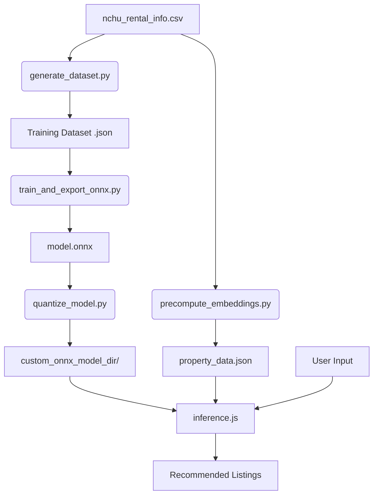

# 興大 AI 租屋推薦 (NCHU AI Rental Recommendation)

這是一個專為中興大學學生設計的 AI 租屋推薦系統。使用者只需輸入自然語言需求（例如：「預算 6000 以內、近正門、有冷氣」），系統即可透過微調後的 ALBERT 模型進行語意匹配，提供最適合的房源建議。

## 核心特徵

- **自然語言辨識**: 採用 Sentence-Pair Classification 模式，精準理解使用者需求。
- **路名/地點感知**: 模型現在能識別具體路名（如：「國光路」、「復新街」），並自動在第一階段初篩與第二階段精篩中強化位置關聯。
- **邊緣端推論 (Edge AI)**: 使用 ONNX Runtime Web，模型直接在使用者瀏覽器運行不需將資料回傳伺服器，反應迅速且保護隱私。
- **直覺式介面**: 採用現代化曜石黑 (Obsidian Dark) 與 霓虹青 (Neon Cyan) 主題設計，支援行動裝置與響應式排版。
- **完整的訓練管線**: 包含自動化合成資料集、模型訓練、ONNX 形狀清理與動態量化 (Dynamic Quantization) 壓縮流程。

## 核心技術棧

- **前端介面 (Frontend)**: 原生 JavaScript (ES6+), HTML5, Vanilla CSS
- **邊緣推論引擎 (Inference)**: [ONNX Runtime Web](https://onnxruntime.ai/docs/tutorials/web/) (WASM 加速)
- **機器學習建構 (Machine Learning)**: PyTorch, Hugging Face Transformers (`clue/albert_chinese_tiny`), Datasets
- **部署環境 (Deployment)**: 支援純靜態網頁託管 (Vercel, GitHub Pages)

---

## 專案架構與核心資料流

本專案將機器學習與預測流程嚴謹地切分為「資料準備」、「模型訓練」、以「前端即時推論」三個核心生態系。

### 核心工作流圖 (Workflow Diagram)



### 1. 資料轉換與合成 (Data Preparation)
系統的第一步需要將原本死板的表格資料轉換成能讓 Transformer 理解的形式：
* **清洗與萃取 (`precompute_embeddings.py`)**: 提取 `nchu_rental_info.csv` 中的資訊（租金、物件名稱、距離、家具），將其串接成自然語言的一段「房屋客觀描述字串」，並轉出 `property_data.json` 供網站載入查閱。
* **合成訓練樣本 (`generate_dataset.py`)**: 為了訓練模型具備推論能力，此腳本會模擬各式各樣的學生口語（如：「預算 5k」、「想要單人套房」），並透過動態模板建立高達 10,000 筆的正/負配對樣本，拆分為 Train, Dev, Test 資料集供訓練使用。

### 2. 模型核心訓練 (Model Training & Quantization)
我們採用 `clue/albert_chinese_tiny` 作為預訓練基底模型，因為它參數少但中文語義理解極佳。
* **二元語意分類 (`train_and_export_onnx.py`)**: 讀入上述的 JSON 樣本，透過 `Trainer` 微調。模型主要學會將輸入的句子透過 `[CLS] 查詢 [SEP] 房屋描述 [SEP]` 的結構，判斷這段要求與房源是否匹配。
* **量化壓縮與防禦 (`quantize_model.py`)**: 訓練完成後，為使前端瀏覽器不過度占用記憶體，我們會將 ONNX 架構進行權重量化 (Int8)。此腳本還會負責抹除 `ONNX Protocol Buffers` 中殘留的動態 Shape，藉此防止前端推理時觸發 `ShapeInferenceError`。量化後模型體積由原先近 16MB 壓縮至約 7.8MB 左右。

### 3. Web 邊緣推論引擎 (Browser Runtime Inference)
在網站上，當使用者輸入需求並按下送出時，全套運算都會在瀏覽器內利用 `inference.js` 的兩階段演算法完成：

#### A. 第一階段：預處理與啟發式比對 (Heuristic Match)
1. **條件解析 (Constraint Parsing)**:
   - 動態解析並辨別極端限制 (例如：預算上限為「6K」、「六千」，限制「限女」、「狗」等)。這部分會立刻把完全不達標的房屋移除 (Hard Exclusion)。
2. **路名的實體解析**:
   - 把「位於學府路上」中的過渡詞（如：位於、在）剝離，擷取核心地址路段「學府路」。
3. **需求達成得分計算 (RMS - Requirement Match Score)**:
   - 採用**「未提到即符合」**邏輯。這代表如果用戶沒提到預算，預算維度自動滿分；有提到的將基於容差（例如誤差 500 元內）給予評分計算。最終根據綜合 RMS 得出最具潛力的 **Top 30 候選名單**。

#### B. 第二階段：神經網路語意重排 (Neural Re-ranking)
1. **ALBERT 深度比對**: 前端使用 `@xenova/transformers` 的 WASM Web Assembly 對 Top 30 房源與使用者的搜查字眼進行 Tokenize 切詞，然後餵給量化後的 ONNX Runtime。
2. **對數轉換 (Logits to Probability)**: 讀取 `logits`，利用 Softmax 取出 `True / MATCH` 的語意機率指數。模型會識別「近興大」與「學校旁邊」在語法上的等價關係。
3. **混合加權機制 (Score Blending)**:
   - 最終配對相符分數 = **(規則得分 RMS * 40%) + (AI 語義得分 * 60%)**。
   - 保底機制：若 RMS 滿分且判讀正確，該房源分數至少保證在 85 分以上，從而確保系統不會產生反直覺排序。
模型採用 Sentence-Pair 模式，輸入格式為 [CLS] 查詢 [SEP] 房屋描述 [SEP]。
---

## 本地部署與開發指南

### 1. 執行網頁推薦系統
本專案為靜態網頁架構，僅需一個支援靜態服務的本機伺服器即可完美執行：
```bash
# 開啟終端機並在專案根目錄下執行 (Mac/Linux/Windows):
python3 -m http.server 8000
```
完成後，請打開瀏覽器訪問 `http://localhost:8000` 即可使用。

### 2. 開發與訓練環境重置
如果您調整了 `nchu_rental_info.csv`，需要重新訓練模型或更新資料庫：

```bash
# 1. 建立 Python 虛擬環境
python3 -m venv .venv
source .venv/bin/activate

# 2. 安裝必要的深度學習開源依賴
pip install torch transformers datasets numpy onnx onnxruntime
```

#### 完整重訓工作流操作
請嚴格依序執行下方腳本來重置並佈署新模型：

```bash
# 步驟 1: 生成自然語言問答合成訓練資料庫
python generate_dataset.py

# 步驟 2: 微調 ALBERT 模型並打包為原版 ONNX
python train_and_export_onnx.py

# 步驟 3: 抹除衝突 Shape 並壓縮權重至 Int8 (生成 my_custom_model_quant.onnx)
python quantize_model.py

# 步驟 4: 取代舊有模型檔案 (手動覆蓋至前端載入區)
mv my_custom_model_quant.onnx custom_onnx_model_dir/model.onnx

# 步驟 5: 抓取最新房屋描述並產生給前端使用的靜態 JSON 提供即時比對
python precompute_embeddings.py
```

## 目錄結構
```text
├── index.html                 # 網頁主進入點
├── styles.css                 # Obsidian Dark 風格的介面樣式表
├── app.js                     # UI 封裝邏輯與互動渲染模組
├── inference.js               # ONNX Web推論引擎、NLP兩階段檢索主邏輯
├── property_data.json         # 房源資訊與標準描述文本 (由 Python 產生)
├── custom_onnx_model_dir/     # AI 模型專屬存放區 (過大時建議使用 Git LFS)
│   ├── model.onnx             # 經量化壓縮的 ALBERT 權重
│   ├── model.onnx.data        # External Protocol Buffer Data
│   └── tokenizer.json         # HF 標記器設定分詞字典
├── generate_dataset.py        # 訓練資料合成器腳本
├── train_and_export_onnx.py   # 模型微調主程式
├── precompute_embeddings.py   # 靜態特徵匯出腳本 
├── quantize_model.py          # 模型形狀清理與壓縮工具
└── nchu_rental_info.csv       # 系統的唯一資料來源 (單一事實點)
```
