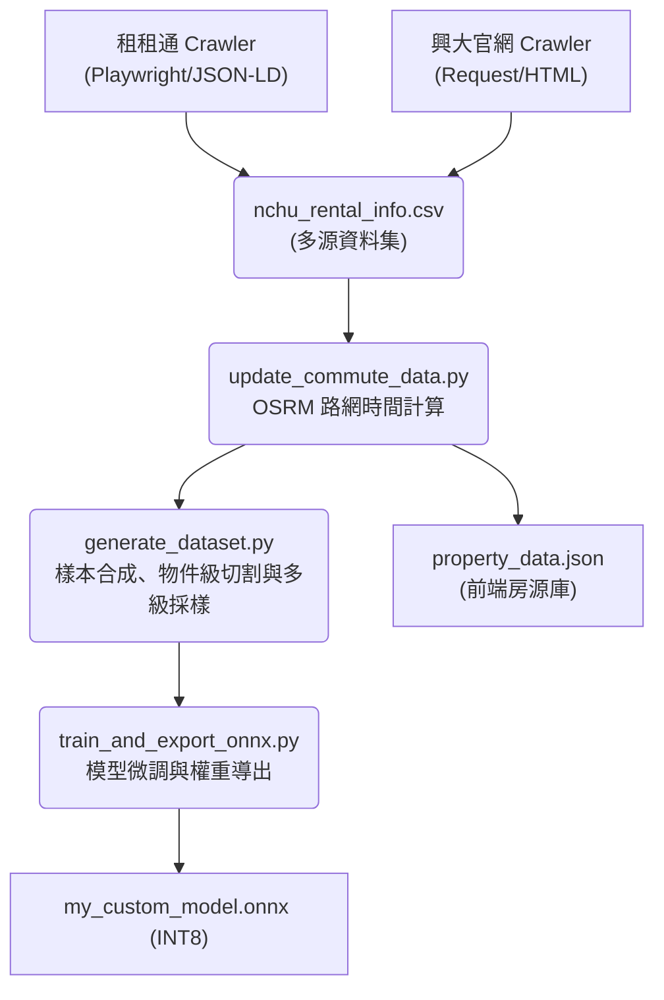
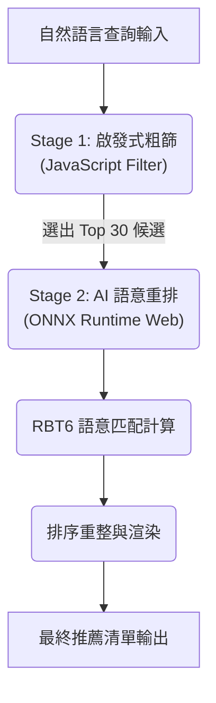

# 興大 AI 租屋推薦系統 (NCHU AI Rental Recommendation)

本專案為針對中興大學學生設計之 Edge AI 租屋推薦系統。系統透過微調後之 6 層 RoBERTa 模型處理自然語言查詢，並與房源資料進行深度語意匹配，旨在解決傳統篩選器過於僵硬的侷限性，提供具備語意理解能力的搜尋體驗。

## 系統核心亮點

- **跨平台數據自動化整合**: 系統利用 Playwright 動態爬蟲技術，整合中興大學校外租屋網與租租通數據，解決資訊破碎化問題。
- **深度語意解析 (RoBERTa RBT6)**: 採用 hfl/rbt6 架構，其深層的參數容量與特徵空間能細膩地捕捉口語化需求中的語意細節，精確識別各類隱性衝突。
- **真實路網權重系統**: 整合 OSRM 引擎計算真實路網權重，以步行與機車的實際通勤時間作為推薦排序的核心因子。
- **邊緣端高效推論 (Edge AI)**: 透過 ONNX Runtime Web 實作瀏覽器端即時推理，並利用 INT8 量化技術確保在客戶端裝置上的執行效率。
- **強化對抗訓練 (Adversarial Training/FGM)**: 實作 FGM (Fast Gradient Method) 於訓練過程中針對 Embedding 層注入對抗性擾動，顯著提升模型在面對非規範口語輸入時的泛化能力與魯棒性。

---

## 系統架構圖 (System Architecture)

### 1. 數據流水線 (Data Pipeline)
展示從原始資料抓取到模型產出的完整自動化流程：



### 2. 推論與匹配邏輯 (Inference Flow)
展示使用者查詢如何在前端進行兩階段即時重排：



---

## 資料工程核心 (Data Engineering Deep Dive)

本專案的推薦品質高度仰賴於 `generate_dataset.py` 的資料處理策略，其解決了以下核心問題：

### 1. 嚴防資料洩漏：物件級切割 (Object-Level Split)
- **問題**：若將同一個房源的不同查詢隨機分配到訓練集與測試集，模型會產生「背答案」的現象，導致測試數據虛高。
- **解決方案**：本系統採取「先切房源，再生樣本」的策略。測試集中出現的所有房源，在模型訓練期間皆為完全未見過的「陌生樣本」，確保評估結果具備高度的泛化真實性。

### 2. 樣本合成與噪音注入 (Synthesis & Noise Injection)
- **樣本生成**：透過自定義模板庫將結構化房源資料（如：租金、格局、設施）轉換為數萬組口語化查詢。
- **噪音模擬**：隨機注入錯字、簡寫（如：興大 vs 中興大學）與網路用語（如：滴 vs 的），模擬真實世界中非規範的輸入場景。

### 3. 多級相關性標記 (Graded Relevance Labeling)
系統實作了複雜的評分引擎，將匹配程度分為 0~3 分，不僅支援是非題辨識，更支持排序權重：
- **3 分 (Perfect)**：預算、地點、設施全數滿足。
- **2 分 (Good)**：多數符合，或在預算上有合理的緩衝餘裕（15% 內）。
- **0 分 (Conflict)**：存在性別限制、寵物政策等硬性衝突。

---

## 檢索與排序機制 (Search & Ranking Mechanism)

為了在瀏覽器端 (Edge AI) 同時兼顧推論精度與回應速度，本系統採用 **兩階段重排 (Two-Stage Re-ranking)** 架構：

### 1. 階段一：啟發式粗篩 (Heuristic Filtering)
- **運作機制**：利用前端 JS 引擎對本地房源庫進行 O(N) 的基礎屬性過濾（如預算上限、特定區域）。
- **優化目標**：將 600+ 筆房源迅速收斂至 20-30 筆候選物件，將 AI 運算負載控制在毫秒等級。

### 2. 階段二：Cross-Encoder 深度重排 (Semantic Re-ranking)
- **運作機制**：將候選名單輸入 RBT6 模型，透過 Cross-Encoder 進行「查詢-房源」深度交互運算。
- **核心價值**：識別細微的語意衝突（例如：查詢「台水台電」，房源描述中標註「一度 5 元」的語意陷阱）。

---

## 效能指標 (Model Performance)

| 指標名稱 | 任務類型 | 數值 | 狀態 | 說明 |
| :--- | :--- | :--- | :--- | :--- |
| **F1-Score** | **二分類語意匹配** | **0.832** | 優秀 | 評估「查詢-房源」是否符合的最佳表現 |
| **Accuracy** | **二分類語意匹配** | **0.884** | 穩定 | 基礎語意辨識準確率 |
| **Matching Latency** | **AI 推論耗時** | **< 150ms** | 極速 | 單筆候選物件的語意評分時間 |
| **Architecture** | **Matching Engine** | **RBT6** | 穩定 | 具備 6 層 Transformer 架構的深度匹配引擎 |

> [!NOTE]
> 效能數據係指「語意匹配模型」之表現。系統預處理階段之 NER (實體辨識) 由另一獨立輕量化模型負責，不計入此表指標中。

---

## 前端工程優化

系統針對 Web 端部署實作了多項關鍵效能技術：

1. **並行加載策略 (Parallel Loading)**: 分詞器與模型檔案透過 Promise.all 進行並行下載，縮短初始化時間。
2. **串流進度追蹤 (Stream Fetch)**: 改用原生 Fetch API 監控資料流，提供精確的載入進度回報。
3. **快取策略 (Edge Caching)**: 於 vercel.json 實作強效快取標頭，確保 ONNX 資源瞬間載入。
4. **渲染隔離**: 核心推理邏輯運行於獨立的 Web Worker，避免主線程凍結。

---

## 核心模組說明

### 1. 數據處理 (pipeline/)
- **crawler_ddroom.py**: 使用 Playwright 處理動態網頁渲染，解析 JSON-LD 結構化資料。
- **rent_info_catcher.py**: 針對興大官方租屋網進行 DOM 解析。
- **update_commute_data.py**: 調用 OSRM API 獲取真實路網數據。
- **augment_with_llm.py**: 利用 Gemini API 生成模擬口語查詢樣本。

### 2. 模型開發 (pipeline/model_training/)
- **train_and_export_onnx.py**: 整合 FGM 對抗訓練與加權損失函數。
- **export_from_checkpoint.py**: 支援從檢查點導出並產出評估報告。
- **quantize_model.py**: 實施 INT8 量化優化模型體積。

---

## 執行與部署

### 1. 本地開發
```bash
# 安裝依賴
pip install torch transformers datasets onnxruntime playwright
playwright install chromium

# 啟動全流水線
./run_pipeline.sh
```

### 2. 爬蟲合規性與聲明
- **robots.txt**: 本專案嚴格遵循目標網站之協定。
- **速率限制**: 實作隨機等待機制 (1~3s)，避免對伺服器造成壓力。
- **用途聲明**: 資料僅用於學術研究與 Edge AI 技術驗證。

---

## 未來展望 (Roadmap)
- **向量檢索升級**：針對萬筆級房源引入 ANN 向量索引。
- **模型蒸餾 (Distillation)**：將 RBT6 蒸餾至更小的 Tiny-Model 以優化低階手機體驗。
- **即時地圖互動**：將推薦結果直接標註於互動式地圖中。
