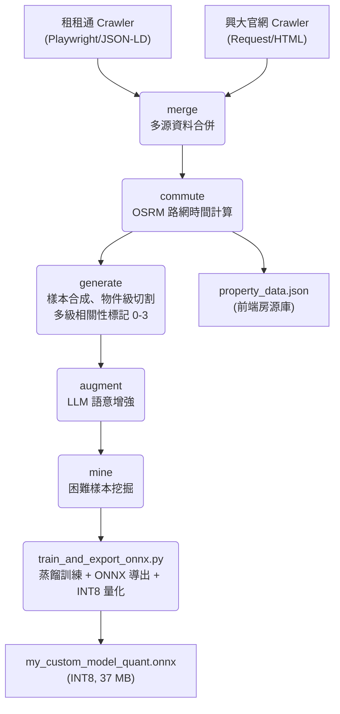
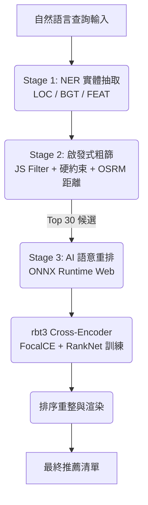

# 興大 AI 租屋推薦系統 (NCHU AI Rental Recommendation)

本專案為針對中興大學學生設計之 **Edge AI 租屋推薦系統**。透過微調並蒸餾的中文 RoBERTa 模型（rbt3 INT8，**37 MB**）在瀏覽器端進行即時語意匹配，解決傳統篩選器過於僵硬的侷限，提供具備深層語意理解的搜尋體驗。

---

## 系統核心亮點

- **超輕量 rbt3 Cross-Encoder（37 MB INT8）**：以 3 層 rbt3 搭配多任務損失（CE + RankNet + ListNet）+ R-Drop 正規化 + FGM 對抗訓練，在 **37 MB** 模型大小下實現瀏覽器端即時語意重排。v2.3 採知識蒸餾（rbt6→rbt3，NDCG@5=0.818）；v2.4 全面修正訓練策略缺陷，確立下一版蒸餾的穩健基礎。

- **雙層 NER + 語意匹配**：
  - **第一層**：輕量 NER（rbt3，**37 MB** INT8）自動抽取地點 (LOC)、預算 (BGT)、設施 (FEAT) 三類實體，F1=0.997，用於初步篩選。
  - **第二層**：rbt3 Cross-Encoder 深度語意重排，Graded NDCG@5 = **0.818**（v2.3）/ **0.727**（v2.4，無蒸餾基準）。
  - **前端優化**：兩個模型均運行於獨立 Web Worker，NER < 20ms，Cross-Encoder < 150ms。

- **生活型態意圖推論（Lifestyle Intent Inference）**：15+ 組語意聚類，自動將「不想追垃圾車」映射至子母車設施、「想省錢自炊」映射至瓦斯廚房等深層意圖。

- **硬性約束一票否決（Hard Constraints）**：預算上限、寵物政策、台電計費的「零容忍」過濾，確保絕對底線條件不被語意優勢覆蓋。

- **多組合損失 + 對抗訓練**：CE + RankNet + ListNet + KL蒸餾 + R-Drop + FGM 對抗擾動，從多個角度優化排序精度。

- **真實路網通勤時間**：整合 OSRM 計算步行／機車實際路網時間，作為排序核心因子。

- **Edge AI 零延遲體驗**：
  - 模型完全在瀏覽器端執行（ONNX Runtime Web + WASM）
  - Service Worker 快取策略：重複載入 < 1 秒（第一次 ~25 秒）
  - Cache API 持久化：兩個模型共 ~74 MB，命中快取後瞬間啟動

---

## 系統架構圖 (System Architecture)

### 1. 數據流水線 (Data Pipeline)
從原始資料抓取到模型產出的完整自動化流程（6 步）：



### 2. 推論與匹配邏輯 (Inference Flow)



> **v2.4 rbt3 Cross-Encoder 已完成**：R-Drop + FGM + 多任務損失（KD 因 teacher 品質問題停用，見 CHANGELOG FAIL-04）

---

## 效能指標 (Model Performance)

### 1. NER 實體辨識（預處理階段）

| 指標 | 數值 | 說明 |
|:---|:---|:---|
| **F1-Score** | **0.997** | LOC / BGT / FEAT 三類實體聯合 F1 |
| **Latency** | **< 20ms** | 瀏覽器端 Web Worker 推論延遲 |
| **Model Size** | **37 MB** (INT8) | rbt3 量化後（bert-base-chinese 98 MB → 37 MB，-62%） |

### 2. Cross-Encoder 語意匹配（核心排序引擎）

> 以下為 v2.3 已驗證指標（tokenizer 修正後，量化 INT8 模型）

#### Phase 1：二元分類（test set，n=3,993，物件級切割）

| 閾值 | Accuracy | Precision | Recall | **F1** |
|:---|:---|:---|:---|:---|
| 0.5 | 86.2% | 68.5% | **98.0%** | 80.6% |
| **0.7** | 87.3% | 71.2% | 95.2% | **81.5%** ✅ |
| 0.9 | 88.0% | 79.3% | 80.3% | 79.8% |

高 Recall（98%）確保符合條件的房源極少被遺漏，適合推薦系統場景。

#### Phase 2：排名指標（500 queries，Top-30 重排模擬）

| 指標 | v2.3 (rbt3 INT8) | v2.4 (rbt3 INT8) | 說明 |
|:---|:---|:---|:---|
| **Graded NDCG@5** | **0.818 ± 0.015** | 0.727 ± 0.017 | 指數增益版 NDCG（rel 0-3 四級），Bootstrap CI |
| Graded NDCG@1 | — | 0.734 | |
| Graded NDCG@3 | — | 0.729 | |
| Graded NDCG@10 | — | 0.737 | |
| Binary NDCG@5 | 0.691 | 0.606 | 二元相關性 NDCG |
| **MRR** | **0.692** | 0.611 | 平均倒數排名 |
| Precision@1 | — | 0.774 | Top-1 相關比例 |
| Precision@3 | — | 0.768 | Top-3 相關比例 |
| Precision@5 | — | 0.760 | Top-5 相關比例 |
| Hit@1 (rel≥3) | — | 0.462 | 首位為完美匹配的比例 |
| **Avg Satisfaction** | 0.678 | 0.603 | (Satisfaction@3 + @5) / 2 |

**v2.3 Top-5 標籤分佈：** Perfect(3)=44.4%、Good(2)=19.1%、Partial(1)=12.8%、None(0)=23.7%  
**v2.4 Top-30 候選池標籤分佈：** Perfect(3)=43.5%、Good(2)=17.6%、Partial(1)=13.4%、None(0)=25.5%

#### NDCG 計算公式

$$DCG_k = \sum_{i=1}^{k} \frac{2^{rel_i} - 1}{\log_2(i+2)}, \quad NDCG_k = \frac{DCG_k}{IDCG_k}$$

- $rel_i \in \{0, 1, 2, 3\}$：由資料工程模組定義的房源相關性分級
- 分母 $\log_2(i+2)$ 對排在後面的相關結果施加位置折減懲罰

### 3. 模型版本對比

| 指標 | rbt6 FT (v2.1) | rbt3 蒸餾 (v2.3) | rbt3 + R-Drop (v2.4) |
|:---|:---|:---|:---|
| 量化後大小 | 57 MB | **37 MB** | **37 MB** |
| Val F1 (best epoch) | 84.8% | 85.1% | 76.9% |
| Test F1 (holdout) | 83.6% | 83.1% | 76.7% |
| Graded NDCG@5 | — | **0.818** | 0.727 ± 0.017 |
| MRR | — | **0.692** | 0.611 |
| Precision@1 | — | — | 0.774 |
| Precision@5 | — | — | 0.760 |
| Hit@1 (rel≥3) | — | — | 0.462 |
| 推論速度 (mobile) | ~150ms | ~150ms | ~150ms |

---

## 訓練策略（Training Strategy）

### 損失函數組合（v2.4）

```
v2.3（知識蒸餾版）：
  Total Loss = (1-α) × Task Loss + α × KL_Distill + 0.05 × R-Drop
  KL_Distill = T² × KL(student/T ‖ teacher/T),  α: 0.38→0.12（餘弦退火）

v2.4（無蒸餾版，KD 停用）：
  Total Loss = Task Loss + 0.05 × R-Drop
  KD 停用原因：pre-trained rbt6 分類頭隨機初始化 → soft label ≈ [0.5,0.5] → 38% 梯度噪訊

共同核心：
  Task Loss  = CE(label_smoothing=0.05) + RankNet(T=2.0) × 1.5 + ListNet(T=2.0)
  R-Drop     = ½ × [KL(pass1‖pass2) + KL(pass2‖pass1)]
               α_rdrop=0.05（保守值，避免與 FGM 對抗梯度衝突）
```

> **注意**：Focal Loss（γ=2.0）已在 v2.4 實驗後停用（γ=0.0）。
> 實驗發現 γ=2.0 對 Precision 造成 -10% 衝擊，原因是中文租屋語意匹配任務的正例本身多樣化程度高，強抑制簡單正例梯度會使模型無法有效學習正例決策邊界。

### 關鍵設計決策

| 技術 | 說明 |
|:---|:---|
| **FGM 對抗訓練** | 每步訓練在 Embedding 層注入梯度方向擾動，提升非規範口語輸入的泛化性 |
| **R-Drop（α=0.05）** | 雙前向強制 Dropout 一致性，減少預測方差，文獻典型增益 +1~3% F1 |
| **rbt6 Teacher** | 以 6 層 rbt6 作 Teacher，避免自蒸餾鏈退化（teacher 品質差時 student 繼承偏差） |
| **動態 KD α（0.38→0.12）** | 初期 Teacher 引導防崩塌，後期 Task Loss 主導收斂；保守範圍適配 pre-trained teacher |
| **T_task=2.0** | 排序損失（RankNet/ListNet）的 logit 縮放，防止梯度尺度崩塌 |
| **分層負樣本** | 採樣優先取硬衝突（rel=0），消除無信號的純隨機負例（rel=-1） |
| **物件級切割** | Train/Dev/Test 按房源分割，確保測試集房源在訓練期間完全未見 |

---

## 目錄結構 (Project Structure)

```text
.
├── data/
│   ├── raw/                 # 原始爬取數據
│   └── processed/           # 訓練集 / 驗證集 / 測試集 / 前端房源 JSON
├── frontend/
│   ├── index.html           # Edge AI 展示介面主頁
│   ├── sw.js                # Service Worker（模型 cache-first，JS stale-while-revalidate）
│   ├── js/
│   │   ├── app.js           # 主應用邏輯 + 推薦協調
│   │   ├── inference.js     # Cross-Encoder ONNX 推論介面
│   │   ├── inference-worker.js  # Cross-Encoder Web Worker（Cache API 快取）
│   │   └── ner-worker.js    # NER Web Worker（並行載入 vocab + model）
│   └── models/
│       ├── custom_onnx_model_dir/   # Cross-Encoder（FP32 + INT8）+ tokenizer
│       └── ner_model_dir/           # NER 模型（INT8）
├── pipeline/
│   ├── crawlers/            # 多源爬蟲（Playwright + Request）
│   ├── data_prep/           # 6步資料流水線（merge→commute→generate→augment→mine→embed）
│   ├── model_training/
│   │   ├── train_and_export_onnx.py  # v2.5 student 訓練（KD+RDrop+FGM）+ ONNX 導出 + INT8 量化
│   │   ├── train_teacher.py          # rbt6 teacher 專用訓練（v2.5 蒸餾前置步驟）
│   │   ├── evaluate_model.py         # 多指標評估（NDCG@k, MRR, Precision@k, Hit@1）
│   │   ├── quantize_model.py         # 獨立量化腳本（已有 FP32 模型時可單獨執行）
│   │   ├── trainer.py / exporter.py / quantizer.py / evaluator.py  # 模組化框架（pipeline_runner 使用）
│   │   └── base.py / config.py / models.py / pipeline.py           # 模組化框架支援層
│   ├── ner_model/           # NER 訓練與推論
│   └── constraints/         # 硬約束邏輯（預算/寵物/台電零容忍）
├── saved_models/            # PyTorch 模型 checkpoint
│   ├── rbt3_finetuned/      # 最新訓練產出（作為下次訓練的 Teacher）
│   └── recommendation_model_output/  # HF Trainer checkpoint 目錄
└── pipeline_runner.py       # 端到端入口點（Phase 1-2-3）
```

---

## 資料工程核心 (Data Engineering)

### 1. 物件級切割（防資料洩漏）
先按房源切割 Train/Dev/Test，再從每個房源合成查詢。測試集的房源在訓練期間**完全未見**，確保評估的泛化真實性。

### 2. 多級相關性標記（0-3）

每個訓練樣本（query, property）對均由 `compute_relevance_score()` 自動計算 0–3 分級，作為 NDCG 的 ground truth 與訓練樣本權重的依據。評分分三個階段：

#### Part A：硬性衝突（直接判 0）

以下任一條件成立，無論其他維度多好，直接返回 0：

| 衝突類型 | 判斷邏輯 |
|:---|:---|
| **性別限制** | 房源限女 ✕ 查詢找男生（反之亦然） |
| **房型不符** | 查詢要「套房」但物件為「雅房」或反之 |
| **明確排除語氣** | 查詢含「謝絕/禁/❌/不接受」+ 頂加/加蓋/暗房/漏水/壁癌 |

#### Part B：9 個評分維度（每項 0–1，加總後計算比例）

| # | 維度 | 觸發關鍵字 | 評分邏輯 |
|:---|:---|:---|:---|
| 1 | **預算** | 四/五位數字 | 以下/以內=上限；以上=下限；超10%硬衝突；超1~10%軟扣 0.3 |
| 2 | **家具設施** | 冷氣/洗衣機/冰箱/網路… | 符合需求項目數 / 總需求項目數 |
| 2.5 | **生活型態意圖** | 懶人/自炊/潔癖/怕悶熱/外送 | 對應設施組合命中率（如懶人→電梯+子母車+飲水機） |
| 3 | **地點** | 南區/大里/XX路 | 地區或路名命中 +1；核心地段（< 0.5 km）額外 +0.15 |
| 4 | **寵物** | 寵物/貓/狗/毛孩 | 明確可養 +1；明確禁養 → 0；未提及 +0.2 |
| 5 | **垃圾/管理服務** | 垃圾/子母車/管理員 | five_star（子母車+代收包裹）+1；basic +0.7；無 +0.1 |
| 6 | **電費計費** | 台電/台水/省錢/帳單 | 台電或台水計費 +1；其他計費方式 +0 |
| 7 | **開伙** | 煮飯/開火/自炊/瓦斯/廚房 | 有相關設施 +1；無 +0 |
| 8 | **安全設施** | 安全/女性/監視器 | 有保全/門禁/監視器 +1 |
| 9 | **屋況外觀** | 漂亮/質感/新/裝潢/設計 | 全新首租 +1；翻新裝潢 +0.8；一般 +0 |

> **`is_strict` 模式**：查詢含「一定要/必須/絕對/【/＃」等強調語氣時啟動。此模式下，任何一個指定維度 miss 直接返回 0，不允許軟過渡。

#### Part C：最終映射

$$\text{score\_ratio} = \frac{\text{satisfied}}{\text{total\_specified}}$$

| score\_ratio | 分數 | 名稱 |
|:---|:---|:---|
| ≥ 85% | **3** | Perfect Match |
| ≥ 65% | **2** | Good Match |
| ≥ 15% | **1** | Partial Match |
| < 15% | **0** | No Match |

> 若查詢不含任何可驗證條件（如純粹「幫我找個房子」），預設返回 **2**（避免懲罰無關資訊的模糊查詢）。

#### 為什麼這套標準能代表真實推薦品質？

NDCG@5 = 0.818（v2.3）並非對二元「有沒有相關」的評估，而是對上述 **9 個現實租屋維度** 的加權排名品質評估。  
當 NDCG@5 = 0.818 時，意味著：模型在 Top-5 推薦中，越符合查詢條件（預算精準、地點正確、設施齊全）的物件越靠前，且對排名位置施加了對數折減懲罰——排在第 5 位的 Perfect Match 貢獻遠小於排在第 1 位的。

| 分數 | 定義 | 代表案例 |
|:---|:---|:---|
| 3 (Perfect) | score_ratio ≥ 85%，主要條件全部滿足 | 指定南區 6000 以內套房，命中 5500 南區套房有冷氣洗衣機 |
| 2 (Good) | score_ratio ≥ 65%，大多數條件滿足 | 指定 6000，命中 6400 同地區同格局（預算軟超 7%） |
| 1 (Partial) | score_ratio ≥ 15%，部分維度符合 | 指定有陽台南區，命中南區無陽台物件（地點對但設施不全） |
| 0 (Conflict) | 硬性衝突或 score_ratio < 15% | 想養貓，房源標注禁養寵物 |

### 3. 查詢多樣化（7 類策略）
- **S1-S4**：單特徵 / 雙組合 / 三組合 / 多約束原始描述
- **S5**：生活型態推論（15+ 聚類：懶人系→電梯、自炊族→瓦斯、寵物主→可養貓…）
- **S6**：角色情境（大一新生、WFH、安全意識、租補申請…）
- **S7**：負向需求（不要頂加、不要暗房、不要太吵…）
- 噪音注入：錯字、簡寫（興大 vs 中興大學）、網路用語（滴 vs 的）

### 4. 困難樣本挖掘
基於 Jaccard 字符重疊，找出「表面相似卻違反硬約束」的語意陷阱（寵物禁養、性別限制）作為 hard negatives，double weight 在訓練中強化學習。

---

## 前端工程優化

1. **雙 Web Worker 並行推論**：NER + Cross-Encoder 各有獨立 Worker，主線程零阻塞

2. **Cache API + Service Worker 快取策略**：
   - `.onnx` 檔案：cache-first（模型幾乎不變）
   - CDN（ORT Web, FontAwesome）：cache-first
   - HTML/JS/CSS：stale-while-revalidate
   - 版本號 `v20260514` 控制快取失效

3. **串流進度追蹤**：Fetch API 監控資料流，精確顯示 Cross-Encoder（37 MB）+ NER（37 MB）各自的百分比進度

4. **快取命中偵測**：顯示「⚡ 快取」標示，進度條立即到 100%

5. **NER BGT 預算過濾**：解析萬/千/k/中文數字，支援方向感知（「以上」=下限，「以下/以內」=上限）

6. **推薦反饋**：每張卡片附 👍/👎 按鈕，記錄至 localStorage（最多 500 筆）

---

## 執行與部署

### 環境建置

```bash
python -m venv venv
venv\Scripts\activate          # Windows
pip install --upgrade pip
pip install torch torchvision torchaudio --index-url https://download.pytorch.org/whl/cu124
pip install -r requirements.txt
playwright install chromium
```

### 重新訓練模型

```bash
# 一鍵執行：訓練 → ONNX 導出 → INT8 量化 → 同步至前端
set PYTHONUTF8=1
python -m pipeline.model_training.train_and_export_onnx
```

### 只做量化（已有 FP32 模型時）

```bash
python -m pipeline.model_training.quantize_model
```

### 完整資料流水線

```bash
python pipeline_runner.py             # 全流程（爬蟲 + 資料處理 + 訓練）
python pipeline_runner.py --skip-phase 1          # 跳過爬蟲
python pipeline_runner.py --skip-phase 1 2        # 只訓練
```

### 模型評估

```bash
set PYTHONUTF8=1
python -m pipeline.model_training.evaluate_model
# 輸出：NDCG@1/3/5/10、MRR、Precision@1/3/5、Hit@1、Bootstrap CI
```

### 本地前端預覽

```bash
cd frontend && python -m http.server 8000
# 開啟 http://localhost:8000
```

---

## 未來展望 (Roadmap)

- **向量檢索升級**：房源規模擴增至萬筆時引入 ANN 向量索引（FAISS/Annoy）
- **即時地圖互動**：推薦結果直接標註於互動式地圖
- **使用者反饋微調**：利用 localStorage 累積的 👍/👎 反饋進行線上學習

---

*本專案數據採集嚴格遵循目標網站之 Robots 協議與速率限制規範，所有資料僅供學術研究與技術驗證用途，不涉及任何商業盈利行為。*
