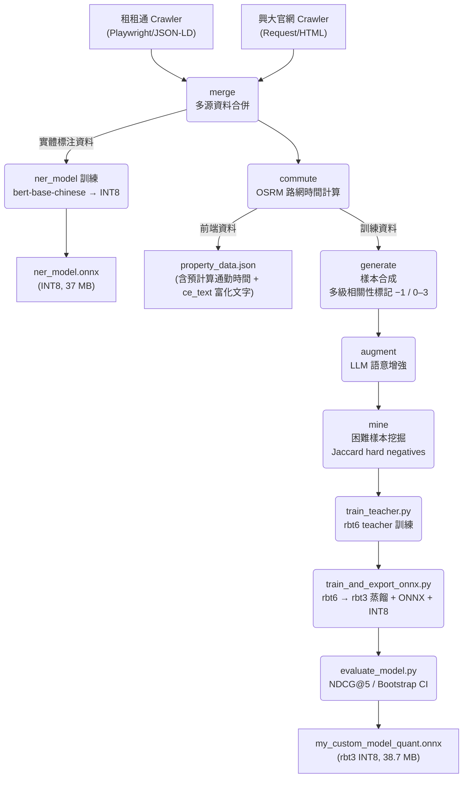
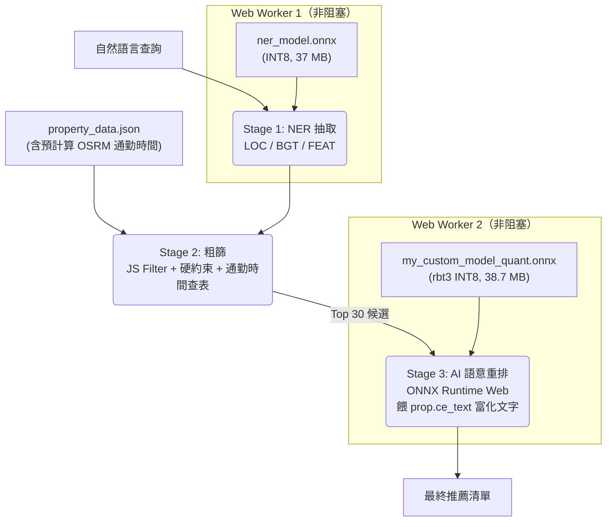

# 興大 AI 租屋推薦系統 (NCHU AI Rental Recommendation)

本專案為針對中興大學學生設計之 **Edge AI 租屋推薦系統**。透過微調並蒸餾的中文 RoBERTa 模型（NER 37 MB + Cross-Encoder 38.7 MB，共 **約 76 MB** INT8）在瀏覽器端進行即時語意匹配，解決傳統篩選器過於僵硬的侷限，提供具備深層語意理解的搜尋體驗。

---

## 系統核心亮點

- **Edge AI 零伺服器**：Cross-Encoder（rbt3 INT8，38.7 MB）+ NER（rbt6 INT8，37 MB），完全在瀏覽器端執行（ONNX Runtime Web + WASM）
- **知識蒸餾**：rbt6 teacher（6 層）→ 3 層 rbt3 student（C 組房源富化），NDCG@5 = **0.9475**、F1 **0.854**（INT8 部署）
- **房源文字富化（核心）**：CE 訓練與線上打分改用富化文字（全 notes + 全 furniture），解鎖採光（對外窗 93%）、安全（保全 97%）、隔音（水泥隔間 79%）、電梯（84%）等高頻需求，根治舊版只取 furniture 前 5、不含 notes 的偏誤
- **雙層語意理解**：NER 抽取地點/預算/設施（F1=0.9941 INT8 per_channel）→ Cross-Encoder 深度重排
- **硬性約束一票否決**：預算、性別、寵物、電梯、開伙、台電計費，必要條件違反損失 ×2
- **字卡不符條件提示**：偵測電梯/陽台/對外窗/車位/垃圾代收/可開伙等條件，房源不符時卡片半透明 + 紅色 ⚠️ 警示
- **真實路網通勤時間**：OSRM 計算步行/機車實際路網時間作為排序核心因子（704/704 房源預計算）
- **生活型態推論**：105 條語意擴展規則，「不想追垃圾車」→ 子母車設施，「自炊族」→ 瓦斯廚房
- **資料來源對齊**：租租通 559 + 興大 145 兩來源欄位品質差距大，以爬蟲補抓 + 同義橋接消除排序偏袒
- **可驗證性審查**：語意擴展詞逐一對房源實據比對，剔除 0-backing 臆測詞，確保擴展詞有資料支撐

---

## 效能指標 (Model Performance)

### 1. NER 實體辨識

| 指標 | 數值 | 說明 |
|:---|:---|:---|
| **F1-Score** | **0.9941**（INT8 per_channel）/ 0.9779（FP32）| LOC / BGT / FEAT 三類實體聯合 F1 |
| **延遲 P95** | **7ms** | 瀏覽器端 Web Worker 推論延遲（batch=1）|
| **大小** | **37 MB** (INT8) | hfl/rbt6 98 MB → 37 MB（−62%）|
| **參數量** | **37.89M** | hfl/rbt6 INT8 量化後 |

### 2. Cross-Encoder 語意匹配（C 組房源富化 rbt3 KD，INT8 量化）

#### Phase 1：單對分類正確率

**測試目標**：給定一個（查詢, 房源）配對，模型能否正確判斷「相關 / 不相關」？以 n=5,000 測試樣本評估模型的二元分類能力，並以三個閾值觀察精準-召回取捨。

**閾值的意義**：模型輸出一個 0–1 的相關性機率分數，閾值決定「超過多少才算 Match」：

| 閾值 | 適用場景 | Accuracy | Precision | Recall | F1 |
|:---|:---|:---|:---|:---|:---|
| 0.5 | 初篩（不遺漏好房源）| 87.8% | 71.2% | **98.0%** | 82.5% |
| **0.7** | **排序引擎實際使用** ✅ | **88.0%** | **82.7%** | 75.0% | **78.7%** |
| 0.9 | 高信心過濾（極嚴格）| 85.6% | 94.5% | 54.3% | 68.9% |

**模型大小**：3 層 rbt3 student，**38.7 MB** INT8（舊版 60 MB 已備份為 `.PREV-20260616.onnx`）

> 上方 Phase 1 三閾值表為 v3.0 非富化基準（NDCG@5 0.877），保留供對照；production 現用 C 組房源富化模型（NDCG@5 **0.9475**、F1 **0.854**），詳見「模型版本演進」。

- **0.5**：幾乎不遺漏任何好房源（Recall 98%），適合作為「寧可多選也不遺漏」的粗篩
- **0.7**：精準與召回的平衡點，是 Top-30 重排的實際運作閾值
- **0.9**：只輸出極高信心的結果，可用於推播通知等高精準場景

#### Phase 2：Top-30 重排品質

**測試目標**：給定一個查詢，從 30 個候選房源中重排，模型能否把最相關的放在最前面？以 500 個查詢模擬真實推薦場景，評估 Top-5 排名品質。

| 指標 | **C 組富化（production）** | A baseline | v3.0 非富化基準 | 說明 |
|:---|:---|:---|:---|:---|
| **Graded NDCG@5** | **0.9475** ✅ | 0.9351 | 0.877（FP32 基準）| 4 級相關性（0-3）指數增益 NDCG |

**NDCG@5 = 0.9475** 代表：在 Top-30 候選房源中，Top-5 的排列順序與理想排序的相似度為 94.75%。分母採指數增益 ($2^{rel} - 1$)，使 Perfect match（rel=3）的排名效益是 Partial（rel=1）的 7 倍。

$$NDCG_k = \frac{DCG_k}{IDCG_k}, \quad DCG_k = \sum_{i=1}^{k} \frac{2^{rel_i} - 1}{\log_2(i+2)}$$

**候選池標籤分佈（Top-30 pool）**：Perfect(3)=45.4%、Good(2)=20.4%、Partial(1)=13.0%、None(0)=21.2%

### 3. 模型版本演進

| 版本 | 量化大小 | Teacher F1 | Student F1 | NDCG@5 |
|:---|:---|:---|:---|:---|
| rbt6 FT (v2.2) | 57 MB | — | 84.8% | — |
| rbt3 KD v1 (v2.3) | 57 MB | 84.1% | 84.8% | 0.818 |
| rbt3 R-Drop (v2.4) | 57 MB | — | 76.9% | 0.727 |
| rbt3 KD v2 (v2.5) | 57 MB | — | 76.4% | 0.760 |
| rbt3 KD v3.0（非富化，歷史）| 57 MB | 84.1% | 84.8% | 0.877 |
| **rbt3 KD（C 組富化，production）** | **38.7 MB** | — | **85.4%** | **0.9475** ✅ |

v2.4–v2.8 退步的根本原因：負樣本採樣 bug（見[知識蒸餾架構](#知識蒸餾架構knowledge-distillation)）。C 組富化版的 NDCG@5 躍升（0.9351→0.9475）來自房源文字富化（CE 改餵 `property_to_text_enriched`：全 notes + 全 furniture），解鎖採光/安全/隔音/電梯等高頻需求；MAX_LENGTH 由 64 提升至 128 以容納富化文字（平均約 98 token）。

---

## 系統架構圖

### 1. 數據流水線



### 2. 推論流程



---

## 知識蒸餾架構（Knowledge Distillation）

本專案以固定 α=0.12、T=4.0 的 Soft-Label BCE 蒸餾損失（`0.5×CE + 0.5×weighted_BCE(soft_labels)`）將 rbt6 的排序知識壓縮至 3 層 rbt3（38.7 MB INT8）；依消融實驗移除 R-Drop（+0.0068），保留 CE + KD + FGM 組合，必要條件違反樣本（rel=−1）損失加倍懲罰。production C 組更進一步以房源富化文字（`property_to_text_enriched`，MAX_LENGTH=128）訓練 student。詳細的 KL 散度公式、溫度縮放原理與蒸餾架構設計，請參考 [模型架構與蒸餾設計](docs/MODEL_ARCHITECTURE.md)。

---

## 訓練策略

Student 損失函數：`0.5×CE(label smoothing ε=0.05) + 0.5×weighted_BCE(soft_labels, T=4.0)`，固定 α=0.12；FGM 對抗訓練（ε=1.0）強化口語輸入魯棒性，v3.0 移除 R-Drop（消融 +0.0068）。詳細的損失函數公式、超參數表與負樣本採樣策略，請參考 [訓練策略與損失函數](docs/TRAINING_STRATEGY.md)。

---

## 資料工程核心

訓練資料採物件級切割（防洩漏），4 級相關性標記（0–3）結合 9 個評分維度；查詢多樣化涵蓋 7 類策略（單特徵/生活型態/角色情境/負向需求），Jaccard hard negative 挖掘強化邊界學習。

**雙來源欄位對齊**：租租通（559 筆）與興大官網（145 筆）爬蟲抓取的欄位子集不同，導致排序系統性偏袒。修法為（1）crawler 補抓興大現成但漏解析的二級表格（租金包含/安全管理/消防逃生），衍生 canonical 特徵標籤（興大特色項 avg 1.6→5.32、has_window 0→70%）；（2）bool 設施欄改三態判定（崩塌欄 false 視為未知而非「無」，避免誤殺）；（3）前端同義橋接，讓擴展詞對上兩來源不同用詞。

**語意擴展層可驗證性審查**：105 條口語意圖規則的擴展詞逐一對 704 房源實據（含 bool 欄、結構欄、同義橋）比對，剔除 0-backing 臆測詞（無任何資料支撐者），救援可橋接者（禁菸→無菸、採光→對外窗、台水→電費結構欄…），確保每個擴展詞都有落地。

**房源文字富化（CE 訓練／打分一致）**：CE 的房源側文字改用 `property_to_text_enriched`（全 notes + 全 furniture），取代舊版 `property_to_text`（只取 furniture 前 5、不含 notes）。富化後採光（對外窗 93%）、安全（保全 97%）、隔音（水泥隔間 79%）、電梯（84%）等高頻需求得以進入 CE 視野。前端 `scorePair` 改餵 `prop.ce_text`，由 `pipeline/data_prep/precompute_ce_text.py` 預先算進 `property_data.json`，確保線上打分與訓練文字格式一致；MAX_LENGTH 由 64 提升至 128（富化文字平均約 98 token，64 會截斷）。

詳細的相關性評分公式、查詢生成策略、來源對齊與 OSRM 通勤整合，請參考 [資料管道與標記設計](docs/DATA_PIPELINE.md)。

---

## 前端推論效能

系統採雙 Web Worker 並行推論（NER + Cross-Encoder 獨立，主線程零阻塞），搭配 Cache API + Service Worker 實現離線可用。實測於 i5-11600KF（82 Mbps），首次載入 **16.31 s**，快取後載入 **1.64 s**（↓90%），單次推論 P95 **248 ms**，heap 穩定 56.6 MB，無記憶體洩漏。詳細的 FLOPs 分析、各裝置延遲推算與前端架構，請參考 [邊緣推論與前端效能](docs/EDGE_INFERENCE.md)。

---

## 執行與部署

```bash
# 環境建置
python -m venv venv && venv\Scripts\activate
pip install torch --index-url https://download.pytorch.org/whl/cu124
pip install -r requirements.txt

# 兩階段蒸餾訓練
set PYTHONUTF8=1
python -m pipeline.model_training.train_teacher
python -m pipeline.model_training.train_and_export_onnx

# 本地前端預覽
cd frontend && python -m http.server 8000
```

完整目錄結構、模型版本歷程與消融實驗執行指令，請參考 [開發者指南](docs/DEVELOPMENT.md)。

---

## 消融實驗 (Ablation Study)

11-run 系統性消融（Groups A/B/C/D）揭示：**移除 R-Drop 後 NDCG@5 提升 +0.0068**（C3 為所有 run 最高分），固定 KD α=0.12 優於餘弦退火（+0.0050）；Group D 噪聲測試顯示所有 checkpoint 均崩潰至 NDCG@5 ≈ 0.307（−65%），根本原因為離散詞彙分佈偏移，非連續嵌入擾動可修復。完整結果、分析與各組件貢獻，請參考 [消融實驗完整報告](docs/ABLATION_STUDY.md)。

---

## Benchmark 建置教學

量測瀏覽器端 Edge AI 的模型載入時間與推論延遲。

### 方式一：線上直接測試（最快）

直接開啟部署網址，無需任何環境設定：

```
https://renting-recommendation-onnx.vercel.app/benchmark.html
```

### 方式二：本地測試

```bash
# 1. 複製專案
git clone https://github.com/eric20041027/Renting-recommendation-ONNX.git
cd Renting-recommendation-ONNX

# 2. 啟動靜態伺服器（任選其一）
python3 -m http.server 8080 --directory frontend
# 或
npx serve frontend -p 8080

# 3. 開啟瀏覽器
# http://localhost:8080/benchmark.html
```

### 測試步驟

1. **步驟一（無快取）**：點擊 🧊「無快取測試」
   - benchmark 會自動清除 SW Cache Storage，模擬首次訪問
   - 量測從網路下載模型的時間（NER 37 MB + Cross-Encoder 38.7 MB）

2. **步驟二（有快取）**：點擊 ♻️「有快取測試」
   - 直接接著步驟一執行（無需手動操作）
   - 主頁面從 Cache Storage 讀取 buffer 傳給 Worker，**零網路請求**
   - 量測純 WASM session 初始化時間，應比首次快 ~90%

### 量測指標說明

| 指標 | 說明 |
|:---|:---|
| **實測下載速度** | Cloudflare 外部測速（Mbps）|
| **NER 模型載入** | hfl/rbt6 INT8，37 MB，首次 vs 快取後（ms）|
| **Cross-Encoder 載入** | 3 層 rbt3 INT8，38.7 MB，首次 vs 快取後（ms）|
| **推論延遲 P95** | 5 次暖機 + 10 次計時，取 P95（ms）|

> **注意**：推論延遲取決於裝置 CPU 效能，與網速無關；模型載入時間則受網速影響（首次）或磁碟讀取速度影響（快取後）。

---

## 未來展望

- **向量檢索升級**：房源規模擴增至萬筆時引入 ANN 向量索引（FAISS/Annoy）
- **即時地圖互動**：推薦結果直接標註於互動式地圖
- **使用者反饋微調**：利用 localStorage 累積的 👍/👎 反饋進行線上學習

### 已實作：CE 房源文字富化（推翻先前 NO-GO）

2026-06-14 的 **CE 文字層 enriched 餵入 NO-GO** 決策已被本次 C 組重訓推翻。當時 A/B 驗證以舊（非富化）CE 直接改餵 enriched 文字，因 CE 對訓練時的短結構文字格式 OOD 敏感而退步；本次改採「訓練與線上打分一致」的做法——直接以富化文字（全 notes + 全 furniture，MAX_LENGTH=128）重訓 student，並讓前端 `scorePair` 餵 `prop.ce_text`，NDCG@5 由 0.9351 升至 **0.9475**、F1 由 0.833 升至 **0.854**。興大文字層偏誤至此根治。

### 已驗證的工程決策（負面結果）

以下方向經離線量化驗證為 **NO-GO**，避免投入不成比例的成本，決策文件保留供日後參考：

- **Bi-encoder 意圖層 fallback**：擬用 text2vec 語意相似度接住字面規則表漏接的口語查詢。離線對 2093 條口語 query 驗證，thr=0.55 下正確路由僅 49%、誤路由 28%（傷 NDCG），各向異性 0.294 使精準與覆蓋無法兼得 → 不值 205 MB 前端成本。詳見 [`docs/encoder_fallback_offline_decision.md`](docs/encoder_fallback_offline_decision.md)。

---

*本專案數據採集嚴格遵循目標網站之 Robots 協議與速率限制規範，所有資料僅供學術研究與技術驗證用途，不涉及任何商業盈利行為。*
