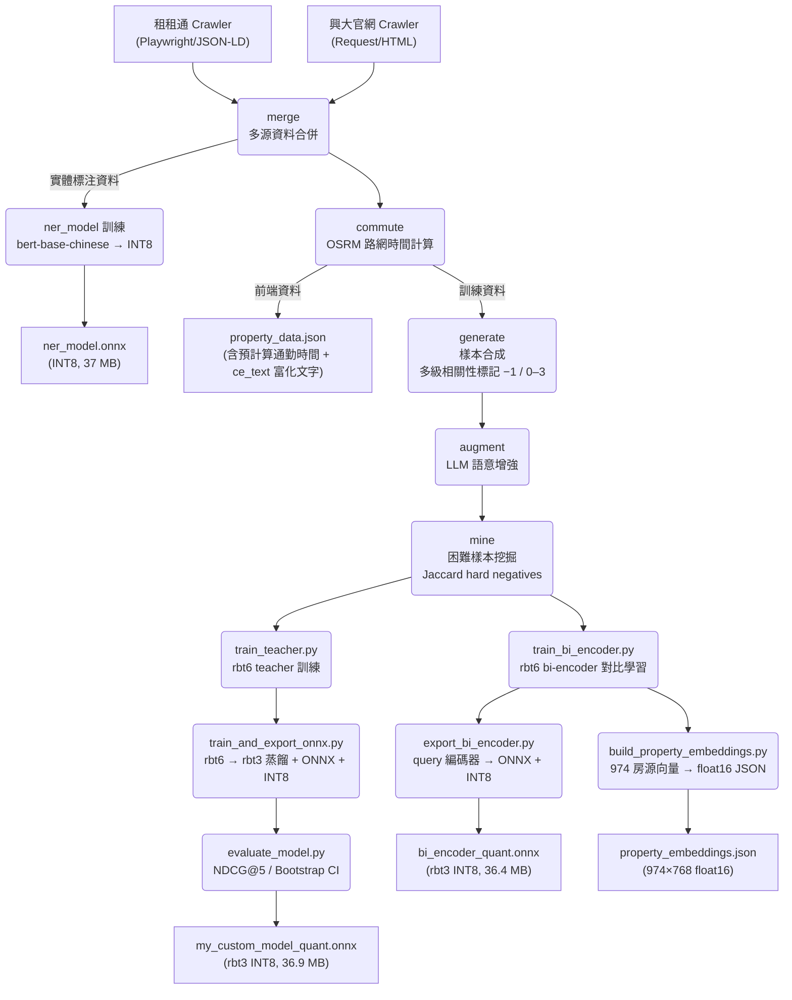
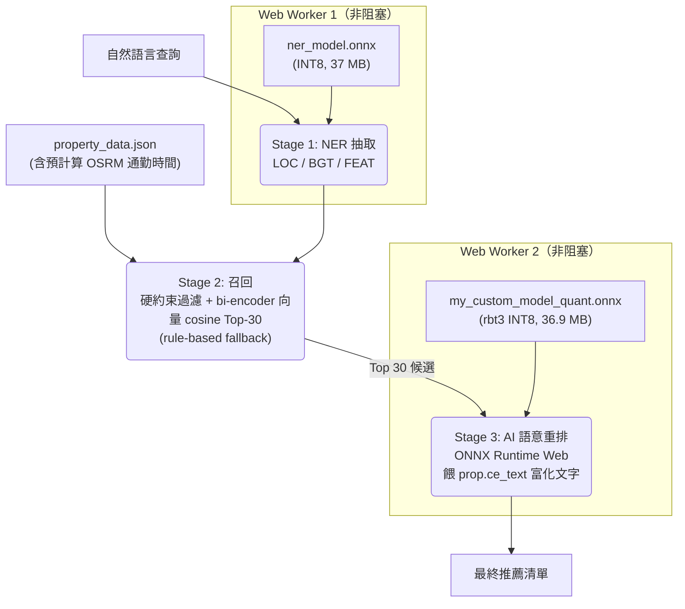

# 興大 AI 租屋推薦系統 (NCHU AI Rental Recommendation)

針對中興大學學生設計的 **Edge AI 租屋推薦系統**。所有 AI 推論(NER 實體辨識、bi-encoder 向量召回、Cross-Encoder 語意精排)皆在**瀏覽器端**以 ONNX Runtime Web 即時執行,零後端推論伺服器。系統以深層語意理解取代傳統篩選器的僵硬比對 ——「怕熱」能對到「附冷氣」、「不要養寵物」能正確排除可養寵物房源。

線上 Demo:<https://renting-recommendation-onnx.vercel.app/>

---

## 系統核心亮點

- **三模型 edge 推論管線**:NER(條件抽取)→ bi-encoder(向量召回)→ Cross-Encoder(語意精排),三個微調中文 RoBERTa 模型全部 INT8 量化、在瀏覽器跑。
- **向量召回(2026-06)**:召回階段由關鍵字 rule-based 升級為 bi-encoder 向量相似度。A/B 實測語意查詢 Recall@30 由 **0.007 → 0.547**,整體召回全面優於關鍵字。
- **知識蒸餾**:bi-encoder 與 Cross-Encoder 皆走 6 層 rbt6 teacher → 3 層 rbt3 student,各壓縮至 ~36 MB INT8(召回零損)。
- **多來源資料對齊**:租租通(665 筆)+ 591 租屋(162 筆)+ 興大官網(147 筆)欄位子集不同,經 crawler 補抓 + 三態 bool 判定 + 同義橋接消除系統性偏袒。
- **離線可用**:Cache API + Service Worker,首次載入後快取,後續秒開。
- **可解釋**:每筆推薦附匹配理由與衝突提示。

---

## 生產環境模型(瀏覽器實際載入)

> 大小為 git 追蹤的量化 ONNX 實檔(bytes 換算 MiB),非估計值。

| 角色 | 模型 | Base | 層數 | 量化 | 大小 | 檔案 |
|:---|:---|:---|:---:|:---|:---:|:---|
| **召回** Recall | bi-encoder | hfl/rbt3 | 3 | INT8 dynamic | **36.4 MB**<br>(38,214,155 B) | `frontend/models/bi_encoder_dir/bi_encoder_quant.onnx` |
| **精排** Re-rank | Cross-Encoder | hfl/rbt3 | 3 | INT8 per-channel | **36.9 MB**<br>(38,721,068 B) | `frontend/models/custom_onnx_model_dir/my_custom_model_quant.onnx` |
| **抽取** NER | Token-classify | hfl/rbt3 | 3 | INT8 | **36.4 MB**<br>(38,206,711 B) | `frontend/models/ner_model_dir/ner_model_quant.onnx` |

加上離線預算的房源向量 `frontend/assets/property_embeddings.json`(974×768 float16,6.0 MB)與房源資料 `property_data.json`(974 筆,含預計算通勤時間與 `ce_text` 富化文字)。

---

## 系統架構圖

### 1. 數據流水線



### 2. 推論流程



---

## 三階段推論管線(技術細節)

### Stage 1 — NER 條件抽取(`ner-worker.js`)

獨立 Web Worker 載入 `ner_model_quant.onnx`(hfl/rbt3,INT8,36.4 MB)。BIO 標注抽出三類實體:

- **LOC**(地點)、**BGT**(預算)、**FEAT**(設施特徵)

抽出的實體回填查詢約束(地點、預算),並補強召回階段的關鍵字。`max_length=64`(見 `ner_config.json`)。

### Stage 2 — 召回(`inference.js`)

**先硬約束過濾,再向量召回。** 這是 2026-06 的核心升級:

1. **`filterHardExclusions`** — 硬約束一票否決:頂加/木板隔間/凶宅排除、預算硬篩、補助、社會住宅,以及**否定意圖**(`excludePet`「不要養寵物」→ 排除可養寵物房源)。兩條召回路徑都先跑這步,所以否定處理不會因召回方式改變而退化。
2. **bi-encoder 向量召回(primary)** — query 經 bi-encoder ONNX 編碼 → mask-aware mean-pool → L2-normalize → 與離線預算的 974 房源向量做暴力 cosine → 取 Top-30(與硬約束允許集取交集,維持 cosine 序)。query 向量與房源向量**同源**(同 hfl/rbt6、同 pooling、同 normalize),內積即 cosine。
3. **結構化設施 boost** — 口語設施隱喻(不想提水→飲水機、夏天怕電費→台電、想曬棉被→曬衣場)bi-encoder 召回弱(text 欄缺線索 + encoder 容量),由 `parseFacilityIntents` 解析意圖後,把命中該結構化特徵的房源 union 進候選(保底名額,維持 Top-30)。bi-encoder 不動、零模型風險,kill-switch `STRUCTURED_BOOST_ENABLED` 可關。設施標靶 P@30 純向量 → boost 全部 →1.0。
3. **rule-based fallback** — 當 bi-encoder worker 尚未載入完成(首載期間)、query 編碼逾時(800 ms),或 kill-switch `VECTOR_RECALL_ENABLED=false` 時,回退到原本的關鍵字 `calculateRuleBasedScore`,避免零結果。

召回 K=30(舊 rule-based 給 15 的 2 倍):向量召回快,多召回幾筆讓 CE 有更大挑選空間;CE 仍只跑 30 次,edge 端負擔可控。

### Stage 3 — Cross-Encoder 語意精排(`inference-worker.js`)

獨立 Web Worker 載入 `my_custom_model_quant.onnx`(hfl/rbt3 蒸餾 student,INT8 per-channel,36.9 MB)。對召回的 Top-30 逐一做 sentence-pair 打分:輸入 `[CLS] query [SEP] property [SEP]` → logits → softmax → 匹配機率。房源側餵 `prop.ce_text`(富化文字,與訓練格式一致,避免 OOD)。最終分數結合召回相似度與 CE 機率,排序輸出。

---

## 模型細節

### Cross-Encoder(語意精排,知識蒸餾)

- **架構**:teacher `hfl/rbt6`(6 層,~117M 參數)→ student `hfl/rbt3`(3 層,~38M 參數),雙階段蒸餾。
- **蒸餾損失**:`(1−α)·[CE(label smoothing ε=0.05) + 1.5·RankNet(T=2.0) + ListNet(T=2.0)] + α·T²·KL(student/T ‖ teacher/T) + FGM`;溫度 `T=4.0`,α 餘弦退火 **0.38 → 0.12**(10 epochs)。
- **正則化**:FGM 對抗訓練(ε=1.0)強化口語輸入魯棒性;依消融實驗 v3.0 **移除 R-Drop**(C3 run 為全部 run 最高,+0.0068);Focal 關閉。
- **必要條件懲罰**:硬衝突樣本(rel=−1)損失加倍。
- **房源文字富化**:房源側改用 `property_to_text_enriched`(全 notes + 全 furniture),取代舊版只取 furniture 前 5、不含 notes;解鎖採光(對外窗 93%)、安全(保全 97%)、隔音(水泥隔間 79%)、電梯(84%)等高頻需求進入 CE 視野。前端 `scorePair` 餵 `prop.ce_text`,由 `pipeline/data_prep/precompute_ce_text.py` 預算進 `property_data.json`,確保線上打分與訓練文字一致。
- **量化**:Dynamic INT8 **per-channel**(對每輸出 channel 獨立算 scale,精度高於 per-tensor,batch=1 時 ORT kernel 也更快)。

詳見 [模型架構與蒸餾設計](docs/MODEL_ARCHITECTURE.md)、[訓練策略與損失函數](docs/TRAINING_STRATEGY.md)。

### bi-encoder(向量召回)

- **架構**:`hfl/rbt6`,shared-weight encoder(query 與 property 共用同一編碼器),與 CE 同源(tokenizer/vocab 已驗證、量化管線現成)。
- **表示**:mask-aware mean-pool → L2-normalize,pooling + norm 內建於 ONNX graph,輸出 `embedding`(dim 768)。on-device query 編碼與離線房源 embedding 完全同源,cosine = 內積。
- **訓練**:InfoNCE / MultipleNegativesRankingLoss(MNRL),`sim[i,j]=cos(q_i, cand_j)/T`、cross-entropy 取自身正樣本為 target,溫度 **0.05**。
- **負樣本**:anchor = 有 label=1 房源的 query;positive = 該房源;in-batch negatives = 同批其他 anchor 的 positive;hard negatives = 同 query 的 `is_hard` 房源(deduped、capped 2×batch、批內共享)。
- **匯出**:`dynamo=False`(legacy TorchScript tracer,權重內嵌單一 .onnx)、opset 15、Dynamic INT8。CP2 數值驗證:fp32 cosine(PyTorch, ONNX)=1.000、INT8=0.956。
- **房源向量**:離線以 bi-encoder 批次編碼 974 房源 → `property_embeddings.json`(float16,dim 768,L2-norm)。

詳見 [向量檢索 spec](docs/spec/vector-retrieval.md)。

### NER(實體抽取)

- **架構**:`hfl/rbt3`(3 層;v2.2 由 `bert-base-chinese` 12 層換成 rbt3,98 MB → 37 MB)。
- **任務**:BIO token classification,抽 LOC / BGT / FEAT 三類(見 `ner_config.json`)。

---

## A/B 評估 — 向量召回 vs rule-based(go/no-go gate)

用固定查詢集(78 語意 query + 200 關鍵字 query,語意 query 經「rule-based 在 K=30 會 miss」的經驗 gate 篩選)比較兩種召回。harness:`tests/eval_vector_vs_rulebased.py`(複用基準 harness + 同一查詢集,忠實鏡像前端召回路徑)。

| 分組 | 指標 | rule-based | **bi-encoder 向量** | Δ |
|:---|:---|:---:|:---:|:---:|
| **語意 (78)** | Recall@30 | 0.007 | **0.547** | **+0.540** |
| | Recall@15 | 0.000 | **0.506** | +0.506 |
| | NDCG@5 | 0.000 | **0.325** | +0.325 |
| **關鍵字 (200)** | Recall@30 | 0.077 | **0.359** | +0.282 |
| **全部 (278)** | Recall@30 | 0.057 | **0.412** | +0.354 |

**判決:GO。** 向量召回不只補語意 blind-spot(怕熱→冷氣 這類關鍵字對不上的洞),連關鍵字控制組也贏 —— 整體召回全面優於 rule-based。rule-based 因此由「對等召回路徑」降級為 fallback 安全網。

> 評估方法 caveat:基準查詢集的房源標註來自舊版訓練資料,與現行 974 筆 snapshot 經 token fuzzy-join(match-rate 偏低、分佈 bimodal),故**絕對值偏低、相對 A/B 差才是判準**;harness 兩邊用同一 join / 同一指標慣例,確保公平。現役獨立評估 baseline:ab_eval all R@30 = 0.26。

---

## Cross-Encoder 效能指標

### 二元分類(Phase-1,test n=5,000)

| 閾值 | Accuracy | Precision | Recall | F1 |
|:---:|:---:|:---:|:---:|:---:|
| 0.5 | — | — | **98.0%** | — |
| 0.7(Top-30 重排實際運作點)| 88.0% | 82.7% | 75.0% | 78.7% |

### 排序品質(graded NDCG@5,指數增益 $(2^{rel}-1)/\log_2(rank+2)$)

| 配置 | NDCG@5 | 備註 |
|:---|:---:|:---|
| v2.9 全功能 baseline(INT8)| **0.833 ± 0.014** | 500-query Top-30 重排,Bootstrap CI |
| v3.0 消融最佳(C3 no R-Drop)| **0.8787** | 移除 R-Drop |

### 量化策略 A/B(Cross-Encoder)

| 策略 | 大小 | Accuracy | F1 | P50 | P95 |
|:---|:---:|:---:|:---:|:---:|:---:|
| Dynamic INT8 per_tensor(舊)| 57.2 MB | 0.7832 | 0.6335 | 18.7 ms | 41.0 ms |
| **Dynamic INT8 per_channel(現用)** | **36.9 MB** | **0.8568** | **0.7191** | **14.2 ms** | **24.8 ms** |

詳見 [消融實驗完整報告](docs/ABLATION_STUDY.md)。

---

## 模型更新史

> 來源:`CHANGELOG.md`、`docs/MODEL_ARCHITECTURE.md`、`docs/spec/`。指標跨版本評估集不一定相同,比較請看同段落內的相對變化。

| 日期 / 版本 | 變更 | 關鍵指標 |
|:---|:---|:---|
| Phase 1(2026.02.27–03.07)| 多源爬蟲(591/Dcard/FB)、Flask 後端、regex 關鍵字比對 | baseline |
| Phase 2(2026.03.08–03.12)| 改瀏覽器端 ONNX Runtime Web + Transformers.js、3 類 NER 部署、Vercel | 100% on-device |
| Phase 3(2026.03.18–04.02)| 改 Cross-Encoder(sentence-pair)架構、INT8 動態量化、UI 改版 | — |
| Phase 4(2026.04.27–05.06)| 採 NDCG@5 + MRR 為核心指標、OSRM 通勤、困難樣本挖掘(1:2.5)、預算解析 | — |
| 2026.05.08 | 可解釋推薦(匹配理由)、混合硬約束過濾、模型壓縮 105 MB → 57.3 MB | — |
| 2026.05.10 | 生活型態意圖推斷、硬約束一票否決、全棧語意同步(LTR 3.0)| — |
| 2026.05.11 v2 | rbt6 Cross-Encoder | NDCG@5 0.5234,MRR 0.6573 |
| 2026.05.11 v2.1 | Soft-Label ranking loss(0.5·CE + 0.5·BCE soft),負樣本 1:2 | NDCG@5 0.9629(該評估集)|
| 2026.05.12 v2.2 | NER base 換 rbt3(98→37 MB)、CE 重訓、通勤整合 | NER F1 0.9972;CE Test F1 83.6% |
| 2026.05.13 v2.3 | KD:rbt6 teacher → rbt3 student(T=4.0,α=0.40);修 5-vocab tokenizer 致命 bug | graded NDCG@5 0.818,INT8 37 MB |
| 2026.05.14 v2.4–2.7 | R-Drop、動態 α、teacher 超參搜尋與 root-cause(`metric_for_best_model` 影響重大)| — |
| 2026.05.15 v2.8 | 修負樣本採樣 bug(teacher)| teacher F1 0.859;student NDCG@5 0.798 |
| 2026.05.15 v2.9 | 同修套用 student — 紀錄高 | graded NDCG@5 **0.833 ± 0.014** |
| v3.0(消融驅動)| 移除 R-Drop(+0.0068)、KD 固定低 α、保留 FGM | Dev F1 85.4%;NDCG@5 best 0.8787 |
| 2026.06.11 | 量化 per_tensor → **per_channel**、git 歷史清理、README 同步 | per_channel Acc 0.8568 / F1 0.7191 / P95 24.8 ms |
| 2026.06.14 | 雙來源欄位對齊、語意層審查、OSRM;兩項 NO-GO 決策 | — |
| 2026.06.16 | C 組房源富化 rbt3 接回 production(富化文字,MAX_LENGTH 64→128);舊版備份 `*.PREV-20260616.onnx` | NDCG@5 0.9351 → **0.9475**,F1 0.833 → **0.854** |
| 2026.06.21–22 | **bi-encoder 向量召回**取代 rule-based(T0–T7 完整 spec-driven);A/B GO | 語意 Recall@30 **0.007 → 0.547** |
| 2026.06.23 | 階段②**反饋重排**:CE 精排後 per-propertyId 👍/👎 純後處理(👍+8/👎−25,kill-switch 可關) | 行為判準驗收 |
| 2026.06.23 | 階段③**資料管線一鍵化**:`build_frontend_data` 本機段一條命令(precompute→ce_text→check);砍 FB 來源 | 本機段純 CPU 可驗 |

完整版本歷程與消融細節見 [開發者指南](docs/DEVELOPMENT.md)、[消融實驗](docs/ABLATION_STUDY.md)。

---

## 資料工程核心

- **物件級切割**防洩漏;4 級相關性標記(0–3,另有 −1 sentinel 表「明確硬衝突的簡單負樣本」,訓練時與 0 同視為 label=0);查詢多樣化涵蓋單特徵/生活型態/角色情境/負向需求等策略。
- **困難樣本挖掘**:基於 Jaccard 字符 n-gram 重疊,找「表面相似卻違反硬約束」的語意陷阱(禁養寵物、性別限制)作 hard negatives,`sample_weight ×2`。
- **OSRM 通勤**:以 Open Source Routing Machine 計算步行/機車至中興大學的實際路網時間,預算進 `property_data.json`。
- **多來源欄位對齊**:`property_data.json` 共 **974** 筆,以 `url` 區分租租通(dd-room,**665** 筆)/ 591 租屋(**162** 筆)/ 興大官網(nchu,**147** 筆)。興大 detail 頁有 6 個二級表格,原 crawler 只解析 3 個,漏掉「租金包含/安全管理/消防逃生」→ crawler 補抓 + `derive_nchu_features()` 衍生標籤後,興大特色項 avg **1.6 → 5.32**、`has_window` **0 → 70%**、`safety_level high` **0 → 94%**。
- **三態 bool 判定**:崩塌欄(某來源整欄 ≈0% true)的 false 視為「未知」回退文字判斷,而非「明確無」,避免系統性誤殺。
- **語意擴展層審查**:口語意圖規則的擴展詞逐一對房源實據比對,剔除 0-backing 臆測詞、救援可橋接者(禁菸→無菸、採光→對外窗)。

詳見 [資料管道與標記設計](docs/DATA_PIPELINE.md)。

---

## 前端推論效能

雙(實為三)Web Worker 並行推論,主線程零阻塞,搭配 Cache API + Service Worker 離線可用。實測於 i5-11600KF(6C12T,82 Mbps,`benchmark.html` 5 暖機 + 10 計時):

| 項目 | 首次載入(無快取)| 快取後(SW Cache)|
|:---|:---:|:---:|
| NER(37 MB INT8)| 6,501 ms | 770 ms(↓88%)|
| Cross-Encoder(57 MB 舊基準)| 9,810 ms | 871 ms(↓91%)|
| **總計** | **16.31 s** | **1.64 s(↓90%)** |

- 單次推論 P95 **248 ms**(舊 MAX_LENGTH=64 基準);MAX_LENGTH=128 富化模型單執行緒 ~152–168 ms/pair。
- heap 穩定 56.6 MB,無記憶體洩漏。
- 每次查詢 30 候選 × 30 次 forward pass;rbt3 每 pass ~2.1G INT8 ops。

> 上表 Cross-Encoder 載入數字為舊 57 MB 模型基準;production CE 已換 36.9 MB 富化 rbt3、bi-encoder 已蒸餾 rbt6→rbt3 至 **36.4 MB**(原 57 MB,#78),首載應更快(尚未重測,保留舊值為歷史對照)。bi-encoder 為向量召回新增的首載成本 —— 已是最優 INT8 量化(int4 反而更大),SW 快取後僅首次下載,接受為語意召回大勝的代價。

詳見 [邊緣推論與前端效能](docs/EDGE_INFERENCE.md)。

---

## 執行與部署

```bash
# 環境建置
python -m venv venv && venv\Scripts\activate
pip install torch --index-url https://download.pytorch.org/whl/cu124
pip install -r requirements.txt

# ── 資料管線(兩段;階段③一鍵化)─────────────────────────────
# 本機段(純 CPU,無 torch):crawl(可選)→ 富化 → property_data.json + 驗證
#   一條命令跑完 precompute_embeddings → precompute_ce_text --write → --check:
python -m pipeline.build_frontend_data            # 用既有 CSV
python -m pipeline.build_frontend_data --crawl    # 先跑 ddroom/nchu 爬蟲更新 CSV(需網路)
# Colab 段(需 torch + 已訓練 bi-encoder 權重):重算房源向量
python -m pipeline.data_prep.build_property_embeddings        # → property_embeddings.json
python -m pipeline.data_prep.build_property_embeddings --check  # 本機可驗:記錄數/欄位/向量同步(無 torch)

# Cross-Encoder 兩階段蒸餾訓練
set PYTHONUTF8=1
python -m pipeline.model_training.train_teacher
python -m pipeline.model_training.train_and_export_onnx

# bi-encoder 向量召回訓練 + 匯出 + 房源向量(GPU,Colab 可用 colab_train_bi_encoder.ipynb)
python -m pipeline.model_training.train_bi_encoder --bf16 --tf32   # A100 純加速,不動訓練動態
python -m pipeline.model_training.export_bi_encoder               # query 編碼器 → ONNX + INT8 + CP2 驗證
python -m pipeline.data_prep.build_property_embeddings            # 974 房源 → property_embeddings.json

# 向量 vs rule-based A/B(需 onnxruntime + transformers)
python tests/eval_vector_vs_rulebased.py

# 本地前端預覽
cd frontend && python -m http.server 8000
```

完整目錄結構與指令見 [開發者指南](docs/DEVELOPMENT.md)。

---

## Benchmark 建置教學

量測瀏覽器端 Edge AI 的模型載入時間與推論延遲。

### 方式一:線上直接測試(最快)

```
https://renting-recommendation-onnx.vercel.app/benchmark.html
```

### 方式二:本地測試

```bash
git clone https://github.com/eric20041027/nchu-edge-rental-ai.git
cd nchu-edge-rental-ai
python3 -m http.server 8080 --directory frontend
# 開啟 http://localhost:8080/benchmark.html
```

### 測試步驟

1. **無快取**:點 🧊「無快取測試」— 清除 SW Cache Storage 模擬首訪,量網路下載模型時間。
2. **有快取**:點 ♻️「有快取測試」— 從 Cache Storage 讀 buffer 傳給 Worker,零網路請求,量純 WASM session 初始化(比首次快 ~90%)。

> 推論延遲取決於裝置 CPU,與網速無關;模型載入時間首次受網速、快取後受磁碟讀取影響。

---

## 消融實驗

11-run 系統性消融(Groups A/B/C/D)結論:

- **移除 R-Drop → NDCG@5 +0.0068**(C3 為所有 run 最高分)。
- 固定 KD α=0.12 優於餘弦退火(+0.0050)。
- RankNet(+0.0030)、ListNet(+0.0020)各有微幅貢獻。
- **Group D 噪聲魯棒性**:所有 checkpoint 在縮寫/錯字/口語化輸入下崩至 NDCG@5 ≈ 0.307(−65%),根因為離散詞彙分佈偏移,非連續嵌入擾動(FGM)可修復 —— 此即向量召回(語意空間比對)的價值所在。

完整結果見 [消融實驗完整報告](docs/ABLATION_STUDY.md)。

---

## 已驗證的工程決策(負面結果)

以下方向經離線量化驗證為 **NO-GO**,決策文件保留供日後參考:

- **CE 文字層 enriched 直接餵入(2026-06-14 NO-GO,後推翻)**:當時以非富化 CE 直接改餵 enriched 文字,因 OOD 退步。後以「訓練與線上打分一致」重訓 student 根治(見模型更新史 2026.06.16)。見 [`docs/ce_text_layer_decision.md`](docs/ce_text_layer_decision.md)。
- **bi-encoder 意圖層 fallback(NO-GO)**:擬用 text2vec 語意相似度接住字面規則表漏接的口語 query。離線對 2093 條口語 query 驗證,thr=0.55 下正確路由僅 49%、誤路由 28%,各向異性 0.294 使精準與覆蓋無法兼得。見 [`docs/encoder_fallback_offline_decision.md`](docs/encoder_fallback_offline_decision.md)。
  > 註:此 NO-GO 針對「意圖層 fallback」(把口語映射到既有規則)。本系統最終採用的是**召回層**的 bi-encoder(直接以向量相似度取代關鍵字召回),為不同用途,經 T7 A/B 驗證為 GO。

---

## 未來展望

- **使用者反饋微調**:利用 localStorage 累積的 👍/👎 反饋進行線上學習(中長期路線階段 ②)。
- **向量索引擴展**:房源規模拓至萬筆以上時,瀏覽器端暴力 cosine 需改 ANN 索引(HNSW)或後端服務(現規模 ~千筆,暴力 cosine 即足夠)。
- **bi-encoder 瘦身**:已蒸餾 rbt6→rbt3(57→36.4 MB,#78,召回零損);可再探索 l2h128 蒸餾或與 CE 共享 base(目前 int8 已最優,int4 反而更大)。

---

*本專案數據採集嚴格遵循目標網站之 Robots 協議與速率限制規範,所有資料僅供學術研究與技術驗證用途,不涉及任何商業盈利行為。*
