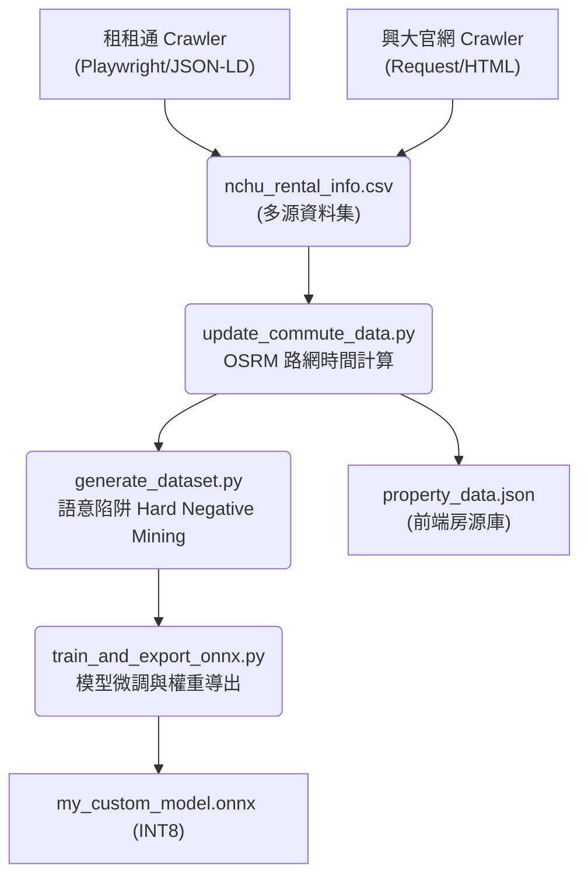
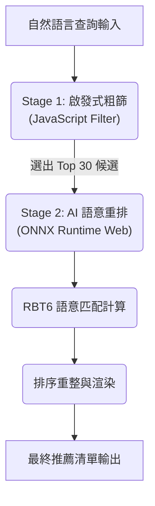

# 興大 AI 租屋推薦系統 (NCHU AI Rental Recommendation)

本專案為針對中興大學學生設計之 Edge AI 租屋推薦系統。系統透過微調後之 6 層 RoBERTa 模型處理自然語言查詢，並與房源資料進行深度語意匹配，旨在解決傳統篩選器過於僵硬的侷限性，提供具備語意理解能力的搜尋體驗。

## 系統核心亮點

- **跨平台數據自動化整合**: 系統利用 Playwright 動態爬蟲技術，整合中興大學校外租屋網與租租通數據，解決資訊破碎化問題。
- **深度語意解析 (RoBERTa RBT6)**: 採用 hfl/rbt6 架構，相較於初版 RBT3，其參數容量與特徵空間能更細膩地捕捉非結構化需求中的潛在衝突。
- **真實路網權重系統**: 捨棄傳統的直線距離計算，全面接入 OSRM 引擎，計算房源至校門口的真實步行與機車通勤時間。
- **邊緣端高效推論 (Edge AI)**: 模型透過 INT8 動態量化技術壓縮，直接於瀏覽器端透過 ONNX Runtime Web 進行運算。
- **行動端專項優化 (Mobile-First)**: 全介面採用響應式設計與觸控優化，確保行動裝置的使用流暢度。

---

## 系統架構圖 (System Architecture)

### 1. 數據流水線 (Data Pipeline)
展示從原始資料抓取到模型產出的完整自動化流程：



### 2. 推論與匹配邏輯 (Inference Flow)
展示使用者查詢如何在前端進行兩階段即時重排：



---

## 效能指標 (Model Performance)

| 指標名稱 | 任務類型 | 數值 | 狀態 | 說明 |
| :--- | :--- | :--- | :--- | :--- |
| **F1-Score** | **二分類語意匹配** | **0.832** | 優秀 | 評估「查詢-房源」是否符合的最佳表現 |
| **Accuracy** | **二分類語意匹配** | **0.884** | 穩定 | 基礎語意辨識準確率 |
| **Matching Latency** | **AI 推論耗時** | **< 150ms** | 極速 | 單筆候選物件的語意評分時間 |
| **Architecture** | **Matching Engine** | **RBT6** | 升級 | 6 層 Transformer 架構 |

> [!NOTE]
> 效能數據係指「語意匹配模型」之表現。系統預處理階段之 NER (實體辨識) 由另一獨立輕量化模型處理，不計入此表指標中。

---

## 核心技術機制 (Technical Mechanism)

### 1. 兩階段重排 (Two-Stage Re-ranking)
- **第一階段 (Heuristic Filtering)**：利用前端 JS 引擎對房源庫進行 O(N) 的基礎屬性過濾（如預算上限、特定區域），將候選名單收斂至 20-30 筆。
- **第二階段 (Semantic Re-ranking)**：將候選清單輸入 RBT6 模型，透過 Cross-Encoder 機制識別細微的語意衝突。

### 2. 語意陷阱挖掘 (Hard Negative Mining)
- **策略**：系統刻意製造「字面相似但關鍵屬性互斥」的樣本。
- **實例**：查詢要求「台水台電」，系統配對「環境優美、近興大、預算 5500」但註明「電費一度 5 元」的房源為負樣本，強迫模型學習「費用計算方式」的核心權重。

---

## 核心模組說明

### 1. 數據處理 (pipeline/)
- **crawler_ddroom.py**: 使用 Playwright 處理動態網頁渲染，解析 JSON-LD 結構化資料。
- **rent_info_catcher.py**: 針對興大官方租屋網進行 DOM 解析，確保官方認證房源不遺漏。
- **update_commute_data.py**: 調用 OSRM API 獲取真實路網數據。相較於直線距離，更能真實反應如繞路等地理實際情況。
- **augment_with_llm.py**: 利用 Gemini API 生成高度模擬口語的查詢樣本。

### 2. 模型開發 (pipeline/model_training/)
- **train_and_export_onnx.py**: 整合 FGM 對抗訓練與加權損失函數。
- **export_from_checkpoint.py**: 支援從檢查點導出並產出能力評估報告。
- **quantize_model.py**: 實施 INT8 量化，將 RBT6 體積優化至適合網頁傳輸的大小。

---

## 執行與部署

### 1. 本地開發
```bash
# 安裝依賴
pip install torch transformers datasets onnxruntime playwright
playwright install chromium

# 啟動全流水線
./run_pipeline.sh
```

### 2. 爬蟲合規性與聲明
- **robots.txt**: 本專案嚴格遵循目標網站之協定。
- **速率限制**: 實作隨機等待機制 (1~3s)，避免對伺服器造成壓力。
- **用途聲明**: 資料僅用於學術研究與 Edge AI 技術驗證，不涉及營利。
