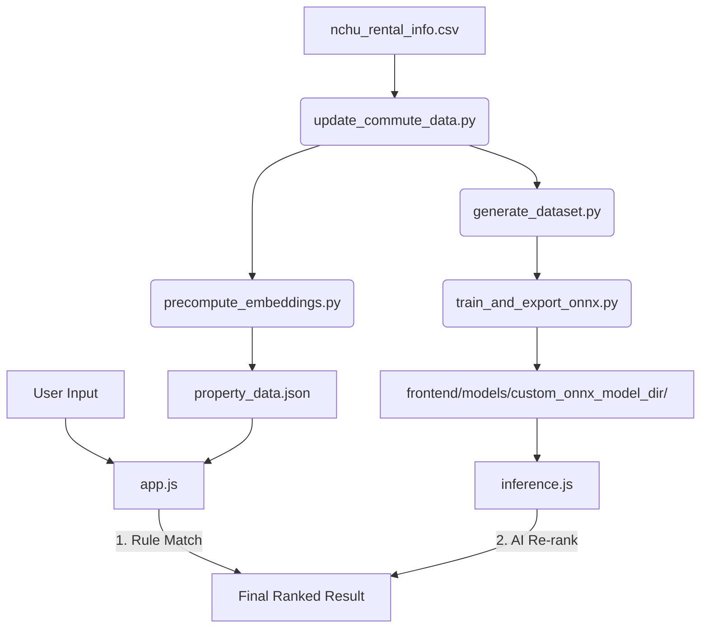

# 興大 AI 租屋推薦系統 (NCHU AI Rental Recommendation)

這是一個專為中興大學學生設計的 **Edge AI 租屋推薦系統**。使用者只需輸入自然語言需求（例如：「預算 6000 以內、走路 5 分鐘、要採光好有冷氣」），系統即可透過微調後的 **RoBERTa (rbt3)** 模型進行深度語意匹配，提供精準的房源建議。

## 專案亮點

- **深度語意理解 (RoBERTa)**: 從輕量級 ALBERT 升級至 **hfl/rbt3** (3 層 RoBERTa)，顯著提升對口語化需求（如：「不想追垃圾車」、「怕吵」）的理解能力。
- **真實路網導航 (OSRM)**: 捨棄直線距離估算，全面接入 **OSRM (Open Source Routing Machine)** 與 **ArcGIS Geocoding**。所有通勤時間皆為真實路網的步行/行車時間。
- **漸進式渲染 (Progressive Rendering)**: 採用「規則預覽 + AI 重排」雙階段渲染。使用者輸入後 **0.1 秒內** 顯示初步結果，AI 在背景運算完成後動態重排，消除等待延遲感。
- **邊緣端推論 (Edge AI)**: 使用 **ONNX Runtime Web (WASM)**，模型直接在瀏覽器運行，支援 **多執行緒 (Multi-threading)** 加速，反應迅速且隱私無虞。
- **可稽核分級評分 (Graded Relevance)**: 獨創 **0-3 分級評分引擎**，將推薦品質量化為「完美 (3)」、「優良 (2)」、「部分符合 (1)」與「不匹配 (0)」，使模型評估具備極高可信度。
- **加權對比學習 (Weighted Training)**: 訓練過程中針對「完美匹配」樣本給予雙倍權重，確保 AI 優先學習關鍵特徵，將最優房源精準推向搜尋結果頂端。
- **極致視覺體驗**: 採用 Premium Dark Mode 設計，並實作了 **AI 運算遮罩 (Computing Overlay)**。在深度語意匹配期間提供流暢的視覺回饋，避免使用者產生系統卡頓的錯覺。


---

## 技術架構

- **前端介面 (Frontend)**: 原生 JavaScript (ES6+), HTML5, Vanilla CSS (Premium Dark Mode)
- **邊緣推論引擎 (Inference)**: [ONNX Runtime Web](https://onnxruntime.ai/) (啟用 WASM SIMD & Multi-threading)
- **語意模型 (Model)**: `hfl/rbt3` (Sentence-Pair Classification)，採單一匯出路徑至前端目錄，確保權重一致性。
- **路徑引擎 (Routing)**: OpenStreetMap (OSRM) + ArcGIS Geocoding API。

---

##  專案架構與資料流



---

## 核心模組說明

### 1. 數據與通勤修正 (`pipeline/data_prep/`)
* **`update_commute_data.py`**: 關鍵模組。使用 ArcGIS 將地址轉換為精確經緯度，再透過 OSRM 計算到興大正門的真實步行與機車路程。
* **`generate_dataset.py`**: 合成訓練樣本。引入 **0-3 分級打分引擎**，並進行 **Hard Negative Mining** 提升模型分辨相似物件的能力。


### 2. 模型訓練與評估 (`pipeline/model_training/`)
* **`train_and_export_onnx.py`**: 使用 `rbt3` 進行微調。導入 **樣本權重 (Sample Weighting)** 機制，針對高品質匹配進行強化學習。輸出的數值已精確至**小數點後五位**。
* **`quantize_model.py`**: 對導出的 ONNX 模型進行 **INT8 量化**，將模型體積壓縮至約 1/4，並顯著提升在瀏覽器端的執行速度。
* **`evaluate_model.py`**: 提供專業評估指標。導入業界標準 **Graded NDCG (Exponential Gain)** 與標籤分佈報告，目前評估集已擴大至 1000+ 樣本，提供具統計意義的效能分析。


### 3. 前端推論引擎 (`frontend/js/`)
* **`inference.js`**: 核心邏輯。負責 Tokenization、ONNX 推理。實作了 **非同步 Yield 機制**，確保大型運算不阻塞 UI 渲染。
* **`app.js`**: 負責 UI 渲染。實作了 **Progressive Rendering** 與 **AI Loading Overlay**。

---

## 快速開始

### 1. 開啟推薦網頁
本專案為靜態網頁，只需本機伺服器即可執行：
```bash
python3 -m http.server 8080
```
造訪 `http://localhost:8080`。

### 2. 環境設定 (Python)
若要重新執行數據修正或模型訓練：
```bash
python3 -m venv .venv
source .venv/bin/activate
pip install torch transformers datasets numpy onnx onnxruntime requests onnxruntime-tools
```

### 3. 數據刷新與重訓全流程 (End-to-End Workflow)
若修改了原始資料或需要更新模型，請依序執行：
```bash
# 1. 更新真實路網距離與時間 (使用 OSRM)
python pipeline/data_prep/update_commute_data.py

# 2. 生成前端所需的特徵資料與描述
python pipeline/data_prep/precompute_embeddings.py

# 3. 數據集擴張 (1:2 負樣本比例, 每個物件 60 個模擬查詢)
python pipeline/data_prep/generate_dataset.py

# 4. 模型微調與 ONNX 導出
python pipeline/model_training/train_and_export_onnx.py

# 5. 模型量化加速 (INT8 Quantization)
python pipeline/model_training/quantize_model.py

# 6. 執行深度評估報告 (Graded NDCG & Binary Metrics)
python pipeline/model_training/evaluate_model.py
```

---

## 📊 評估機制與指標說明

為了確保推薦結果不只是「有相關」而是「真準確」，本專案導入了資訊檢索 (Information Retrieval) 領域的專業評估指標：

### 1. 0-3 分級相關性評分 (Graded Relevance)
系統自動為每個「需求-房源」對進行打分，這決定了 AI 在排序時的目標：

| 分數 | 分類 | 詳細說明 |
| :--- | :--- | :--- |
| **3** | **完美匹配 (Perfect)** | 查詢中指定的條件（預算/地點/房型/設施）**≥ 85%** 均精確滿足，包含所有特殊要求（如：可養寵、非頂加）。 |
| **2** | **優良匹配 (Good)** | 條件滿足率介於 **65%–85%**，或查詢為口語化探詢（無明確約束條件）。例如：三項條件中有兩項符合。 |
| **1** | **部分符合 (Partial)** | 條件滿足率介於 **15%–65%**。例如：指定預算與地點，但僅地點相符。 |
| **0** | **硬衝突 (Conflict)** | 存在不可妥協的衝突，如：**性別不符**、**房型不對**、**命中明確排除項**（謝絕頂加/木板隔間等）。 |

### 2. 核心排序指標

傳統 Accuracy 無法區分「把最優房源排在第 1 名」與「排在第 5 名」的差異。本系統採用以下業界標準指標：

*   **Graded NDCG @ 5 (Normalized Discounted Cumulative Gain)**:
    *   **計算公式**：$\sum_{i=1}^{5} \frac{2^{rel_i}-1}{\log_2(i+2)}$，再除以理想排列下的最高得分（IDCG）。
    *   **意義**：衡量前 5 名結果的「綜合品質」。完美房源 (3分) 排在首位的貢獻遠大於排在第 5 位，分數以對數速率衰減。
    *   **目標**：越接近 1.0，代表 AI 越能將最適合的房源推至最前面。
*   **MRR (Mean Reciprocal Rank)**:
    *   **計算公式**：$\frac{1}{|Q|}\sum_{q=1}^{|Q|} \frac{1}{rank_q}$，其中 $rank_q$ 為第一個相關結果的排名。
    *   **意義**：衡量使用者「需要看幾筆才找到第一個好結果」。MRR = 0.67 意味平均在第 1.5 名即可找到合適房源。
    *   **目標**：確保使用者不需要向下滑動就能看到至少一個符合條件的選項。

### 3. 基線比較 (Baseline Comparison)

| 方法 | 描述 | 預期弱點 |
| :--- | :--- | :--- |
| **隨機排序 (Random)** | NDCG 理論下限 | 無語意能力 |
| **TF-IDF 關鍵字匹配** | 字詞重疊率排序 | 口語詞（「怕熱」→ 冷氣）必敗 |
| **規則過濾 (Rule-only)** | 僅用硬規則篩選 | 只有二元結果，無法排序 |
| **hfl/rbt3（未微調）** | 同架構但未訓練 | 驗證微調的價值 |
| **✅ 本系統 (Fine-tuned RBT3)** | 語意微調 + Graded Ranking | — |

---

## 🔬 模型泛化能力論證

> **核心主張**：本模型在租屋語意匹配任務上，具備跨查詢表達方式的廣泛辨識能力，而非僅對合成查詢的過擬合。

### 1. 合成資料的有效性：語意空間的系統性覆蓋

合成資料的有效性不在於「完美模擬真實使用者」，而在於「系統性地覆蓋語意空間」。`generate_dataset.py` 針對每間房源的特徵，透過以下五種策略生成平均 60 個查詢：

| 生成策略 | 目的 | 範例 |
| :--- | :--- | :--- |
| **單維度特徵** | 覆蓋最基礎的單一需求表達 | 「找套房」、「預算六千內」 |
| **雙維度組合** | 模擬最常見的複合需求 | 「想找南區 有冷氣的」 |
| **三維度組合** | 測試多條件語意整合能力 | 「6000以下 套房 走路五分鐘」 |
| **口語化／隱含意圖** | 涵蓋非直接表達的語意（最具挑戰性）| 「怕吵」→ 隔音佳；「不想追垃圾車」→ 有子母車 |
| **噪音注入 (Noise Injection)** | 提升對錯字、縮寫、口音的容忍度 | 「興大」↔「中興大學」↔「NCHU」；字元隨機丟失 |

### 2. 真實資料的交叉驗證（分佈外測試）

資料集中混入了來自 **Facebook 租屋社群**爬取的真實用戶貼文（`fb_queries.json`）。這些查詢**完全未參與訓練**，作為分佈外測試集（Out-of-Distribution Test Set），直接驗證模型對真實口語表達的泛化能力。

### 3. 困難負樣本挖掘（Hard Negative Mining）

負樣本並非隨機選取，而是**依字元 Jaccard 相似度**優先挑選「外表與正樣本最相似、但存在硬衝突的房源」。這強迫模型學習細微的語意差異（例如：同區同預算、但性別限制不符），確保模型的判斷力建立在語意本質上，而非表面詞彙匹配。

### 4. 加權學習策略（Sample Weighting）

訓練時對不同相關性等級的樣本賦予差異化權重：

| 標籤 | 權重 | 設計意圖 |
| :--- | :--- | :--- |
| Perfect (3) | **2.5×** | 強化模型對「完美條件組合」的特徵學習 |
| Good (2) | **1.5×** | 鼓勵對「大部分符合」情境的辨識 |
| Partial (1) | **0.8×** | 降低模糊樣本對決策邊界的干擾 |
| Conflict (0) | **1.5×** | 強化對硬衝突（性別、房型）的懲罰偵測 |

---

## 📈 效能指標 (Latest Evaluation - RBT3)

| 指標 | 數值 | 說明 |
| :--- | :--- | :--- |
| **Accuracy** | **92.2%** | 基於 1,000 筆測試樣本的二元分類準確率 |
| **F1 Score** | **0.882** | Precision 與 Recall 的調和平均，反映正負樣本均衡表現 |
| **Graded NDCG @ 5** | **0.851** | 語意排序品質；完美房源極大機率排在搜尋結果首位 |
| **Mean MRR** | **0.675** | 平均在第 1.5 名即可找到符合條件的房源 |
| **感官延遲** | **< 100ms** | Progressive Rendering + UI Yielding 帶來的即時回饋感 |


---

## 目錄架構
```text
Renting_model_ONNX/
├── data/                       # 數據存儲
│   ├── raw/                    # 原始資料 (nchu_rental_info.csv, FB 貼文)
│   └── processed/              # 處理後資料 (訓練集 JSON, 預算特徵等)
├── frontend/                   # 網頁前端 (生產環境)
│   ├── js/                     # 推論引擎 (inference.js) 與 UI 邏輯 (app.js)
│   ├── models/                 # 核心 ONNX 模型與 Tokenizer 設定
│   ├── assets/                 # 前端靜態資源 (property_data.json)
│   └── index.html              # 推薦系統介面
├── pipeline/                   # AI 流水線 (開發環境)
│   ├── data_prep/              # 數據清洗、OSRM 路網修正、分級資料生成
│   ├── model_training/         # 模型訓練、Graded NDCG 評估、ONNX 匯出
│   └── crawlers/               # 社群與網站資料採集
└── saved_models/               # 訓練產物 (PyTorch Checkpoints)
```

