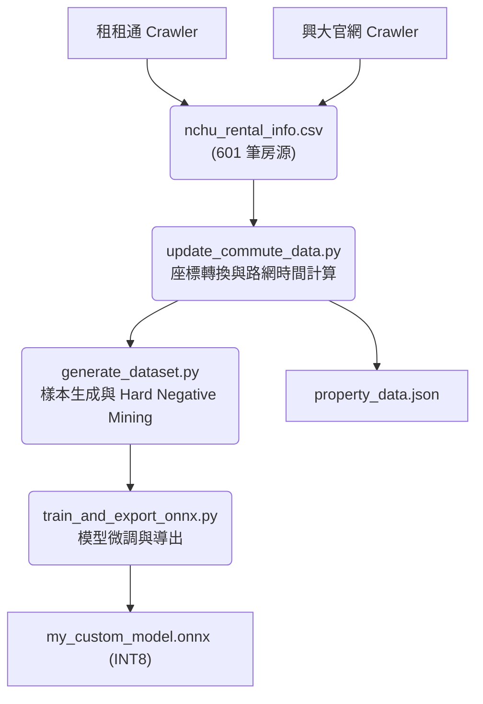
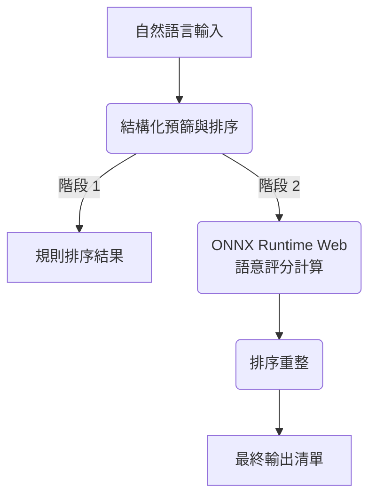

# 興大 AI 租屋推薦系統 (NCHU AI Rental Recommendation)

本專案為針對中興大學學生設計之 Edge AI 租屋推薦系統。系統透過微調後之 RoBERTa (rbt3) 模型處理自然語言查詢，並與房源資料進行語意匹配。

## 系統功能

- **資料整合 (Multi-Source Integration)**: 整合興大校外租屋網與租租通數據，目前資料庫規模為 601 筆房源。
- **語意匹配模型 (RoBERTa)**: 採用 hfl/rbt3 模型，用於處理口語化需求與房源描述之關聯性計算。
- **路網距離計算 (OSRM)**: 串接 OSRM 與 ArcGIS API，計算房源至校園之實際路網行走與行車時間。
- **評分機制 (Graded Relevance)**: 採用 0-3 分級標註機制進行訓練與測試，並以 Graded NDCG 作為主要排序評估指標。
- **模型量化 (Quantization)**: 模型經 INT8 量化處理，體積為 84 MB，於瀏覽器端環境執行推理。
- **特徵解析**: 提取租金補貼、計費方式、陽台等結構化資訊供預篩選使用。

---

## 效能測試數據 (Model Evaluation)

| 指標 | 數值 | 說明 |
| :--- | :--- | :--- |
| **Accuracy** | **0.940** | 樣本分類之準確比率 |
| **F1-Score** | **0.870** | 精確率與召回率之調和平均數 |
| **Graded NDCG@5** | **0.848** | 評估前五名排序結果與預期相關度之一致性 |
| **Inference Time** | **< 100ms** | 瀏覽器端單次推理之平均耗時 |

---

## 系統架構

### 數據流水線 (Data Pipeline)



### 執行流程 (Inference Flow)



---

## 模組說明

### 1. 資料處理 (pipeline/crawlers/ & data_prep/)
* **crawler_ddroom.py**: 抓取租租通房源資料與解析 JSON-LD 格式。
* **rent_info_catcher.py**: 抓取興大官方租屋網房源資料。
* **merge_sources.py**: 執行多源資料合併與去重。
* **update_commute_data.py**: 計算房源至興大正門之預估交通時間。

### 2. 模型開發 (pipeline/model_training/)
* **train_and_export_onnx.py**: 執行模型訓練並匯出為 ONNX 格式。
* **quantize_model.py**: 執行 INT8 動態量化。
* **evaluate_model.py**: 計算各項評估指標並產出測試報告。

---

## 🛠️ 執行與維護

### 1. 自動化全流程 (Automation)
本專案提供一鍵執行腳本，涵蓋從抓取到評估的完整生命週期：
```bash
chmod +x run_pipeline.sh
./run_pipeline.sh
```

### 2. 爬蟲合規性與規範 (Crawler Compliance)
- **robots.txt**: 本專案之爬蟲均遵循目標網站之 `robots.txt` 協定。
- **速率限制 (Throttling)**: 實作了漸進式等待機制（平均間隔 1-2 秒），避免對目標伺服器造成壓力。
- **資料用途**: 抓取之資料僅用於學術研究與 AI 模型訓練，不進行任何商業營利行為。

---

## 📈 深度技術分析

### 1. 排序 (Ranking) 與分類 (Classification) 的平衡
目前系統在分類準確度 (Accuracy: 0.94) 表現極佳，但在 Graded NDCG@5 (0.848) 仍有優化空間。
- **原因分析**: 這是因為排序涉及了更多「語意細節」的權重分配。目前系統採用兩階段重排：
    - **Phase 1 (結構化篩選)**: 處理租金、坪數等硬性條件。
    - **Phase 2 (AI 語意重排)**: 處理如「採光」、「通風」、「安靜」等口語化特徵。
- **權重策略**: 為避免語意優勢被結構化特徵稀釋，我們在訓練樣本中引入了 **Hard Negative Mining**，強迫模型學習在基礎條件相似下的微小特徵差異。

### 2. 數據純淨度 (Data Purity)
為確保跨平台資料的一致性，`merge_sources.py` 實作了：
- **地址正規化**: 自動將中文數字（如：二五○）轉換為阿拉伯數字，消除刊登格式差異。
- **租金容差比對**: 對於相同地址且租金誤差在 **±5%** 以內的物件，系統會自動判定為重複刊登並進行合併。

### 3. 前端性能優化 (UX)
針對 **84 MB** 的模型體積，系統採取以下措施確保流暢度：
- **WASM 多執行緒**: 充分利用客戶端 CPU 核心進行加速。
- **載入遮罩**: 在模型載入與推理期間提供視覺回饋。
- **優化建議**: 未來版本將導入 **Web Worker** 進行非同步加載，以徹底避免主線程在模型初始化時的短暫卡頓。

---

## 技術堆疊
- 前端: Vanilla JS, ONNX Runtime Web, CSS Grid/Flex
- 後端: Python, PyTorch, Transformers, ONNX
- 外部服務: ArcGIS API, OSRM

---
**本專案旨在提供租屋資訊整合與語意推薦之技術方案。**
