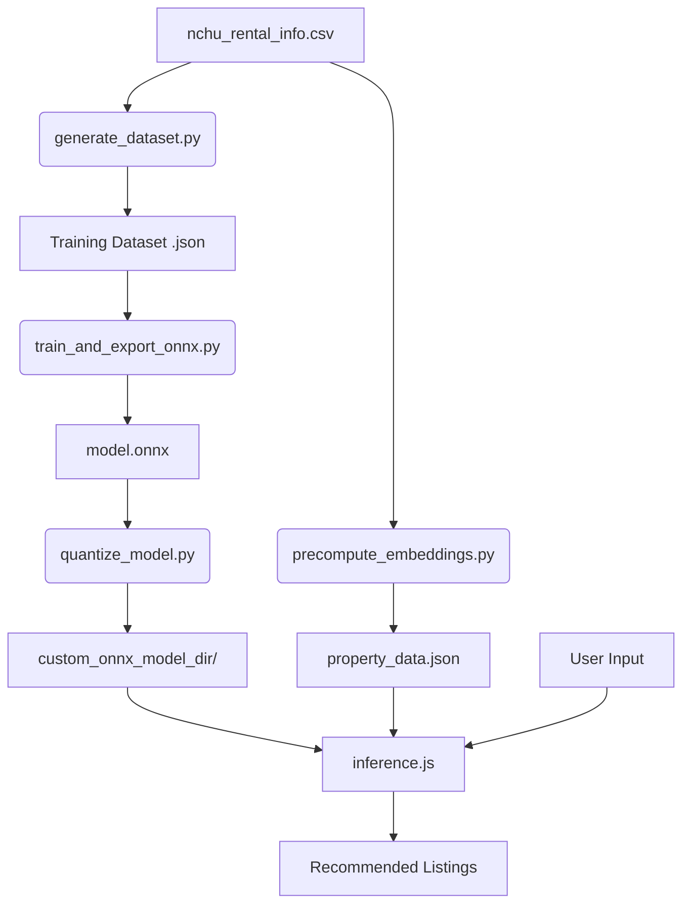

# 興大 AI 租屋推薦 (NCHU AI Rental Recommendation)

這是一個專為中興大學學生設計的 AI 租屋推薦系統。使用者只需輸入自然語言需求（例如：「預算 6000 以內、近正門、有冷氣」），系統即可透過微調後的 ALBERT 模型進行語意匹配，提供最適合的房源建議。

## 核心特徵

- **自然語言辨識**: 採用 Sentence-Pair Classification 模式，精準理解使用者需求。
- **路名/地點感知**: 模型現在能識別具體路名（如：「國光路」、「復新街」），並自動在第一階段初篩與第二階段精篩中強化位置關聯。
- **邊緣端推論 (Edge AI)**: 使用 ONNX Runtime Web，模型直接在使用者瀏覽器運行不需將資料回傳伺服器，反應迅速且保護隱私。
- **直覺式介面**: 現代化、響應式設計，支援行動裝置。
- **完整的訓練管線**: 包含自動化合成資料集、模型訓練、匯出與路名清理量化流程。

## 核心技術棧

- **Frontend**:
  - 原生 JavaScript (ES6+)
  - [ONNX Runtime Web](https://onnxruntime.ai/docs/tutorials/web/) (WASM 加速)
  - CSS3 (現代化佈局與動畫)
- **Machine Learning**:
  - Python 3.10+
  - PyTorch
  - Hugging Face Transformers (ALBERT Tiny)
  - Hugging Face Datasets
- **Deployment**:
  - 支援 Vercel, GitHub Pages 等靜態託管平台。

## 快速開始

### 1. 執行網頁應用
本專案為靜態網頁，您可以直接開啟 `index.html` 或使用本地伺服器：

```bash
# 使用 Python 啟動伺服器
python3 -m http.server 8000
```
然後訪問 `http://localhost:8000`。

### 2. 開發與訓練環境設定
如果需要重新訓練模型或產生資料集，請設定 Python 環境：

```bash
# 建立虛擬環境
python3 -m venv .venv
source .venv/bin/activate

# 安裝依賴
pip install torch transformers datasets numpy onnx onnxruntime
```

## 專案架構與資料流

本專案將流程分為資料準備、模型訓練、以及前端推論三個核心階段。

### 核心工作流圖 (Workflow Diagram)



### 1. 資料準備 (Data Preparation)
*   **原始資料**: 從 `nchu_rental_info.csv` 讀取房源資訊。
*   **描述生成**: `precompute_embeddings.py` 會讀取 CSV 並生成 `property_data.json`，其中包含每筆房源的「標準化描述文本」，這是 AI 進行比對的基準。

### 2. 模型訓練 (Model Training)
*   **合成資料**: `generate_dataset.py` 模擬學生口語（如：「預算 5k」、「套房」）生成正負配對樣本。
*   **微調與匯出**: `train_and_export_onnx.py` 基於 `albert-chinese-tiny` 進行二分類微調，並匯出為 `model.onnx`。可以使用 `quantize_model.py` 進一步壓縮模型體積。

### 3. Web 推論 (Runtime Inference)
當使用者輸入需求時，系統會啟動「兩階段推論系統」：

#### A. 第一階段：預處理與需求匹配 (Heuristic Match)
1.  **約束解析 (Constraint Parsing)**:
    - 自動辨識預算 (如：「6000 以下」、「5K」、「六千」)。
    - 辨識性別限制、房型需求與核心位置。
2.  **關鍵字清理與地址識別**:
    - 過濾無意義詞彙 (位於、我在、想要、大約 等)。
    - **智慧路名提取**: 自動從「位於學府路」等片語中提取核心地址「學府路」。
3.  **需求達成率 (RMS) 計算**:
    - 採用 **「未提到即符合 (Not Mentioned = Match)」** 邏輯。
    - 僅針對使用者「有提到」的維度進行評分，未提到的維度預設為 100% 匹配，避免漏掉潛在好房。
4.  **初步篩選**: 根據關鍵字得分與 RMS，從數百筆房源中挑選出最具潛力的 **Top 30** 候選名單。

#### B. 第二階段：AI 語義重排 (Neural Re-ranking)
1.  **ALBERT 深度比對**: 將使用者查詢與 Top 30 房源描述組成 Sentence-Pair，送入 ONNX 模型。
2.  **語義相似度語分**: 模型會理解「近興大」與「興大門口」在語法不同但語義相近，賦予高分。
3.  **混合評分機制 (Score Blending)**:
    - **最終分數 = (RMS * 40%) + (AI Score * 60%)**。
    - **保底機制**: 若 RMS 為 100% (提到的條件全中)，分數將保底在 85% 以上，確保直覺。

#### C. 分頁渲染 (Pagination)
- **Top 20 結果**: 回傳分數最高的前 20 筆。
- **漸進載入**: 每次顯示 5 筆，滑到底部可點擊「載入更多」，並伴隨流暢的進場動畫。

## 目錄結構
```text
├── index.html            # 網頁主進入點
├── styles.css             # 介面樣式
├── app.js                 # UI 邏輯與互動
├── inference.js           # ONNX 推論邏輯與兩階段檢索系統
├── property_data.json      # 房源完整資訊與描述文本
├── custom_onnx_model_dir/ # 模型存放區 (過大時需使用 LFS)
│   ├── model.onnx         # ALBERT 權重
│   ├── model.onnx.data    # 外部權重資料
│   └── tokenizer.json     # 標記器設定
├── generate_dataset.py       # 自動生成模擬訓練集
├── train_and_export_onnx.py  # 模型微調與匯出
├── precompute_embeddings.py   # 生成 property_data.json
├── quantize_model.py         # 模型量化壓縮工具
└── nchu_rental_info.csv   # 原始房源資料庫
```

## 模型訓練流程

如果您想要更新房源或優化模型：

1. **更新資料**: 修改 `nchu_rental_info.csv`。
2. **生成資料集**:
   ```bash
   python generate_dataset.py
   ```
   這會模擬學生口語，自動生成正負配對樣本。
3. **訓練並匯出**:
   ```bash
   python train_and_export_onnx.py
   ```
   此步驟會微調 `albert-chinese-tiny` 並直接匯出為 `model.onnx`。
4. **量化壓縮**:
   ```bash
   python quantize_model.py
   ```
   此步驟會自動清理衝突的形狀資訊並將模型壓縮至約 7.8MB。
5. **更新推論資料**:
   ```bash
   python precompute_embeddings.py
   ```
   此步驟會提取路名並生成最新的 `property_data.json`。
6. **部署模型**: 將 `my_custom_model_quant.onnx` 重新命名為 `model.onnx` 並放至 `custom_onnx_model_dir/` 即可。

## 備註
- 模型採用 Sentence-Pair 模式，輸入格式為 `[CLS] 查詢 [SEP] 房屋描述 [SEP]`。
- 由於 ONNX 模型權重較大，建議使用支援 LFS 的 Git 託管。
