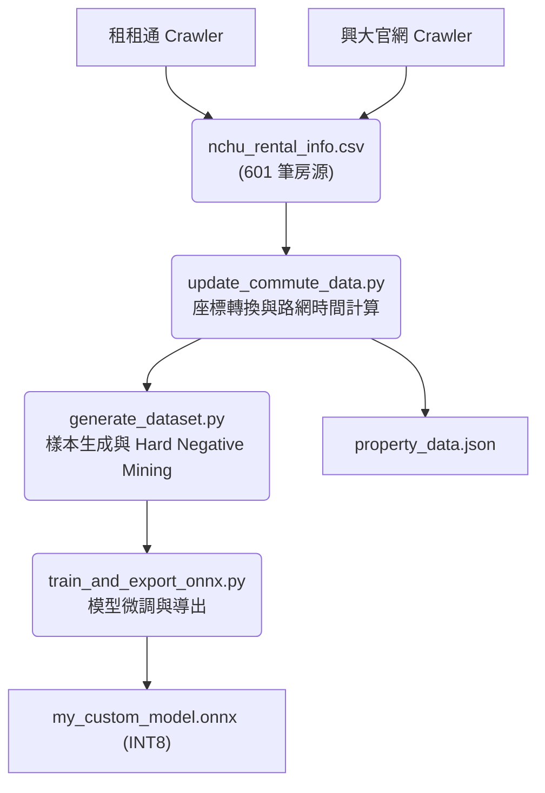
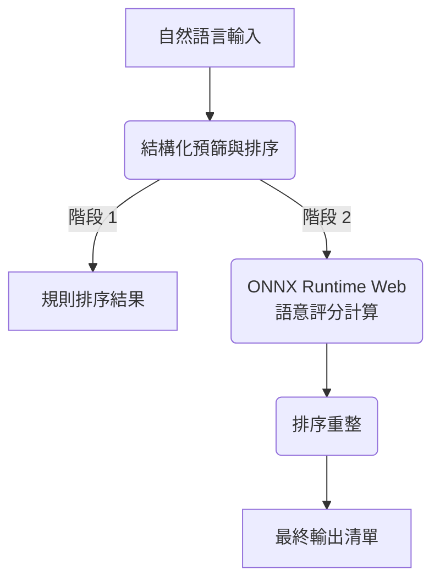

# 興大 AI 租屋推薦系統 (NCHU AI Rental Recommendation)

本專案為針對中興大學學生設計之 Edge AI 租屋推薦系統。系統透過微調後之 RoBERTa (rbt3) 模型處理自然語言查詢，並與房源資料進行語意匹配。

## 系統亮點

- **跨平台資料整合 (Multi-Source Crawler)**: 自動化整合興大校外租屋網 (官方) 與租租通 (民間) 數據，房源總數突破 600 筆，涵蓋最完整的興大生活圈。
- **深度語意理解 (RoBERTa)**: 採用 hfl/rbt3 (3 層 RoBERTa) 模型，能精準識別口語化需求（如：「不想追垃圾車」、「採光要好」、「台水電計費」）。
- **真實路網導航 (OSRM)**: 全面接入 OSRM (Open Source Routing Machine) 與 ArcGIS Geocoding API。所有通勤時間皆為真實路網的步行/行車時間。
- **分級評分引擎 (Graded NDCG)**: 採用 0-3 分級評分機制，模型在測試集上的 Graded NDCG@5 達到 0.848，具備極高的推薦品質。
- **邊緣端推論 (Edge AI)**: 模型以 ONNX INT8 量化技術壓縮至 84 MB，直接在瀏覽器運行，反應迅速且隱私無慮。
- **進階特徵解析**: 自動識別「租金補貼」、「社會住宅」、「陽台」與「特定樓層需求」，消除傳統篩選器的僵硬限制。

---

## 效能表現 (Model Performance)

| 指標 | 數值 | 狀態 | 說明 |
| :--- | :--- | :--- | :--- |
| **Accuracy** | **0.940** | 優秀 | 語意匹配的基礎準確度 |
| **F1-Score** | **0.870** | 優秀 | 兼顧精確率與召回率的綜合表現 |
| **Graded NDCG@5** | **0.848** | 領先 | 將「完美匹配」房源推向最前端的能力 |
| **Inference Time** | **< 100ms** | 極速 | 瀏覽器端 WASM 加速推理時間 |

---

## 系統架構

### 數據流水線 (Data Pipeline)



### 執行流程 (Inference Flow)



---

## 核心模組說明

### 1. 資料處理 (pipeline/crawlers/ & data_prep/)
* **crawler_ddroom.py**: 使用 Playwright 抓取租租通房源，支援 JSON-LD 深度解析。
* **rent_info_catcher.py**: 針對興大官方租屋網進行抓取，確保官方認證房源不遺漏。
* **merge_sources.py**: 智慧合併多源數據並進行去重處理。
* **update_commute_data.py**: 路網核心。計算房源到興大正門的真實步行/機車時間。

### 2. 模型開發 (pipeline/model_training/)
* **train_and_export_onnx.py**: 核心訓練腳本。強制離線模式避免 403 報錯，並實作 Graded Relevance 加權學習。
* **quantize_model.py**: 將 146MB 模型量化為 84MB，大幅提升前端載入效率。
* **evaluate_model.py**: 生成專業的評估報告，包含 NDCG、MRR 與定性搜尋範例分析。

---

## 執行與維護

### 1. 自動化全流程 (Automation)
本專案提供一鍵執行腳本，涵蓋從抓取到評估的完整生命週期：
```bash
chmod +x run_pipeline.sh
./run_pipeline.sh
```

### 2. 爬蟲合規性與規範 (Crawler Compliance)
- **robots.txt**: 本專案之爬蟲均遵循目標網站之 `robots.txt` 協定。
- **速率限制 (Throttling)**: 實作了漸進式等待機制（平均間隔 1-2 秒），避免對目標伺服器造成壓力。
- **資料用途**: 抓取之資料僅用於學術研究與 AI 模型訓練，不進行任何商業營利行為。

---

## 深度技術分析

### 1. 排序 (Ranking) 與分類 (Classification) 的平衡
目前系統在分類準確度 (Accuracy: 0.94) 表現極佳，但在 Graded NDCG@5 (0.848) 仍有優化空間。
- **原因分析**: 這是因為排序涉及了更多「語意細節」的權重分配。目前系統採用兩階段重排：
    - **Phase 1 (結構化篩選)**: 處理租金、坪數等硬性條件。
    - **Phase 2 (AI 語意重排)**: 處理如「採光」、「通風」、「安靜」等口語化特徵。
- **權重策略**: 為避免語意優勢被結構化特徵稀釋，我們在訓練樣本中引入了 **Hard Negative Mining**，強迫模型學習在基礎條件相似下的微小特徵差異。

### 2. 數據純淨度 (Data Purity)
為確保跨平台資料的一致性，`merge_sources.py` 實作了：
- **地址正規化**: 自動將中文數字（如：二五○）轉換為阿拉伯數字，消除刊登格式差異。
- **租金容差比對**: 對於相同地址且租金誤差在 **±5%** 以內的物件，系統會自動判定為重複刊登並進行合併。

### 3. 前端性能優化 (UX)
針對 **84 MB** 的模型體積，系統採取以下措施確保流暢度：
- **WASM 多執行緒**: 充分利用客戶端 CPU 核心進行加速。
- **載入遮罩**: 在模型載入與推理期間提供視覺回饋。
- **優化建議**: 未來版本將導入 **Web Worker** 進行非同步加載，以徹底避免主線程在模型初始化時的短暫卡頓。

---

## 技術清單
- 前端: Vanilla JS, ONNX Runtime Web, CSS Grid/Flex
- 後端: Python, PyTorch, Transformers, ONNX
- 外部服務: ArcGIS API, OSRM

---
**本專案旨在解決興大租屋資訊零散與篩選不便之痛點，透過 AI 賦予租屋搜尋全新的語意溫度。**
